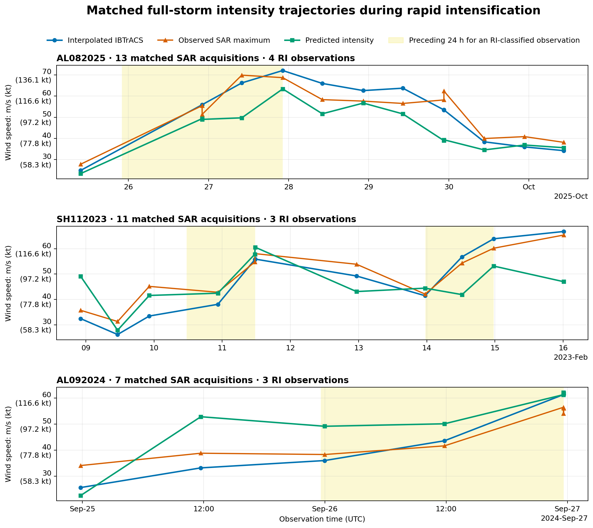
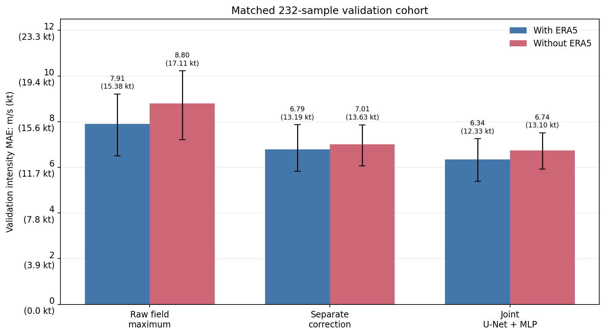
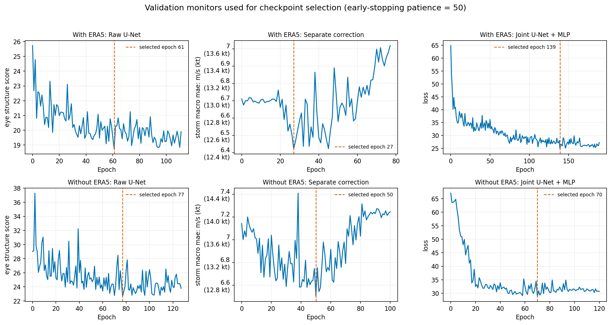
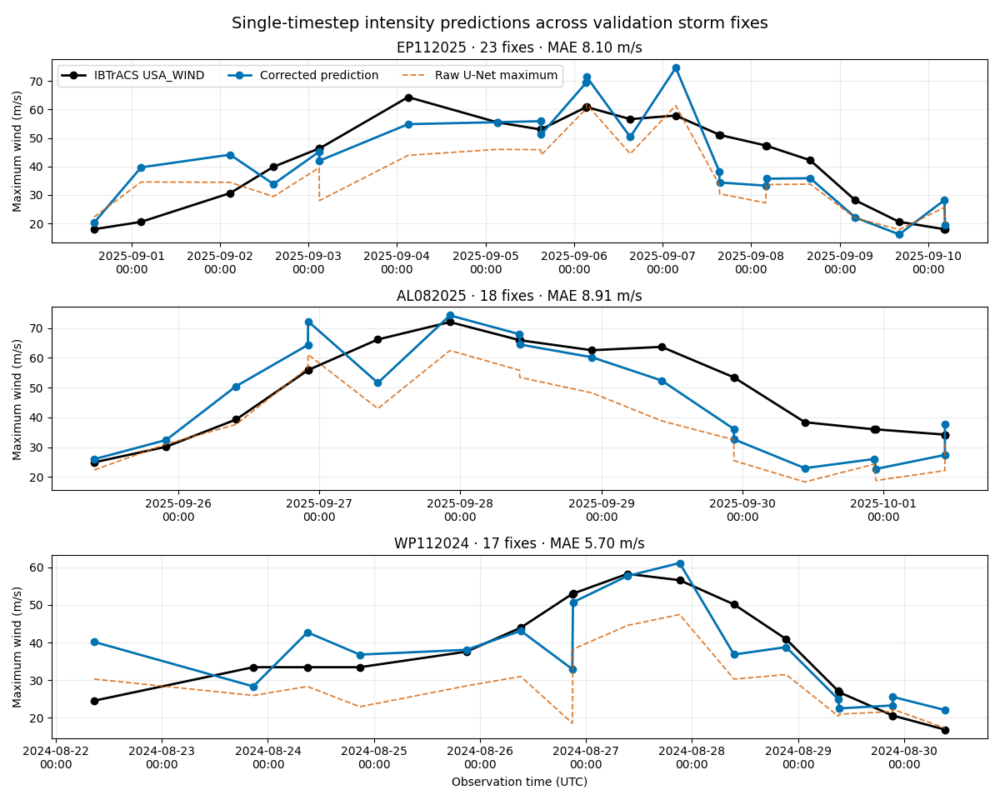
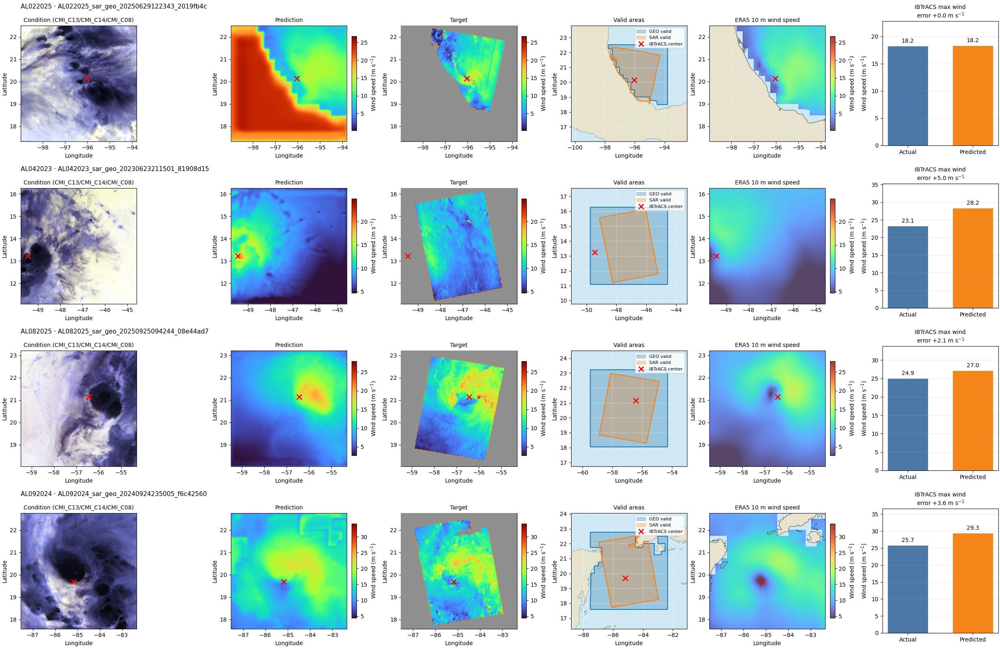
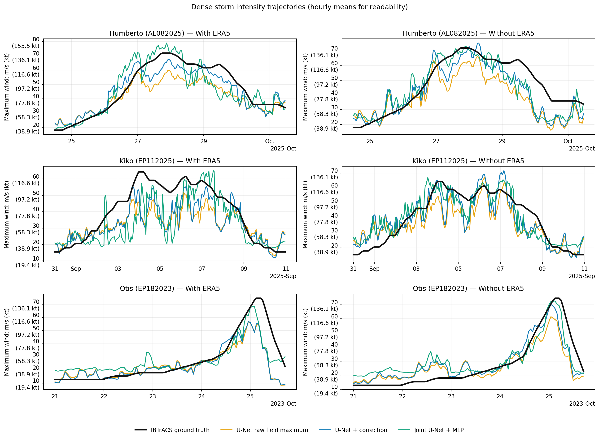
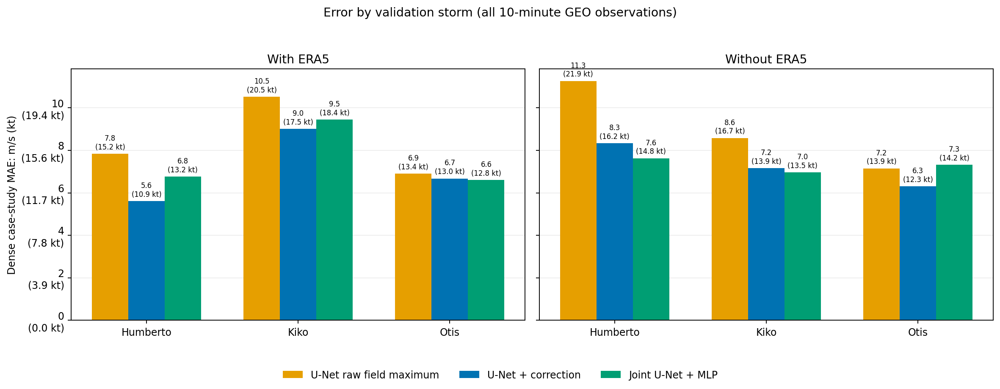

# Archived intensity reconstruction benchmark

!!! archive "Archived result set"
    These seed-42 validation results predate the streamlined experiment matrix.
    They are preserved for provenance and are not current results.

This report compares the raw U-Net field maximum, a separately trained U-Net plus correction network, and the jointly trained U-Net+MLP. Every model is evaluated once with ERA5 conditioning and once without it.

!!! warning "Validation results, not a final test claim"
    The matched benchmark and the Humberto, Kiko, and Otis trajectories are all from the `val` split. None of these storm IDs occurs in training, but validation metrics were used for early stopping and checkpoint selection. These are model-selection diagnostics, not an unbiased held-out test estimate.

## Matched IBTrACS versus SAR supervision experiment

This seed-42 experiment asks whether the scalar intensity heads should learn
from temporally interpolated IBTrACS `USA_WIND` or directly from a SAR-derived
robust peak. It uses the same 159 center-valid validation samples from 33 storms
for every target and ERA5 setting. Twenty-four samples from 14 storms satisfy
the rapid-intensification (RI) definition.

### Main findings

| ERA5 | Training target | Best target-aligned model | Overall MAE, m/s (kt) | RI MAE, m/s (kt) |
|---|---|---|---:|---:|
| With | IBTrACS | U-Net + correction | 6.099 (11.856 kt) | 8.109 (15.763 kt) |
| With | SAR robust peak | U-Net + correction | 4.682 (9.101 kt) | 5.181 (10.071 kt) |
| Without | IBTrACS | Joint U-Net + MLP | 6.583 (12.796 kt) | 5.440 (10.575 kt) |
| Without | SAR robust peak | Joint U-Net + MLP | 5.250 (10.205 kt) | 4.260 (8.281 kt) |

Target-aligned MAE is lowest when each model is scored against the reference it
was trained to reproduce, but the two references are not interchangeable.
Against IBTrACS, SAR supervision did not improve either learned scalar head:
with ERA5, correction MAE changed from 6.099 m/s (11.856 kt) to 7.021 m/s
(13.648 kt) and joint-model MAE from 7.641 m/s (14.853 kt) to 8.724 m/s
(16.958 kt); without ERA5, the corresponding changes were 7.578 m/s
(14.730 kt) to 8.778 m/s (17.063 kt) and 6.583 m/s (12.796 kt) to 8.167 m/s
(15.875 kt). The disagreement is larger during RI because the
SAR robust peak is usually lower than IBTrACS then. These are validation/model-
selection findings from one seed, not locked held-out test estimates.

### SAR and IBTrACS divergence

The matched data contain 568 train, 159 validation, and 139 test samples after
requiring a valid SAR center pixel. Validation contains 24 RI samples from 14
storms. Center-valid rates among otherwise usable IBTrACS/SAR matches are 67.5%
train, 68.5% validation, 65.6% test, 68.7% for RI, and 67.2% for non-RI.

| Subset | SAR diagnostic | Samples | Storms | Bias, m/s (kt) | MAE, m/s (kt); 95% CI | RMSE, m/s (kt) | Pearson | Spearman |
|---|---|---:|---:|---:|---:|---:|---:|---:|
| All | Maximum | 866 | 175 | 4.319 (8.395 kt) | 7.150 (13.899 kt); 95% CI 6.441–8.014 m/s (12.520–15.578 kt) | 11.097 (21.571 kt) | 0.762 | 0.806 |
| All | Robust peak | 866 | 175 | -2.009 (-3.905 kt) | 5.522 (10.734 kt); 95% CI 4.994–6.012 m/s (9.708–11.686 kt) | 7.826 (15.213 kt) | 0.889 | 0.906 |
| Validation | Maximum | 159 | 33 | 4.877 (9.480 kt) | 7.512 (14.602 kt); 95% CI 5.673–10.633 m/s (11.027–20.669 kt) | 12.634 (24.559 kt) | 0.722 | 0.804 |
| Validation | Robust peak | 159 | 33 | -2.212 (-4.300 kt) | 5.248 (10.201 kt); 95% CI 4.259–6.124 m/s (8.279–11.904 kt) | 6.893 (13.399 kt) | 0.933 | 0.941 |
| RI, all splits | Maximum | 92 | 53 | -2.108 (-4.098 kt) | 5.697 (11.074 kt); 95% CI 4.792–6.755 m/s (9.315–13.131 kt) | 7.446 (14.474 kt) | 0.764 | 0.786 |
| RI, all splits | Robust peak | 92 | 53 | -9.997 (-19.433 kt) | 10.734 (20.865 kt); 95% CI 9.582–11.917 m/s (18.626–23.165 kt) | 12.255 (23.822 kt) | 0.760 | 0.745 |
| Non-RI, all splits | Maximum | 774 | 171 | 5.083 (9.881 kt) | 7.322 (14.233 kt); 95% CI 6.526–8.274 m/s (12.686–16.083 kt) | 11.453 (22.263 kt) | 0.708 | 0.769 |
| Non-RI, all splits | Robust peak | 774 | 171 | -1.060 (-2.060 kt) | 4.903 (9.531 kt); 95% CI 4.467–5.391 m/s (8.683–10.479 kt) | 7.119 (13.838 kt) | 0.870 | 0.887 |

Bias is `SAR diagnostic − IBTrACS`. The robust peak is more correlated with
IBTrACS and has lower overall disagreement than the single-pixel SAR maximum.
During RI, however, its mean bias is -9.997 m/s (-19.433 kt). This explains why learning the
SAR target can be successful against SAR while degrading IBTrACS-aligned RI
estimates.

### Full matched-storm intensity trajectories

The three panels show the RI storms with the most RI-classified matched SAR
observations. Each panel spans the full retained SAR timeline for that storm
and includes every center-valid SAR acquisition between its first and last
plotted timestamps. The prediction is from the with-ERA5, IBTrACS-trained
U-Net + correction model, selected because it had the lowest overall IBTrACS
MAE before inspecting these trajectories.



Blue is interpolated IBTrACS, orange is the SAR-derived maximum, and green is
the model prediction. A yellow interval covers the preceding 24 hours for each
SAR acquisition classified as RI. Overlapping windows are merged. Lines connect
available SAR acquisition times for readability; they do not imply that SAR or
model predictions were observed between acquisitions.

[Download the plotted observations](intensity-comparison/data/matched-ri-full-storm-trajectories.csv){ .md-button }
[Download all matrix metrics](intensity-comparison/data/matched-target-validation.csv){ .md-button }
[Download all per-sample predictions](intensity-comparison/data/matched-target-predictions.csv){ .md-button }
[Download SAR–IBTrACS divergence statistics](intensity-comparison/data/matched-sar-ibtracs-divergence.csv){ .md-button }

### Complete dual-reference validation table

Rows labeled `sar_field_only` are reference-aligned diagnostics from the shared
field U-Net rather than separately trained scalar heads.

Bold, shaded cells mark the best value within each matched ERA5 × evaluation
reference × subset comparison. MAE, RMSE, and storm-macro MAE are minimized;
bias is ranked by absolute magnitude (closest to zero).

<!-- matched-validation-results:start -->

Generated on `2026-08-26T11:32:29.260940+00:00` from the completed seed-42 validation matrix. All rows use the same cohort fingerprint `b9fb64003b6c6b483aeea9f9052895f6b3c2f08971392322ca62281739d579f8` (159 samples from 33 storms).

All models use the identical SAR-center-valid cohort. RI denotes an IBTrACS gain of at least 30 kt in the preceding 24 hours.

| ERA5 | Trained target | Model | Evaluated against | Subset | Samples | Storms | MAE, m/s (kt); 95% CI | RMSE, m/s (kt) | Bias, m/s (kt) | Storm-macro MAE, m/s (kt) |
|---|---|---|---|---|---:|---:|---:|---:|---:|---:|
| with_era5 | ibtracs | U-Net encoder + MLP (IBTrACS only) | ibtracs | overall | 159 | 33 | **7.045 (13.694 kt); 95% CI 4.980–8.930 m/s (9.680–17.359 kt)** | 9.680 (18.817 kt) | -1.786 (-3.471 kt) | **5.815 (11.303 kt)** |
| with_era5 | ibtracs | Joint U-Net + MLP | ibtracs | overall | 159 | 33 | 7.535 (14.646 kt); 95% CI 5.519–9.567 m/s (10.729–18.597 kt) | 10.850 (21.091 kt) | **-1.445 (-2.808 kt)** | 6.323 (12.291 kt) |
| with_era5 | ibtracs | U-Net + correction | ibtracs | overall | 159 | 33 | 7.094 (13.790 kt); 95% CI 5.912–8.094 m/s (11.493–15.733 kt) | **8.928 (17.355 kt)** | -2.082 (-4.047 kt) | 7.046 (13.696 kt) |
| with_era5 | sar_field_only | U-Net raw field maximum | ibtracs | overall | 159 | 33 | 7.122 (13.845 kt); 95% CI 5.836–8.162 m/s (11.344–15.865 kt) | 9.003 (17.500 kt) | -2.646 (-5.144 kt) | 7.122 (13.845 kt) |
| with_era5 | ibtracs | U-Net encoder + MLP (IBTrACS only) | ibtracs | rapid_intensification | 24 | 14 | 9.681 (18.819 kt); 95% CI 6.696–12.750 m/s (13.017–24.784 kt) | **11.631 (22.608 kt)** | -8.940 (-17.379 kt) | **9.135 (17.757 kt)** |
| with_era5 | ibtracs | Joint U-Net + MLP | ibtracs | rapid_intensification | 24 | 14 | **9.435 (18.339 kt); 95% CI 6.475–14.222 m/s (12.586–27.646 kt)** | 13.123 (25.509 kt) | **-8.077 (-15.701 kt)** | 11.102 (21.580 kt) |
| with_era5 | ibtracs | U-Net + correction | ibtracs | rapid_intensification | 24 | 14 | 10.913 (21.213 kt); 95% CI 8.159–14.389 m/s (15.859–27.969 kt) | 12.930 (25.133 kt) | -10.172 (-19.774 kt) | 11.736 (22.813 kt) |
| with_era5 | sar_field_only | U-Net raw field maximum | ibtracs | rapid_intensification | 24 | 14 | 11.194 (21.759 kt); 95% CI 8.613–14.644 m/s (16.743–28.466 kt) | 13.230 (25.717 kt) | -10.673 (-20.746 kt) | 12.038 (23.400 kt) |
| with_era5 | ibtracs | U-Net encoder + MLP (IBTrACS only) | sar_robust_peak | overall | 159 | 33 | 6.101 (11.860 kt); 95% CI 4.980–7.330 m/s (9.681–14.248 kt) | 8.001 (15.554 kt) | 0.427 (0.830 kt) | 6.184 (12.021 kt) |
| with_era5 | ibtracs | Joint U-Net + MLP | sar_robust_peak | overall | 159 | 33 | 6.880 (13.374 kt); 95% CI 5.214–8.467 m/s (10.135–16.458 kt) | 9.434 (18.339 kt) | 0.768 (1.492 kt) | 6.491 (12.618 kt) |
| with_era5 | ibtracs | U-Net + correction | sar_robust_peak | overall | 159 | 33 | 5.035 (9.788 kt); 95% CI 4.330–5.734 m/s (8.417–11.145 kt) | 6.501 (12.636 kt) | 0.130 (0.253 kt) | 5.552 (10.792 kt) |
| with_era5 | sar_field_only | U-Net raw field robust peak | sar_robust_peak | overall | 159 | 33 | 5.177 (10.064 kt); 95% CI 4.436–5.910 m/s (8.623–11.487 kt) | 6.768 (13.156 kt) | -3.094 (-6.014 kt) | 5.779 (11.233 kt) |
| with_era5 | ibtracs | U-Net encoder + MLP (IBTrACS only) | sar_robust_peak | rapid_intensification | 24 | 14 | 6.063 (11.786 kt); 95% CI 3.947–9.049 m/s (7.672–17.589 kt) | 8.503 (16.529 kt) | -0.977 (-1.898 kt) | 6.479 (12.595 kt) |
| with_era5 | ibtracs | Joint U-Net + MLP | sar_robust_peak | rapid_intensification | 24 | 14 | 6.321 (12.287 kt); 95% CI 3.716–10.558 m/s (7.222–20.524 kt) | 10.166 (19.761 kt) | **-0.114 (-0.221 kt)** | 8.315 (16.163 kt) |
| with_era5 | ibtracs | U-Net + correction | sar_robust_peak | rapid_intensification | 24 | 14 | 5.625 (10.935 kt); 95% CI 3.716–8.424 m/s (7.223–16.374 kt) | 7.798 (15.158 kt) | -2.209 (-4.293 kt) | 6.388 (12.416 kt) |
| with_era5 | sar_field_only | U-Net raw field robust peak | sar_robust_peak | rapid_intensification | 24 | 14 | 6.635 (12.897 kt); 95% CI 4.361–10.171 m/s (8.477–19.771 kt) | 9.183 (17.850 kt) | -6.416 (-12.473 kt) | 8.289 (16.113 kt) |
| with_era5 | sar_robust_peak | Joint U-Net + MLP | ibtracs | overall | 159 | 33 | 8.141 (15.825 kt); 95% CI 6.696–9.261 m/s (13.016–18.003 kt) | 10.041 (19.518 kt) | -2.176 (-4.229 kt) | 7.683 (14.934 kt) |
| with_era5 | sar_robust_peak | U-Net + correction | ibtracs | overall | 159 | 33 | 7.264 (14.119 kt); 95% CI 5.832–8.417 m/s (11.336–16.361 kt) | 9.267 (18.013 kt) | -2.922 (-5.681 kt) | 7.065 (13.734 kt) |
| with_era5 | sar_robust_peak | Joint U-Net + MLP | ibtracs | rapid_intensification | 24 | 14 | 11.920 (23.171 kt); 95% CI 9.286–14.961 m/s (18.051–29.083 kt) | 14.042 (27.296 kt) | -11.840 (-23.015 kt) | 12.044 (23.412 kt) |
| with_era5 | sar_robust_peak | U-Net + correction | ibtracs | rapid_intensification | 24 | 14 | 12.285 (23.880 kt); 95% CI 9.587–15.781 m/s (18.635–30.676 kt) | 14.356 (27.905 kt) | -11.990 (-23.306 kt) | 12.957 (25.186 kt) |
| with_era5 | sar_robust_peak | Joint U-Net + MLP | sar_robust_peak | overall | 159 | 33 | 4.860 (9.448 kt); 95% CI 4.207–5.505 m/s (8.177–10.700 kt) | 6.359 (12.361 kt) | **0.037 (0.072 kt)** | **5.257 (10.219 kt)** |
| with_era5 | sar_robust_peak | U-Net + correction | sar_robust_peak | overall | 159 | 33 | **4.575 (8.894 kt); 95% CI 3.985–5.192 m/s (7.746–10.092 kt)** | **6.061 (11.782 kt)** | -0.710 (-1.380 kt) | 5.275 (10.253 kt) |
| with_era5 | sar_robust_peak | Joint U-Net + MLP | sar_robust_peak | rapid_intensification | 24 | 14 | 5.270 (10.244 kt); 95% CI 3.478–7.890 m/s (6.760–15.336 kt) | **7.441 (14.465 kt)** | -3.876 (-7.535 kt) | **6.191 (12.035 kt)** |
| with_era5 | sar_robust_peak | U-Net + correction | sar_robust_peak | rapid_intensification | 24 | 14 | **5.200 (10.108 kt); 95% CI 3.194–8.282 m/s (6.208–16.098 kt)** | 7.705 (14.977 kt) | -4.026 (-7.826 kt) | 6.513 (12.660 kt) |
| without_era5 | ibtracs | U-Net encoder + MLP (IBTrACS only) | ibtracs | overall | 159 | 33 | 12.915 (25.105 kt); 95% CI 9.866–15.256 m/s (19.178–29.655 kt) | 16.141 (31.375 kt) | -7.210 (-14.016 kt) | 11.537 (22.426 kt) |
| without_era5 | ibtracs | Joint U-Net + MLP | ibtracs | overall | 159 | 33 | **6.516 (12.665 kt); 95% CI 5.504–7.522 m/s (10.699–14.621 kt)** | **8.538 (16.596 kt)** | **-0.926 (-1.800 kt)** | **6.115 (11.886 kt)** |
| without_era5 | ibtracs | U-Net + correction | ibtracs | overall | 159 | 33 | 7.322 (14.232 kt); 95% CI 6.238–8.276 m/s (12.125–16.088 kt) | 9.547 (18.559 kt) | -2.484 (-4.829 kt) | 7.360 (14.307 kt) |
| without_era5 | sar_field_only | U-Net raw field maximum | ibtracs | overall | 159 | 33 | 8.917 (17.332 kt); 95% CI 7.048–10.438 m/s (13.700–20.290 kt) | 11.460 (22.277 kt) | -5.514 (-10.719 kt) | 8.158 (15.857 kt) |
| without_era5 | ibtracs | U-Net encoder + MLP (IBTrACS only) | ibtracs | rapid_intensification | 24 | 14 | 22.964 (44.639 kt); 95% CI 18.745–26.497 m/s (36.438–51.506 kt) | 24.738 (48.086 kt) | -22.964 (-44.639 kt) | 21.983 (42.732 kt) |
| without_era5 | ibtracs | Joint U-Net + MLP | ibtracs | rapid_intensification | 24 | 14 | **5.394 (10.484 kt); 95% CI 4.236–6.976 m/s (8.234–13.560 kt)** | **6.602 (12.833 kt)** | **-0.948 (-1.843 kt)** | **5.896 (11.460 kt)** |
| without_era5 | ibtracs | U-Net + correction | ibtracs | rapid_intensification | 24 | 14 | 7.477 (14.534 kt); 95% CI 5.089–10.804 m/s (9.892–21.001 kt) | 9.834 (19.117 kt) | -5.388 (-10.473 kt) | 8.324 (16.181 kt) |
| without_era5 | sar_field_only | U-Net raw field maximum | ibtracs | rapid_intensification | 24 | 14 | 12.866 (25.009 kt); 95% CI 10.365–15.839 m/s (20.148–30.789 kt) | 14.823 (28.814 kt) | -12.647 (-24.583 kt) | 12.846 (24.970 kt) |
| without_era5 | ibtracs | U-Net encoder + MLP (IBTrACS only) | sar_robust_peak | overall | 159 | 33 | 9.702 (18.860 kt); 95% CI 7.736–11.226 m/s (15.037–21.822 kt) | 11.877 (23.088 kt) | -4.998 (-9.715 kt) | 9.701 (18.858 kt) |
| without_era5 | ibtracs | Joint U-Net + MLP | sar_robust_peak | overall | 159 | 33 | 7.596 (14.765 kt); 95% CI 6.356–8.683 m/s (12.354–16.879 kt) | 9.570 (18.603 kt) | 1.286 (2.500 kt) | 7.235 (14.065 kt) |
| without_era5 | ibtracs | U-Net + correction | sar_robust_peak | overall | 159 | 33 | 6.570 (12.771 kt); 95% CI 5.614–7.635 m/s (10.913–14.841 kt) | 8.218 (15.975 kt) | **-0.272 (-0.529 kt)** | 7.051 (13.705 kt) |
| without_era5 | sar_field_only | U-Net raw field robust peak | sar_robust_peak | overall | 159 | 33 | 7.214 (14.022 kt); 95% CI 6.017–8.310 m/s (11.697–16.152 kt) | 9.084 (17.659 kt) | -5.527 (-10.743 kt) | 7.316 (14.222 kt) |
| without_era5 | ibtracs | U-Net encoder + MLP (IBTrACS only) | sar_robust_peak | rapid_intensification | 24 | 14 | 15.060 (29.275 kt); 95% CI 11.896–18.093 m/s (23.125–35.171 kt) | 16.523 (32.118 kt) | -15.000 (-29.158 kt) | 15.428 (29.989 kt) |
| without_era5 | ibtracs | Joint U-Net + MLP | sar_robust_peak | rapid_intensification | 24 | 14 | 9.589 (18.640 kt); 95% CI 6.758–12.757 m/s (13.136–24.797 kt) | 12.342 (23.991 kt) | 7.016 (13.637 kt) | 10.308 (20.038 kt) |
| without_era5 | ibtracs | U-Net + correction | sar_robust_peak | rapid_intensification | 24 | 14 | 7.072 (13.748 kt); 95% CI 5.226–9.073 m/s (10.158–17.636 kt) | 8.473 (16.471 kt) | 2.576 (5.007 kt) | 7.481 (14.542 kt) |
| without_era5 | sar_field_only | U-Net raw field robust peak | sar_robust_peak | rapid_intensification | 24 | 14 | 8.328 (16.189 kt); 95% CI 6.427–10.989 m/s (12.493–21.361 kt) | 10.143 (19.717 kt) | -8.319 (-16.171 kt) | 9.193 (17.869 kt) |
| without_era5 | sar_robust_peak | Joint U-Net + MLP | ibtracs | overall | 159 | 33 | 7.939 (15.433 kt); 95% CI 6.699–8.999 m/s (13.023–17.493 kt) | 9.770 (18.991 kt) | -2.618 (-5.090 kt) | 7.561 (14.697 kt) |
| without_era5 | sar_robust_peak | U-Net + correction | ibtracs | overall | 159 | 33 | 8.006 (15.563 kt); 95% CI 6.408–9.321 m/s (12.456–18.119 kt) | 10.112 (19.656 kt) | -3.106 (-6.038 kt) | 7.954 (15.461 kt) |
| without_era5 | sar_robust_peak | Joint U-Net + MLP | ibtracs | rapid_intensification | 24 | 14 | 10.707 (20.813 kt); 95% CI 8.214–12.696 m/s (15.967–24.678 kt) | 12.631 (24.553 kt) | -10.619 (-20.642 kt) | 9.972 (19.383 kt) |
| without_era5 | sar_robust_peak | U-Net + correction | ibtracs | rapid_intensification | 24 | 14 | 10.769 (20.933 kt); 95% CI 8.351–13.566 m/s (16.233–26.369 kt) | 12.485 (24.268 kt) | -10.382 (-20.182 kt) | 10.623 (20.650 kt) |
| without_era5 | sar_robust_peak | Joint U-Net + MLP | sar_robust_peak | overall | 159 | 33 | 5.308 (10.319 kt); 95% CI 4.675–5.975 m/s (9.088–11.615 kt) | **6.801 (13.219 kt)** | -0.406 (-0.789 kt) | **5.690 (11.061 kt)** |
| without_era5 | sar_robust_peak | U-Net + correction | sar_robust_peak | overall | 159 | 33 | **5.248 (10.202 kt); 95% CI 4.484–6.028 m/s (8.717–11.718 kt)** | 6.937 (13.484 kt) | -0.894 (-1.738 kt) | 6.077 (11.812 kt) |
| without_era5 | sar_robust_peak | Joint U-Net + MLP | sar_robust_peak | rapid_intensification | 24 | 14 | **3.999 (7.773 kt); 95% CI 2.669–6.220 m/s (5.188–12.091 kt)** | **6.002 (11.667 kt)** | -2.655 (-5.161 kt) | **4.622 (8.985 kt)** |
| without_era5 | sar_robust_peak | U-Net + correction | sar_robust_peak | rapid_intensification | 24 | 14 | 4.658 (9.054 kt); 95% CI 3.113–7.022 m/s (6.051–13.649 kt) | 6.698 (13.020 kt) | **-2.419 (-4.702 kt)** | 5.357 (10.414 kt) |
<!-- matched-validation-results:end -->

### How the tables and metrics were calculated

- **IBTrACS reference:** `USA_WIND` is converted with
  `1 kt = 0.514444 m/s` and linearly interpolated to the SAR timestamp only when
  its enclosing fixes are no more than three hours apart.
- **SAR maximum:** largest finite wind-speed pixel in the resized,
  center-cropped valid SAR mask.
- **SAR robust peak:** arithmetic mean of the highest 0.5% of finite valid
  pixels in that same crop. At least one pixel is always selected.
- **RI subset:** interpolated IBTrACS increased by at least 30 kt over the
  preceding 24 hours. Missing interpolatable 24-hour history is not labeled RI.
- **MAE / RMSE / bias:** mean absolute error, root mean squared error, and mean
  signed `prediction − reference` error over observations.
- **Storm-macro MAE:** compute MAE within each storm, then average storms with
  equal weight.
- **Category metrics:** exact accuracy, macro F1, and accuracy within one TD,
  TS, or Saffir–Simpson category, using continuous unrounded wind thresholds.
- **Field metrics:** pixel-pooled MAE, RMSE, and bias over the common finite
  valid mask. They apply only to field-producing models.
- **Uncertainty:** 95% percentile intervals use 2,000 seed-42 cluster-bootstrap
  repetitions over storms. Each sampled storm contributes all of its
  observations, and every model uses the same resampled storms.

The overall subset has 159 observations from 33 storms. The RI subset has 24
observations from 14 storms. RI metrics were diagnostic only: checkpoint
selection and early stopping always used the complete validation cohort.

### How the matrix was run

The run used seed 42 and two RTX 3090 GPUs. For each ERA5 regime, one field-only
U-Net was trained and reused across both scalar targets. Four joint U-Net+MLP
models and four correction models were trained. IBTrACS correction used the
predicted field maximum as its anchor; SAR correction used the predicted field
top-0.5%-mean. The full command was:

```bash
uv run python scripts/run_matched_intensity_validation_matrix.py \
  --joint-gpu 0 \
  --pipeline-gpu 1 \
  --seed 42 \
  --wandb-project geo2wf
```

The first evaluation was resumed from its selected checkpoints after fixing
JSON handling for undefined RI history; no partial metrics selected a
checkpoint. The final matrix manifest records every command, checkpoint, and
hash. The consolidated W&B evaluation is
[`use15m4l`](https://wandb.ai/simon-donike/geo2wf/runs/use15m4l).

The trajectory asset is reproducible with:

```bash
.venv/bin/python scripts/build_matched_intensity_storm_plot.py
```

For the experiment design, cohort contract, cache schema, and runner interface,
see the [active experiment matrix](../../experiments/intensity-comparison.md).

## Earlier IBTrACS-only benchmark

On the matched **232-observation, 34-storm** validation cohort, the joint model has the lowest intensity MAE: **6.344 m/s (12.332 kt) with ERA5** and **6.738 m/s (13.098 kt) without ERA5**. With ERA5, the separate correction reaches **6.786 m/s (13.191 kt)**, versus **7.910 m/s (15.376 kt)** for the raw field maximum. The storm-bootstrap intervals for both learned scalar heads' improvement over the raw maximum exclude zero in both regimes.



[Download validation results as CSV](intensity-comparison/data/validation-results.csv){ .md-button }

### Matched validation tables

#### With ERA5

| Model | n | MAE, m/s (kt); 95% CI | Δ MAE vs raw, m/s (kt); 95% CI | RMSE, m/s (kt) | Bias, m/s (kt) | Storm-macro MAE, m/s (kt) | Exact category | Macro F1 | Within one | Field MAE / RMSE / bias, m/s (kt) |
|---|---:|---:|---:|---:|---:|---:|---:|---:|---:|---:|
| U-Net raw field maximum | 232 | 7.910 (15.376 kt); 95% CI 6.495–9.205 m/s (12.625–17.893 kt) | 0.000 (0.000 kt) | 10.312 (20.045 kt) | -5.160 (-10.030 kt) | 6.785 (13.189 kt) | 0.487 | 0.265 | 0.784 | 2.032 (3.950 kt) / 3.097 (6.020 kt) / -0.287 (-0.558 kt) |
| U-Net + correction | 232 | 6.786 (13.191 kt); 95% CI 5.823–7.863 m/s (11.319–15.284 kt) | -1.124 (-2.185 kt); 95% CI -1.902–-0.235 m/s (-3.697–-0.457 kt) | 8.847 (17.197 kt) | -2.368 (-4.603 kt) | 6.422 (12.483 kt) | 0.487 | 0.330 | 0.901 | — / — / — |
| Joint U-Net + MLP | 232 | 6.344 (12.332 kt); 95% CI 5.392–7.254 m/s (10.481–14.101 kt) | -1.566 (-3.044 kt); 95% CI -2.686–-0.228 m/s (-5.221–-0.443 kt) | 8.606 (16.729 kt) | -0.800 (-1.555 kt) | 5.693 (11.066 kt) | 0.522 | 0.362 | 0.875 | 2.205 (4.286 kt) / 3.208 (6.236 kt) / 0.434 (0.844 kt) |

#### Without ERA5

| Model | n | MAE, m/s (kt); 95% CI | Δ MAE vs raw, m/s (kt); 95% CI | RMSE, m/s (kt) | Bias, m/s (kt) | Storm-macro MAE, m/s (kt) | Exact category | Macro F1 | Within one | Field MAE / RMSE / bias, m/s (kt) |
|---|---:|---:|---:|---:|---:|---:|---:|---:|---:|---:|
| U-Net raw field maximum | 232 | 8.804 (17.114 kt); 95% CI 7.212–10.223 m/s (14.019–19.872 kt) | 0.000 (0.000 kt) | 11.521 (22.395 kt) | -6.285 (-12.217 kt) | 7.324 (14.237 kt) | 0.448 | 0.256 | 0.806 | 3.604 (7.006 kt) / 4.960 (9.641 kt) / -0.307 (-0.597 kt) |
| U-Net + correction | 232 | 7.011 (13.628 kt); 95% CI 6.063–7.861 m/s (11.786–15.281 kt) | -1.793 (-3.485 kt); 95% CI -2.700–-0.806 m/s (-5.248–-1.567 kt) | 9.060 (17.611 kt) | -1.549 (-3.011 kt) | 6.503 (12.641 kt) | 0.509 | 0.354 | 0.879 | — / — / — |
| Joint U-Net + MLP | 232 | 6.738 (13.098 kt); 95% CI 5.914–7.511 m/s (11.496–14.600 kt) | -2.067 (-4.018 kt); 95% CI -3.162–-0.735 m/s (-6.146–-1.429 kt) | 8.655 (16.824 kt) | 0.179 (0.348 kt) | 7.021 (13.648 kt) | 0.496 | 0.330 | 0.914 | 3.725 (7.241 kt) / 4.934 (9.591 kt) / 0.280 (0.544 kt) |

The two tables use identical sample IDs. ERA5 therefore changes only the conditioning available to the models, not the evaluation cohort.

### What each metric measures

Let the scalar error be `prediction − IBTrACS target` for one observation.

| Metric | Calculation and interpretation |
|---|---|
| **Intensity MAE** | Mean absolute scalar error. It describes the typical magnitude of an intensity miss in m/s; lower is better. The range is a 95% paired cluster-bootstrap interval over storms. |
| **Δ MAE vs raw** | Candidate MAE minus raw-U-Net MAE on the same storm resample. Negative favors the candidate. An interval below zero means the improvement is consistent across the storm bootstrap. |
| **Intensity RMSE** | Square root of mean squared scalar error. Large misses receive extra weight; lower is better. |
| **Intensity bias** | Mean signed scalar error. Negative is systematic underprediction, positive is overprediction, and zero is ideal. Positive and negative errors can cancel. |
| **Storm-macro MAE** | MAE is computed within each storm and then averaged with equal weight per storm. It prevents storms with many images from dominating. |
| **Exact category accuracy** | Fraction assigned exactly the correct TD, TS, or Saffir–Simpson category; higher is better. |
| **Category macro F1** | Per-category harmonic mean of precision and recall, averaged equally across represented categories; higher is better. |
| **Within one** | Fraction no more than one category away from the target; higher is better. |
| **Field MAE / RMSE / bias** | Pixel-pooled U-Net-minus-SAR errors over the common finite valid mask. These diagnose the reconstructed wind field, not scalar intensity. They do not apply to the separate correction head, which emits only a scalar. |

IBTrACS `USA_WIND` is converted from knots with `1 kt = 0.514444 m/s` and linearly interpolated to the image timestamp only when the enclosing fixes are at most three hours apart. Categories use the unrounded thresholds: TD `<34 kt`, TS `34–<64`, C1 `64–<83`, C2 `83–<96`, C3 `96–<113`, C4 `113–<137`, and C5 `≥137 kt`.

The 95% intervals use 2,000 paired cluster-bootstrap repetitions over storm IDs (seed 42). Every resample evaluates all models on the same storms and retains every observation from each sampled storm.

### Training, W&B, and early stopping

All six runs logged metrics to Weights & Biases. Training allowed up to 1,000 epochs but stopped after **50 validation epochs without improvement**. The vertical dashed lines below mark the checkpoint selected by each stage-specific validation monitor.



| Conditioning | Raw U-Net | Separate correction | Joint U-Net + MLP |
|---|---|---|---|
| With ERA5 | epoch 61 · `4rqrc3oh` | epoch 27 · `ymivzoau` | epoch 139 · `rj7951rk` |
| Without ERA5 | epoch 77 · `ldd7fp28` | epoch 50 · `frrrn6dl` | epoch 70 · `oyiqs6go` |

#### Validation reconstruction media at the selected checkpoints

The correction images are the W&B three-storm diagnostic nearest each selected checkpoint. They show the automatically selected validation storms (not the dedicated three-storm dense analysis below). The joint images show validation GEO input, predicted and SAR target fields, valid footprints, ERA5 where applicable, and scalar-intensity error.

The raw U-Net run had media logging disabled, so its panels below were regenerated from the exact selected epoch-77 checkpoint (`ldd7fp28`) on the same storm-stratified validation loader. Each row shows GEO input, the reconstructed wind field, the SAR target, and both valid footprints. No ERA5 field is supplied to this model.

=== "Raw U-Net · without ERA5"

    

    

    

=== "Correction · with ERA5"

    

=== "Correction · without ERA5"

    

=== "Joint · with ERA5"

    

=== "Joint · without ERA5"

    

## Humberto, Kiko, and Otis: dense full-storm inference

The inference manifest contributes every listed 10-minute GEO image: **1,006 Humberto observations (`AL082025`)**, **1,578 Kiko observations (`EP112025`)**, and **684 Otis observations (`EP182023`)**, for **3,268** timestamps. All 3,268 have a valid three-hour-or-narrower IBTrACS bracket. Both conditioning regimes use exactly the same observation IDs, centers, timestamps, and IBTrACS reference targets.

Inference was attempted for all **3,268** scans. **3,266** have a non-empty valid footprint after the model's center crop and are scored; **2 scans** are retained in the download with `inference_valid = false` and excluded identically from both regimes and every model metric.

Across the dense common cohort, **U-Net + correction** has the lowest aggregate MAE with ERA5 (**7.476 m/s (14.532 kt)**), while **Joint U-Net + MLP** is lowest without ERA5 (**7.243 m/s (14.079 kt)**). Per-storm behavior differs; the trajectory and storm-level table report that variation.

The plotted curves are hourly means to keep the dense 10-minute series readable. The table scores every valid individual observation, while the download also retains any explicitly flagged unusable scan.





Every wind-speed value below is shown in m/s with knots in parentheses; the sample count is unitless.

| Conditioning | Model | valid n / attempted | MAE, m/s (kt) | RMSE, m/s (kt) | Bias, m/s (kt) | Humberto MAE, m/s (kt) | Kiko MAE, m/s (kt) | Otis MAE, m/s (kt) |
|---|---|---:|---:|---:|---:|---:|---:|---:|
| With ERA5 | U-Net raw field maximum | 3266 / 3268 | 8.942 (17.382 kt) | 11.882 (23.097 kt) | -6.458 (-12.553 kt) | 7.838 (15.236 kt) | 10.531 (20.471 kt) | 6.908 (13.428 kt) |
| With ERA5 | U-Net + correction | 3266 / 3268 | 7.476 (14.532 kt) | 10.302 (20.026 kt) | -4.430 (-8.611 kt) | 5.614 (10.913 kt) | 9.011 (17.516 kt) | 6.677 (12.979 kt) |
| With ERA5 | Joint U-Net + MLP | 3266 / 3268 | 8.029 (15.607 kt) | 11.146 (21.666 kt) | -3.437 (-6.681 kt) | 6.766 (13.152 kt) | 9.453 (18.375 kt) | 6.604 (12.837 kt) |
| Without ERA5 | U-Net raw field maximum | 3266 / 3268 | 9.113 (17.714 kt) | 11.404 (22.168 kt) | -4.968 (-9.657 kt) | 11.271 (21.909 kt) | 8.586 (16.690 kt) | 7.153 (13.904 kt) |
| Without ERA5 | U-Net + correction | 3266 / 3268 | 7.345 (14.278 kt) | 9.452 (18.373 kt) | -1.483 (-2.883 kt) | 8.338 (16.208 kt) | 7.160 (13.918 kt) | 6.314 (12.273 kt) |
| Without ERA5 | Joint U-Net + MLP | 3266 / 3268 | 7.243 (14.079 kt) | 9.159 (17.804 kt) | 0.071 (0.138 kt) | 7.631 (14.833 kt) | 6.962 (13.533 kt) | 7.318 (14.225 kt) |

[Download all six dense prediction series](intensity-comparison/data/three-storm-inference.csv){ .md-button } [Download dense metrics](intensity-comparison/data/three-storm-metrics.csv){ .md-button } [Download JSON summary](intensity-comparison/data/three-storm-summary.json){ .md-button }

### Split audit

| Storm | Source split | Paired train samples | Paired validation samples | Paired test samples | Dense valid / attempted |
|---|---|---:|---:|---:|---:|
| Humberto (`AL082025`) | `val` | 0 | 18 | 0 | 1,006 / 1,006 |
| Kiko (`EP112025`) | `val` | 0 | 23 | 0 | 1,576 / 1,578 |
| Otis (`EP182023`) | `val` | 0 | 2 | 0 | 684 / 684 |

The split audit confirms that **none of the three storms is in training**. They are validation storms, including Otis; none is in the test split. Because validation guided early stopping, the dense plots are diagnostic case studies rather than independent test cases.

## Reproduce the dense inference

```bash
CUDA_VISIBLE_DEVICES=0 .venv/bin/python scripts/run_intensity_comparison_storm_inference.py --era5 with --device cuda
CUDA_VISIBLE_DEVICES=1 .venv/bin/python scripts/run_intensity_comparison_storm_inference.py --era5 without --device cuda
.venv/bin/python scripts/build_intensity_comparison_web_report.py
```

Each inference JSON records SHA-256 hashes for the raw U-Net, correction, and joint checkpoints. The correction run additionally verifies that its frozen-field cache was generated by the exact selected raw U-Net checkpoint.

## Limitations

- Validation-guided selection makes all reported results model-selection diagnostics.
- Dense 10-minute observations are strongly temporally correlated; 3,268 rows are not 3,268 independent storms or trials.
- IBTrACS is a best-track estimate interpolated in time, not a direct measurement at each satellite scan.
- The raw scalar is the largest valid pixel in a reconstructed field, while the learned heads estimate IBTrACS maximum wind directly; these are related but not identical physical quantities.
- Final performance estimation requires a locked, storm-disjoint test set after architecture and checkpoint selection.
