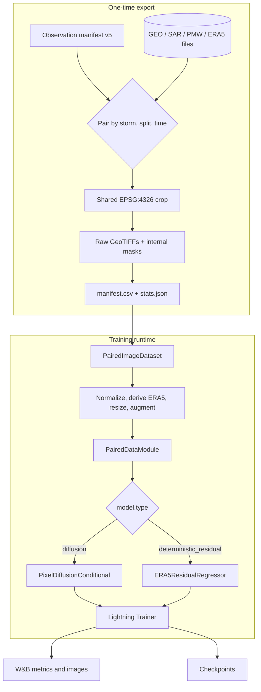

# System architecture



## Entry point: `train.py`

The entry point has four responsibilities:

1. Load the selected YAML and set numeric precision behavior.
2. Create one timestamped run directory. DDP child processes reuse it through `GEO2WF_RUN_DIR`.
3. Build the data module and dispatch to diffusion or residual construction.
4. Configure the Lightning trainer, W&B logger, learning-rate monitor, and checkpoint callback.

Model selection is intentionally a small switch:

```yaml
model:
  type: diffusion  # default when omitted
```

or:

```yaml
model:
  type: deterministic_residual
```

## Boundaries between layers

| Layer | Owns | Does not own |
|---|---|---|
| Exporter | observation pairing, grid construction, regridding, GeoTIFF tags/masks, train stats | model normalization tensors, batching |
| Dataset | file reads, derived ERA5 channels, normalization, resize, augmentation, sample metadata | split shuffling, device placement |
| DataModule | split construction and DataLoaders | scientific transforms |
| LightningModule | loss, optimizer, sampling, metrics, shared reconstruction logging | manifest parsing or raster I/O |
| Trainer | epochs, devices, precision, DDP, callbacks | experiment semantics |

## Validation has two views

`PairedDataModule.val_dataloader()` returns:

1. a validation loader reordered round-robin by `storm_id`, making early bounded validation more representative; and
2. a small fixed prefix of the training data, used only to log a training-sample reconstruction.

The diffusion module knows loader 1 is qualitative only and does not fold it into validation loss. This is why code reading that assumes a single validation loader can be misleading.

## Run directory behavior

A run is created as:

```text
<default_root_dir>/<YYYYMMDD-HHMMSS>_<config-name>/
├── checkpoints/
└── wandb/
    ├── cache/
    └── config/
```

W&B environment directories are scoped under the run directory. Checkpoint filename, monitor, direction, top-k count, and `last.ckpt` behavior come from `trainer.checkpoint` with model defaults as fallback.
