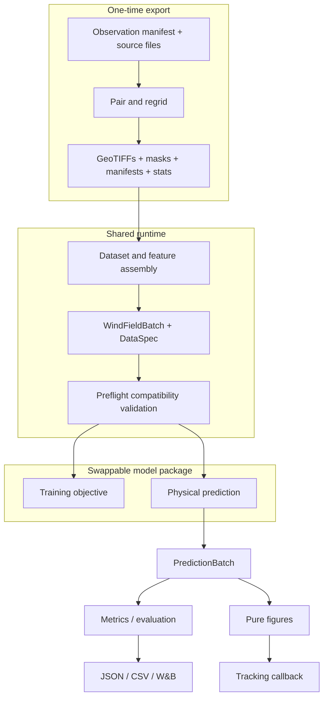

# System architecture

The system separates one-time geospatial export, runtime tensor assembly, model
semantics, and shared lifecycle services.



## Composition root

`geo2wf-train` composes `configs/modular.yaml` and the selected groups. Data and
model configs instantiate their own `_target_` values, so the runtime does not
choose models with an `if model.type` registry.

```bash
uv run geo2wf-train \
  data=geo_sar_common10_era5 \
  model=deterministic_residual
```

The startup path creates a run directory, stores the resolved config and source
provenance, seeds workers, instantiates data/model components, validates
`DataSpec`, and then configures Lightning, CSV logging, optional W&B, media
callbacks, and checkpoints.

## Layer responsibilities

| Layer | Owns | Must not own |
|---|---|---|
| Export/preprocessing | pairing, grids, regridding, source reads, GeoTIFF tags, statistics | model construction |
| Dataset | manifest selection, raster reads, normalization, features, crop, augmentation | model-specific channel concatenation |
| DataModule | split datasets, samplers, loaders, canonical collation, `DataSpec` | scientific prediction logic |
| Model package | network, objective composition, and transforms | raster I/O, concrete datasets, CLI, W&B, Matplotlib |
| Shared model base | batch validation, standardized training/predict extension contract, checkpoint metadata | architecture dispatch |
| Metrics/evaluation | physical prediction calculations and serialization | W&B media |
| Visualization | pure structured-input-to-`Figure` rendering | Trainer or logger access |
| Tracking | CSV/W&B adapters, media callback, run manifest | scientific model behavior |
| Trainer | epochs, devices, precision, DDP, callbacks | experiment semantics |

## Field-model calculation

The field model produces a deterministic physical field around ERA5:

```text
prediction = ERA5 + learned correction
```

It consumes a `WindFieldBatch` and exposes a `PredictionBatch`; the deterministic
output uses shape `[B, 1, C, H, W]`.

## Shared data and prediction contracts

`WindFieldBatch`
: Required tensors, masks, normalization transform, geometry, identifiers, and
  sample-oriented metadata, plus documented optional companions.

`DataSpec`
: Ordered channel names, target channels/units, spatial shape, and companion
  capabilities used for preflight rejection.

`PredictionRequest`
: Prediction controls and model-specific overrides.

`PredictionBatch`
: All physical members, one central physical prediction, and an optional
  physical baseline.

## Run directory

```text
<default_root_dir>/<timestamp>_modular/
├── checkpoints/
├── metrics/metrics.csv
├── resolved-config.yaml
├── run-manifest.json
├── source-diff.patch
├── source-snapshot/
└── wandb/
```

DDP children inherit `GEO2WF_RUN_DIR` and reuse the parent directory. Metrics
are reduced before epoch values are formed.

Continue with [modular package ownership](modular-architecture.md), the
[dataset contract](../data/dataset-contract.md), or [training](../experiments/training.md).
