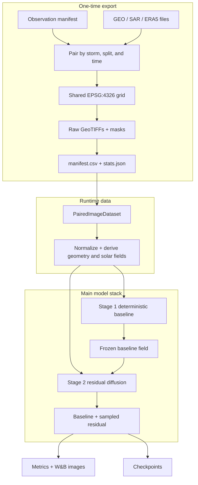

# System architecture

The system has three boundaries: one-time geospatial export, runtime tensor assembly, and the two-stage model stack.



## The model handoff

Stage 1 and Stage 2 see the same normalized observation/context condition, but their outputs and objectives differ:

| | Stage 1 | Stage 2 |
|---|---|---|
| Input added by the model | ERA5 wind + mask | frozen Stage 1 field + mask + noisy residual |
| Predicted variable | deterministic correction in m/s | diffusion noise for a transformed signed residual |
| Physical output | ERA5 + learned correction | Stage 1 baseline + sampled correction |
| Trainable during Stage 2 | no | yes |

See [Two-stage baseline + diffusion](../models/two-stage.md) for the complete equations and channel counts.

## Entry point: `train.py`

The entry point:

1. loads one YAML file and establishes numeric precision;
2. creates one timestamped run directory reused by DDP child processes;
3. builds the data module and dispatches on `model.type`; and
4. configures the Lightning trainer, W&B logger, scheduler, and checkpoints.

Relevant model types are:

```yaml
model:
  type: deterministic_residual  # Stage 1
```

and:

```yaml
model:
  type: diffusion_residual      # Stage 2
```

## Layer responsibilities

| Layer | Owns | Does not own |
|---|---|---|
| Exporter | pairing, grid construction, regridding, GeoTIFF masks/tags, train stats | tensor normalization or batching |
| Dataset | raster reads, derived channels, normalization, crop, augmentation, metadata | split shuffling or device placement |
| DataModule | split construction and DataLoaders | scientific transforms |
| Stage 1 module | physical residual loss, dense baseline, baseline metrics | raster I/O |
| Stage 2 module | residual transform, denoising loss, sampling, ensemble metrics | training the frozen baseline |
| Trainer | epochs, devices, precision, DDP, callbacks | experiment semantics |

## Validation has two views

`PairedDataModule.val_dataloader()` returns a storm-stratified validation loader and a small fixed training prefix used only for qualitative reconstruction logging. The model excludes that qualitative loader from validation loss.

## Run directory

```text
<default_root_dir>/<YYYYMMDD-HHMMSS>_<config-name>/
├── checkpoints/
└── wandb/
    ├── cache/
    └── config/
```

Continue with [model inputs](../data/index.md), the [two-stage workflow](../models/two-stage.md), or [training and checkpoints](../experiments/training.md).
