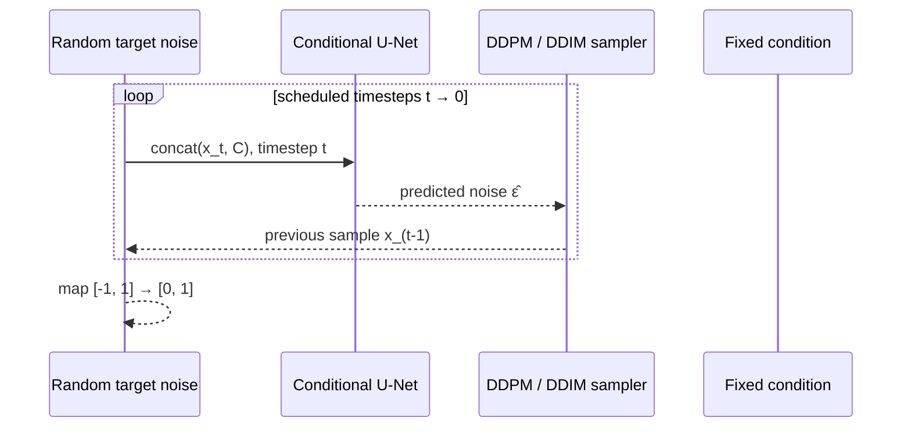

# Diffusion in one page

A diffusion model learns to reverse a gradual corruption process. In geo2wf, the clean object is the normalized target wind field—not the GEO condition.

## Forward process

For a randomly chosen timestep \(t\), Gaussian noise \(\epsilon\) is added directly in closed form:

\[
x_t = \sqrt{\bar\alpha_t}x_0 + \sqrt{1-\bar\alpha_t}\epsilon,
\qquad \epsilon \sim \mathcal N(0, I)
\]

`GaussianForwardProcess` precomputes \(\beta_t\), \(\alpha_t = 1-\beta_t\), and cumulative \(\bar\alpha_t\) for linear, cosine, quadratic, or sigmoid schedules.

## What the network sees

At training time, the U-Net receives a channel concatenation:

\[
[\;x_t^{\text{target}},\; x^{\text{condition}},\; m^{\text{condition}}\;]
\]

and a sinusoidal embedding of `t`. It predicts the noise \(\hat\epsilon_\theta\). The standard objective is masked mean-squared error:

\[
\mathcal L = \frac{\sum m\,(\epsilon - \hat\epsilon_\theta)^2}{\sum m}
\]

For residual-diffusion sparse completion, observed SAR pixels have weight 1 and
eligible off-swath ERA5 anchor pixels have the configured lower weight (0.1 in
the grouped default).

## Reverse process

Inference starts from Gaussian noise shaped like the target. The condition remains fixed while the sampler repeatedly asks the U-Net for a noise estimate.

## Why conditioning works

The network does not reconstruct GEO. GEO and optional ERA5 channels remain
fixed at every denoising step; the noisy target is the variable being refined.

Continue to [Conditional diffusion](../models/conditional-diffusion.md) for implementation details and [Sampling](../models/sampling.md) for DDPM/DDIM behavior.
