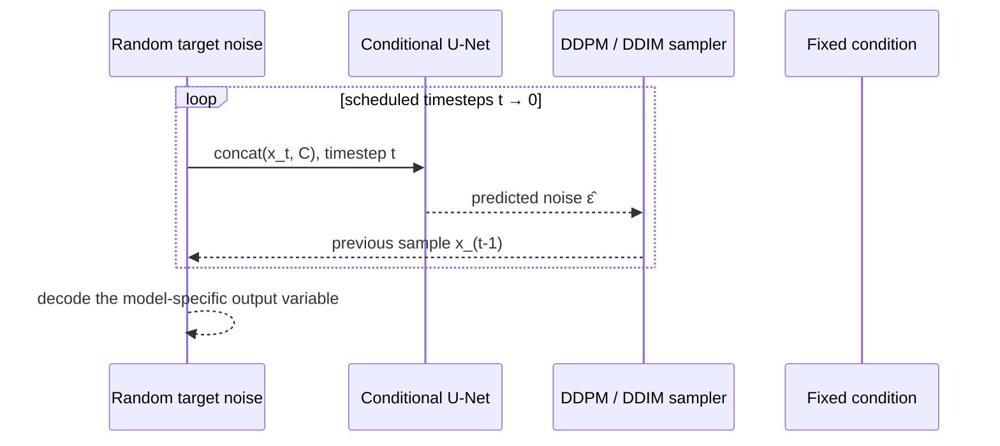

# Diffusion in one page

A diffusion model learns to reverse a gradual corruption process. In geo2wf,
the clean object (x_0) is the output variable chosen by the model—never the GEO
condition:

- standalone conditional diffusion uses the normalized absolute target field;
- Stage 2 uses an encoded signed SAR-minus-baseline residual.

## Forward process

For a randomly chosen timestep \(t\), Gaussian noise \(\epsilon\) is added directly in closed form:

\[
x_t = \sqrt{\bar\alpha_t}x_0 + \sqrt{1-\bar\alpha_t}\epsilon,
\qquad \epsilon \sim \mathcal N(0, I)
\]

`GaussianForwardProcess` precomputes \(\beta_t\), \(\alpha_t = 1-\beta_t\), and cumulative \(\bar\alpha_t\) for linear, cosine, quadratic, or sigmoid schedules.

## What the network sees

At training time, the U-Net receives a channel concatenation:

\[
[\;x_t,\; x^{\text{prepared condition}}\;]
\]

and a sinusoidal embedding of `t`. It predicts the noise \(\hat\epsilon_\theta\). The standard objective is masked mean-squared error:

\[
\mathcal L = \frac{\sum m\,(\epsilon - \hat\epsilon_\theta)^2}{\sum m}
\]

Prepared condition includes the condition-validity mask. Residual diffusion
also appends the frozen baseline and its mask. Its principal objective remains
epsilon-prediction MSE with Min-SNR weighting. Observed SAR pixels have weight
1, while eligible off-swath baseline pixels have the configured lower
zero-residual anchor weight (0.1 in the grouped default). Additional physical
structure terms act on the model's clean-residual estimate at selected lower
noise levels; they do not change the variable being diffused.

## Reverse process

Inference starts from Gaussian noise shaped like the target. The condition remains fixed while the sampler repeatedly asks the U-Net for a noise estimate.

For absolute conditional diffusion, decoding maps the sample from diffusion
space `[-1,1]` to normalized target space `[0,1]` and then to physical units.
For Stage 2, decoding inverts the signed residual transform, adds the result to
the same frozen baseline in m/s, and applies the configured physical bounds.

## Why conditioning works

The network does not reconstruct GEO. GEO and optional ERA5 channels remain
fixed at every denoising step; only the absolute target or residual latent is
updated. Conditioning narrows the learned distribution but does not make the
GEO-to-wind inverse mapping unique.

Continue to [Standalone conditional diffusion](../models/conditional-diffusion.md),
[Stage 2 residual diffusion](../models/residual-diffusion.md), or
[Sampling](../models/sampling.md).
