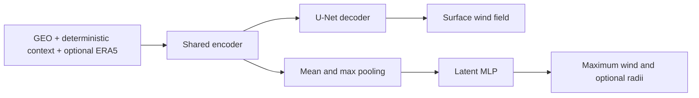

# Paper reasoning and methods

The accepted paper, *Nowcasting of Tropical Cyclone Wind Fields and Intensity
from Geostationary Imagery*, studies a practical question: can learning a
spatial surface-wind field improve estimates of tropical-cyclone intensity and
size, particularly during rapid intensification (RI)?

## Why predict the field as well as intensity?

Maximum sustained wind alone does not describe a storm's spatial extent or
integrated wind hazard. SAR wind retrievals resolve fine surface structure but
sample only occasional swaths. GOES and Himawari observe cloud structure
frequently, yet their infrared brightness temperatures do not directly measure
surface wind. Different surface winds can produce similar cloud patterns.

The paper uses sparse SAR supervision to teach spatial structure to an encoder
that also predicts best-track intensity and radii. At inference, the model
needs GEO imagery, storm-center and time context, and optionally ERA5. It does
not need a new SAR acquisition.

## Observations and supervision

| Source | Role |
|---|---|
| GOES ABI / Himawari AHI | Ten GEO bands, harmonized by band number, provide cloud and moisture information. |
| CyclObs SAR retrievals | Surface wind-speed fields supervise reconstruction inside the observed swath. |
| IBTrACS | Best-track centers, US-agency maximum wind, RMW, and wind radii supply geometry and scalar references. |
| ERA5 | Optional environmental context and a dense wind anchor for the residual model. |

Four deterministic channels encode distance to the storm center, local-solar-time
sine and cosine, and solar zenith angle. This gives 14 condition channels
without ERA5 and 23 with its nine source/derived fields, before model-specific
masks and helpers. The current raster loader uses 256 × 256 exports and
192 × 192 center crops. See the [dataset guide](../data/index.md) for the
published release and its relationship to the paper cohorts.

## Architecture comparisons

1. **Field U-Net:** reconstruct a wind field, then diagnose maximum wind and
   radii from that image. With ERA5, predict a physical residual around its
   wind field; without ERA5, predict absolute wind.
2. **Post-hoc MLP:** freeze the field model and learn an intensity correction
   from its output field and current metadata.
3. **Joint latent MLP:** share an encoder between the field decoder and an
   MLP acting on pooled latent features. Both spatial and scalar objectives
   update the representation.
4. **Encoder-only control:** remove the field decoder and SAR loss to test
   what spatial supervision contributes to scalar prediction.

The joint objective combines field and intensity Huber losses, plus an optional
masked radius term:

\[
L = w_f L_{\mathrm{field}} + w_v L_{V_{\max}} + w_r L_{\mathrm{radii}}.
\]

The retained joint presets use unit field/intensity weights and a radius
weight of 0.25 when enabled. Huber transitions are 2 m/s for fields, 5 m/s
for intensity, and 20 km for radii. Missing pixels and scalar labels are masked
independently. The [field-only model](../models/era5-residual.md) additionally
uses high-wind weighting and a peak term; the [joint model guide](../models/bottleneck-unet-mlp.md)
describes its implemented objective.

## What the evidence supports

The [results](../results.md) show that the GEO-only latent model improves
maximum-wind estimates over the field diagnostic and post-hoc correction in
the architecture comparison. Joint SAR and radius supervision is especially
useful during RI. ERA5 helps some configurations, but does not consistently
improve the joint model. This motivates observation-driven inference without
waiting for a reanalysis product.

The paper favors compact, interpretable comparisons given limited, unevenly
sampled training data. More extensive channel ablations, hyperparameter tuning,
and prospective evaluation remain future work.

## Interpretation and limits

SAR wind is a retrieval from radar backscatter, with rain, sea-state, and
high-wind calibration limitations. ERA5 is a reanalysis, not an independent
surface observation. IBTrACS is retrospective and mixes agency conventions;
scalar workflows use the documented `USA_WIND` contract. See the
[IBTrACS product description](https://www.ncei.noaa.gov/products/international-best-track-archive)
and [SAR retrieval description](https://www.star.nesdis.noaa.gov/socd/mecb/sar/tropical_gmf_tech_doc.php).

A plausible field outside the SAR footprint is a conditional reconstruction,
not an independently verified measurement. Field maxima, SAR peaks, and
best-track sustained winds are related but different quantities. Nearby
observations within a storm are correlated, and each reported experiment must
retain its actual cohort and split provenance. Near-real-time use also requires
an available storm center and evaluation with real-time inputs in place of
retrospective best-track information.
