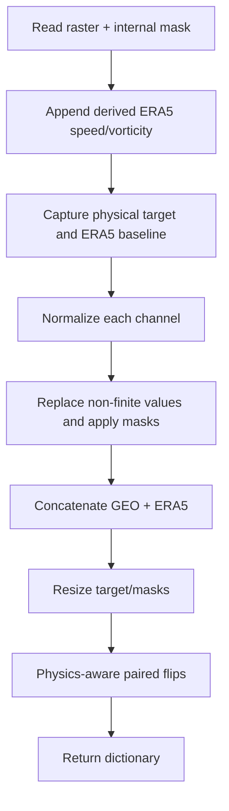

# Dataset contract

`PairedImageDataset` reads one split manifest and returns a dictionary. Fields used by the basic diffusion path are stable; ERA5 and physical-evaluation fields are added when available.

## Core sample

| Key | Shape | Meaning |
|---|---|---|
| `condition` | `[C, H, W]` | normalized GEO, optionally followed by normalized ERA5 context |
| `target` | `[1, H, W]` | normalized SAR wind speed or PMW brightness temperature |
| `condition_mask` | `[1, H, W]` | pixels valid across condition/context |
| `target_mask` | `[1, H, W]` | observed target pixels |
| `target_physical` | `[1, H, W]` | target values in source units, zero outside validity |
| `target_norm_offset` | `[1]` | affine inverse-normalization offset |
| `target_norm_scale` | `[1]` | affine inverse-normalization scale |
| `condition_bounds` | `[4]` | left, right, bottom, top |
| `target_bounds` | `[4]` | left, right, bottom, top |
| `center` | `[2]` | IBTrACS latitude, longitude used by evaluation |
| `sample_id` | string | stable pair identifier |
| `meta` | mapping | source types, sensors, time gap, and channel names |

ERA5-enabled SAR samples also return normalized and physical `era5_wind_speed`, plus `era5_wind_speed_mask`.

!!! important "Center metadata is not a model condition"
    `center` and `target_bounds` establish the coordinate frame for
    storm-centric metrics. Neither model concatenates them to its input
    channels. In particular, `center` is read from
    `ibtracs_center_lat`/`ibtracs_center_lon`, not from the exported raster's
    `center_lat`/`center_lon`. See
    [Evaluation & metrics](../experiments/evaluation.md#eye-center-displacement)
    for the full eye-location calculation.

## Runtime transform order



Condition rasters are not resized in the current loader; the export is expected to produce the configured grid. Targets and relevant masks/baselines are bilinearly or nearest-neighbor resized to `target_size` as appropriate.

## Condition mask channel

The mask is **not** included in `batch["condition"]`. `PixelDiffusionConditional._prepare_condition()` maps the normalized condition from `[0,1]` to `[-1,1]` and appends the single binary mask. Therefore:

```text
model.in_channels = dataset condition channels + 1
unet.channels      = model.in_channels + model.out_channels
unet.out_dim       = model.out_channels
```

For 10 GEO + 9 ERA5 fields + distance + 3 solar-time fields, these become 23,
24, and 1 respectively.

The deterministic residual model handles masks differently: it receives 23 condition channels, then appends condition mask, explicit ERA5 wind, and ERA5 mask internally, giving its compact U-Net 26 input channels.

## Split behavior

By default, checked-in configs set `include_test_in_train: true`, concatenating test into training while keeping validation separate. This is intentional in the current experiment presets but is not conventional held-out evaluation. Set it to `false` when the test split must remain untouched for final reporting.

Validation is storm-stratified by round-robin reordering, which matters when `limit_val_batches` observes only a prefix.

## Manifest diagnostics

The exported manifests can be enriched with physical SAR/ERA5 and
storm-relative diagnostics:

```bash
.venv/bin/python scripts/enrich_dataset_manifests.py \
  --root data/geotiff/geo_sar_10bands_era5
```

The command updates the root and split manifests in place, preserving their
rows and original columns. It adds SAR and ERA5 maximum wind, robust top-0.5%
peak, p95/p99, mean, valid-pixel counts, 0--20 km eye, 0--100 km core,
20--60 km ring, radial-profile/RMW/R64 diagnostics, SAR-minus-ERA5 differences,
storm-relative sample timing, and versioned quality flags. The thresholds used
for `sar_quality_usable_v1`, `sar_well_developed_v1`, `sar_high_intensity_v1`,
and `sar_weak_v1` are recorded in
`manifest-metadata-summary.json`.

The local manifests contain the IBTrACS center but not the upstream intensity
track table, so `ibtracs_msw_ms`, category, and storm-intensity-phase fields are
reported as unavailable rather than estimated from SAR. Those fields can be
joined later without changing the raster-derived columns.
