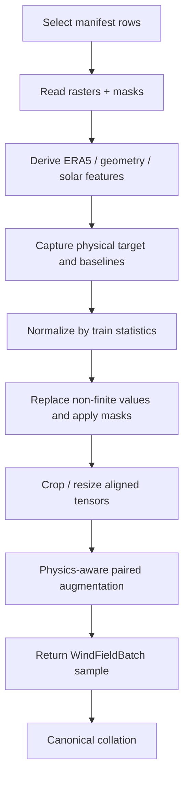

# Dataset contract

Datasets return tensor-oriented samples described by `WindFieldBatch`. The
canonical collator stacks tensors and identifiers but keeps
metadata as one mapping per sample.

## Required sample fields

| Key | Sample shape | Batched shape | Meaning |
|---|---|---|---|
| `condition` | `[C,H,W]` | `[B,C,H,W]` | normalized GEO and optional normalized context/features |
| `condition_mask` | `[1,H,W]` | `[B,1,H,W]` | valid condition/context pixels |
| `target` | `[T,H,W]` | `[B,T,H,W]` | normalized target |
| `target_physical` | `[T,H,W]` | `[B,T,H,W]` | target in source units |
| `target_mask` | `[1,H,W]` | `[B,1,H,W]` | observed target pixels |
| `target_norm_offset` | broadcastable | batched | affine inverse-normalization offset |
| `target_norm_scale` | broadcastable | batched | affine inverse-normalization scale |
| `condition_bounds` | `[4]` | `[B,4]` | left, right, bottom, top |
| `target_bounds` | `[4]` | `[B,4]` | left, right, bottom, top |
| `center` | `[2]` | `[B,2]` | IBTrACS latitude/longitude for diagnostics |
| `sample_id` | string | `list[str]` | stable sample identifier |
| `meta` | mapping | `list[SampleMetadata]` | source/sensor/time/channel provenance |

`validate_batch()` checks required keys and tensor types at the shared model
boundary. Dataset-specific tests remain responsible for shapes, dtypes, finite
values, mask alignment, and normalization equivalence.

## Optional companions

| Companion | Fields |
|---|---|
| ERA5 baseline | `era5_wind_speed`, `era5_wind_speed_physical`, `era5_wind_speed_mask` |
| PMW | `pmw`, `pmw_physical`, `pmw_mask`, `pmw_bounds` |
| IBTrACS | per-sample `ibtracs` mappings |

Rows are filtered as needed so all samples in a loader have a consistent set of
tensor keys. PMW can remain separate or be appended as configured; the base
GEO/ERA5 mask is not intersected with partial PMW coverage.

## Canonical collation

```python
from torch.utils.data import DataLoader
from geo2wf.data.collation import collate_wind_field_samples

loader = DataLoader(dataset, collate_fn=collate_wind_field_samples)
```

Default PyTorch collation transposes nested metadata into a mapping of batched
values. The canonical collator instead returns `batch["meta"]` and optional
`batch["ibtracs"]` as sample-oriented lists, preserving mixed strings and
numbers without changing tensor batching.

## `DataSpec`

Every data module exposes capabilities before training:

```python
DataSpec(
    condition_channels=("CMI_C07", "..."),
    target_channels=("wind_speed",),
    spatial_shape=(192, 192),
    target_units="m s-1",
    companions=frozenset({"era5_wind_speed"}),
)
```

Models validate this object before the first training or inference batch. The
ordered names, rather than only the channel count, make resolved configs and mismatch
errors interpretable. Models with extra requirements should override
`validate_data_spec()`.

## Runtime transform order



Raw-data storm inference and exported-raster loading use the same normalization
and feature functions wherever their inputs overlap.

## Condition mask and channel arithmetic

The mask is not included in `batch["condition"]`. Models append it internally
when required. For the common10 + ERA5 dataset:

```text
10 GEO + 9 ERA5 + distance + 3 solar = 23 data condition channels
```

Standalone conditional diffusion prepares 24 channels after appending the mask
and concatenates one noisy target channel. The deterministic model appends its
condition mask, explicit ERA5 wind, and ERA5 mask. Residual diffusion also adds
the chosen baseline and baseline mask. See each model page instead of inferring
one family's internal width from another.

## Split behavior

Modular data configs default to `include_test_in_train: false`. Some historical
full-YAML research presets intentionally use `true`; those runs must not report
their test metrics as held-out generalization. Validation ordering remains
storm-stratified so bounded validation samples storms rather than a raw manifest
prefix.

## Center metadata

`center` and `target_bounds` define the coordinate frame for storm diagnostics.
The center comes from `ibtracs_center_lat`/`ibtracs_center_lon`, not the raster
crop center. Neither scalar is directly concatenated as a model condition; the
derived distance raster is the model input.
