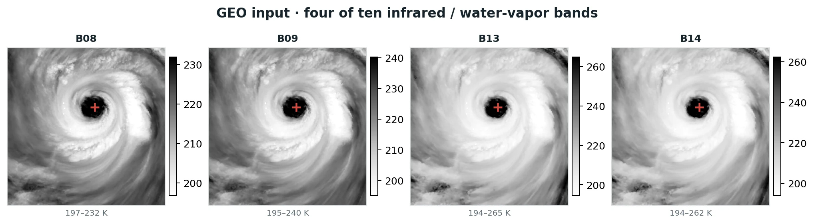
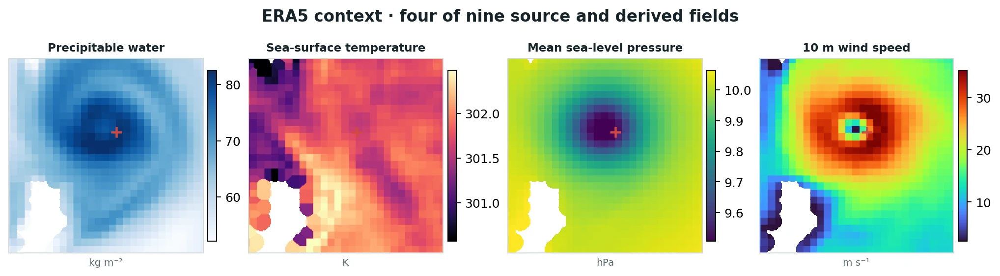
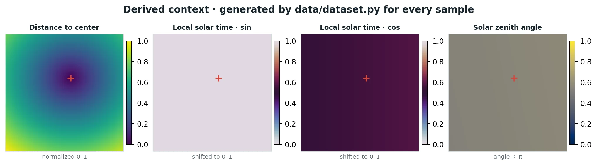

# Model inputs and training targets

This page describes exactly what enters each model. The figures are not illustrations: they are Matplotlib renders of exported GeoTIFFs and derived tensors from sample `WP232024_sar_geo_20241030095303_bb2c52ca`.

## At a glance

| Family | Channels | Used by Stage 1 | Used by Stage 2 | Role |
|---|---:|:---:|:---:|---|
| GEO | 10 | yes | yes | cloud-top and water-vapor structure |
| ERA5 source + derived | 9 | yes | yes | large-scale atmospheric and surface context |
| Storm geometry + solar time | 4 | yes | yes | storm-relative position and illumination |
| Condition-validity mask | 1 | yes | yes | distinguishes data from missing pixels |
| Explicit ERA5 wind + mask | 2 | yes | baseline computation | physical anchor |
| Frozen Stage 1 baseline + mask | 2 | output | yes | field refined by diffusion |
| Noisy residual | 1 | no | yes | variable denoised at the current timestep |
| SAR wind + target mask | 1 + 1 | training only | training only | supervision and observed footprint |

The distinction matters: **SAR is never an inference input.** At inference, Stage 1 receives observation/context tensors and produces a baseline. Stage 2 receives the same context plus that frozen baseline and a noise latent.

## GEO imagery

<span class="channel-count">10</span> The `common10` condition uses bands 7–16 from GOES ABI or Himawari AHI. Each band is a separate normalized channel; the model does not receive a false-color RGB composite.

<figure class="modality-example">
  <a href="../assets/images/data-example-geo.webp"></a>
  <figcaption>Four of the ten real AHI channels in the selected sample. The red plus marks the IBTrACS center. Values are shown in kelvin with per-panel 1st–99th percentile display limits.</figcaption>
</figure>

The ten-channel set is `B07` through `B16` for AHI and `CMI_C07` through `CMI_C16` for ABI. The channels span mid-level and upper-level water vapor, window infrared, and split-window information. See [Export GEO–SAR](export-geo-sar.md) for sensor-name mapping and pairing.

## ERA5 context

<span class="channel-count">9</span> The exporter stores seven ERA5 variables: precipitable water, sea-surface temperature, mean sea-level pressure, 2 m temperature, 2 m dewpoint, and the two 10 m wind components. The loader adds 10 m wind speed and relative vorticity.

<figure class="modality-example">
  <a href="../assets/images/data-example-era5.webp"></a>
  <figcaption>Four of the nine real source and derived ERA5 fields on the same grid. ERA5 is smoother than GEO or SAR by construction; it supplies environmental context and the initial physical wind anchor.</figcaption>
</figure>

ERA5 wind speed is used twice on purpose:

1. its normalized form is available as a context channel; and
2. an explicit target-normalized wind field and validity mask are appended inside Stage 1.

That explicit path makes the residual connection unambiguous: the deterministic prediction begins as ERA5 and learns a correction in m/s.

## Storm geometry and solar context

<span class="channel-count">4</span> These fields are generated in `geo2wf.data.features` after the rasters are read. They are deterministic functions of raster bounds, the manifest’s IBTrACS center, and the GEO timestamp.

<figure class="modality-example">
  <a href="../assets/images/data-example-derived.webp"></a>
  <figcaption>The exact derived tensors for the selected sample: normalized great-circle distance, local-solar-time sine and cosine, and solar zenith divided by π. These are model inputs, not plotting overlays.</figcaption>
</figure>

The distance raster gives the network a storm-relative coordinate without passing scalar latitude/longitude into the model. Local solar time varies by pixel longitude and includes the equation-of-time correction. The sine/cosine pair avoids a discontinuity at midnight; solar zenith helps the model distinguish daylight-dependent imagery.

## Physical anchor, SAR target, and masks

<figure class="modality-example">
  <a href="../assets/images/data-example-target.webp"></a>
  <figcaption>ERA5 wind is dense; the matched SAR target is a sparse observed swath. The target mask is the authority on where SAR loss and metrics are valid. All three panels use the same 256 × 256 EPSG:4326 grid.</figcaption>
</figure>

`condition_mask`
: Marks pixels supported across GEO and ERA5. The models append it as a channel so normalized zero is not confused with missing data.

`era5_wind_speed_mask`
: Limits the explicit physical anchor, off-swath constraints, and baseline comparisons to valid ERA5 pixels.

`target_mask`
: Marks observed SAR pixels. Supervised loss and target-based metrics ignore everything outside it.

The residual models may apply a weak off-swath zero-correction anchor where ERA5 is valid. That is a regularizer; it does not relabel ERA5 as observed SAR.

## Exact tensor assembly

The dataset returns 23 condition channels:

```text
10 GEO
 9 ERA5 source + derived
 1 distance to IBTrACS center
 3 solar-time fields
──
23 data condition channels
```

Stage 1 assembles:

```text
23 data condition
 1 condition mask
 1 explicit ERA5 wind
 1 ERA5-valid mask
──
26 deterministic U-Net input channels
```

Stage 2 assembles:

```text
 1 noisy residual
24 prepared condition channels (23 data + condition mask)
 1 frozen Stage 1 baseline
 1 baseline-valid mask
──
27 diffusion U-Net input channels
```

Continue to [the two-stage model](../models/two-stage.md) to see what each network does with these tensors, or open the [dataset contract](dataset-contract.md) for returned keys and shapes.

## From source files to a batch


The exporter keeps raw physical values, CRS, geotransform, band descriptions, masks, and provenance tags in the GeoTIFFs. `stats.json` is learned from valid training pixels only; validation and test samples do not update normalization statistics.

## Reproduce these figures

Run the checked-in renderer from the repository root:

```bash
uv run python scripts/render_docs_data_examples.py
```

The selected sample, timestamps, sensors, and grid settings are recorded in [`data-example-metadata.json`](../assets/images/data-example-metadata.json). Change `--sample-id` to render another row from the split manifest.

## Related articles

- [Dataset contract](dataset-contract.md) — returned tensors, shapes, and metadata.
- [Normalization & masks](normalization.md) — transforms, invalid pixels, and sparse completion.
- [Export GEO–SAR](export-geo-sar.md) — observation pairing and GeoTIFF creation.
- [Visual examples](../experiments/visual-examples.md) — paired observations and validation panels.
