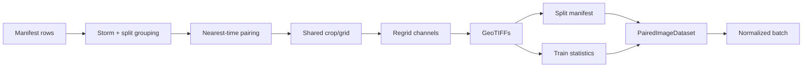

# Data pipeline

The data layer deliberately separates expensive geospatial preparation from fast training-time tensor work.



## Source families

| Family | Role | Channels used |
|---|---|---|
| GEO | condition | `common4` or `common10`, mapped across ABI/AHI names |
| SAR | supervised target | one `wind_speed` channel |
| PMW | proxy target | one sensor-specific ~89–92 GHz V-polarized brightness-temperature channel |
| ERA5 | optional context / baseline | seven source fields plus derived 10 m speed and relative vorticity |
| IBTrACS metadata | geometry | storm center coordinates carried in the manifest |

The GEO `common4` mapping uses ABI `CMI_C08`, `C09`, `C13`, `C14` or AHI `B08`, `B09`, `B13`, `B14`. `common10` covers bands 7 through 16 for either sensor family.

## Pairing and grid

Pairing is performed within a dataset split and storm, with a default maximum GEO/target separation of 0.5 hours. This prevents observations from different storms or train/validation/test partitions from crossing.

The default target grid is:

- 256 × 256 pixels;
- 0.027 degrees per pixel;
- EPSG:4326;
- centered on the source image center by default; and
- shifted just enough to include the IBTrACS center when configured.

The exporter writes raw values, internal validity masks, band descriptions, geotransform, CRS, and provenance-like tags. Normalization stays outside the GeoTIFF so the stored artifact remains interpretable in physical units.

## Export artifacts

```text
<output_root>/
├── stats.json
├── skipped.csv              # when samples fail export
├── train/
│   ├── manifest.csv
│   ├── <sample>_geo.tif
│   ├── <sample>_era5.tif    # optional
│   └── <sample>_sar.tif     # or _pmw.tif
├── val/
└── test/
```

`stats.json` records per-source, per-channel min, max, mean, standard deviation, quartiles, median, robust scale, and count. Only train samples update the accumulator; validation and test do not influence normalization.

## Where to continue

<div class="grid cards" markdown>

- **SAR supervision** — [Export GEO–SAR](export-geo-sar.md)
- **Proxy pretraining** — [Export GEO–PMW](export-geo-pmw.md)
- **Runtime tensors** — [Dataset contract](dataset-contract.md)
- **Statistics and validity** — [Normalization & masks](normalization.md)

</div>
