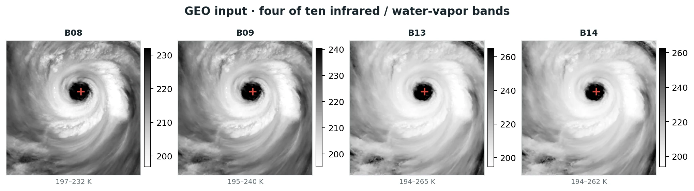
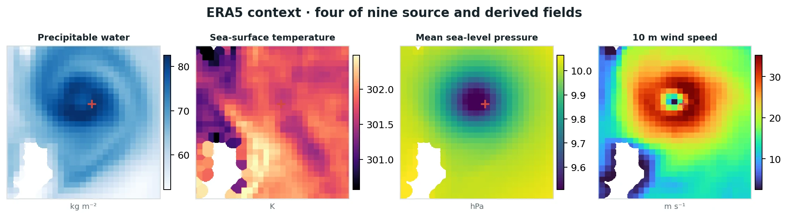
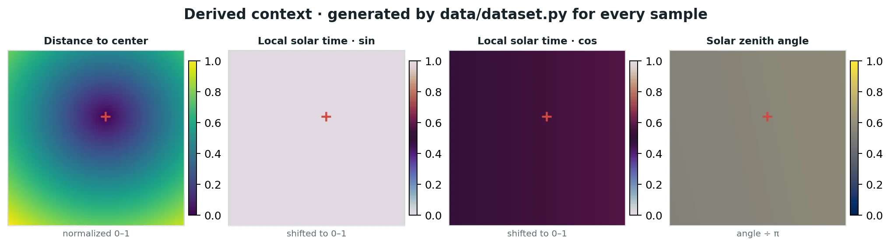
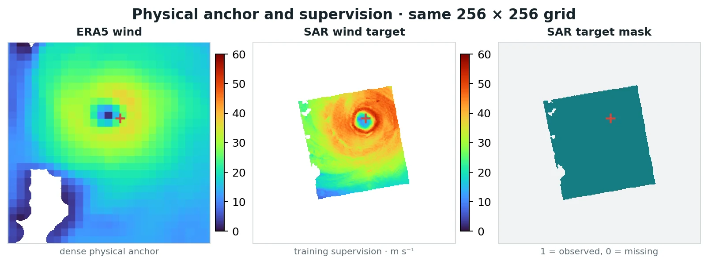

# Dataset and access

The scientific dataset is hosted at
[**simon-donike/geo2wf-data** on Hugging Face](https://huggingface.co/datasets/simon-donike/geo2wf-data).
Its companion model repository is
[**simon-donike/geo2wf-models**](https://huggingface.co/simon-donike/geo2wf-models).
Git contains the loaders, models, and usage docs; scientific data files are
stored separately.

## What the release contains

The published dataset card reports **96,109 catalog samples**, **14,471
observation representations**, **22 source cohorts**, and **18,940 scientific
assets** (32.9 GB in decimal units). Catalog rows span processing versions,
scalar forecast sequences, paired imagery, and case-study products. They are
not 96,109 independent satellite images or a single universal train/test split.

| Directory | Contents |
|---|---|
| `index/` | Sample, observation, asset, and storm catalogs in Parquet and CSV |
| `cohorts/` | Ordered source experiment manifests |
| `effective-cohorts/` | Loader eligibility, RI labels, and historical training membership |
| `assets/` | Processed GeoTIFFs, case-study NetCDFs, derived NPZ fields, and caches |
| `normalization/` | Fixed statistics associated with the original exports |
| `labels/` | Track and intensity references |
| `reference-results/` | Paper, case-study, and dashboard outputs |
| `provenance/` | Original indexes, processing metadata, and path mappings |

Consult the Hub's `schema.json`, `release.json`, and `SHA256SUMS` for the
schema, inventory, and checksums. Optional modalities are absent when
unavailable. The release includes processed training GeoTIFFs and source
NetCDFs for Humberto, Kiko, and Otis; upstream raw training granules must be
acquired separately to rebuild the exports. Source attribution and reuse terms
are recorded in the dataset's `ATTRIBUTION.md`.

## Browse and download

With the [Hugging Face CLI](https://huggingface.co/docs/huggingface_hub/en/guides/cli)
installed, download just the metadata first:

```bash
hf download simon-donike/geo2wf-data README.md schema.json release.json SHA256SUMS \
  --repo-type dataset \
  --local-dir data/geo2wf-hub
```

Download catalog tables separately with `--include 'index/*'` in place of the
four filenames. Use `--revision <full-commit-hash>` to pin a release. Scientific rasters are
separate assets; downloading the indexes alone does not provide training data.
The [dataset card](https://huggingface.co/datasets/simon-donike/geo2wf-data#download-and-reproduce)
describes release-specific download profiles and source requirements.
Those release tools are separate from this slim checkout. Its current loaders
expect the [local export layout](dataset-contract.md), not a Hub catalog root
passed directly to `data.root`.

## Inputs and targets

| Source | Channels / quantity | Use |
|---|---|---|
| GEO | ABI `CMI_C07`–`CMI_C16` or AHI `B07`–`B16` | Ten separate input bands |
| ERA5 | Water vapor, SST, pressure, 2 m temperature/dewpoint, 10 m u/v; derived wind speed and vorticity | Nine optional context channels |
| Geometry and solar time | Center distance, local-solar-time sine/cosine, solar zenith | Four derived input channels |
| SAR | Retrieved surface wind speed in m/s and a validity mask | Field supervision |
| IBTrACS | `USA_WIND` and available wind radii | Scalar supervision and storm geometry |

SAR is used during training and evaluation, not as an inference input. PMW
companions can be retained by the data loader but are not required by the
paper's GEO-based models. ERA5 supplies environmental context; it is not truth.









These figures show sample `WP232024_sar_geo_20241030095303_bb2c52ca` on its
256 × 256 export grid. Current training presets take a 192 × 192 center crop.
The rasters use EPSG:4326 at 0.027° spacing; physical pixel distances vary with
latitude. [Figure metadata](../assets/images/data-example-metadata.json)
records the sources and rendering settings.

## Cohorts and paper counts

The paper reports 841/232/212 train/validation/test samples from 115/34/38
storms before the additional center-valid restriction described for its
supervision ablation. These counts describe the paper's processing cohort.
The [1,205-row website inventory](full-dataset.md) describes a different paired
export, and the [StormSense manifest](storm-manifest.md) describes dense
case-study observations. Neither is the complete Hugging Face catalog.

The release preserves actual experiment membership in `effective-cohorts/`.
Its provenance distinguishes architecture test results from latent-ablation
validation results and records historical training/test overlap for an
auxiliary field model. Use those records when assessing a checkpoint;
do not treat the combined catalog as a newly held-out benchmark.
