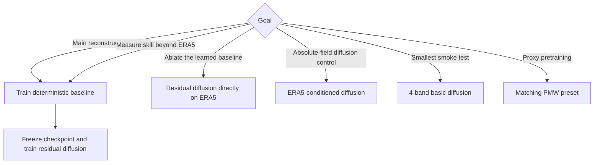

# Choose an experiment

Use the two-stage pair for the main system:

1. `config_geo_sar_10bands_era5_residual.yaml` trains the deterministic baseline.
2. `config_geo_sar_10bands_era5_diffusion_residual_deterministic.yaml` freezes that checkpoint and trains residual diffusion.

The checked-in pair uses the validated peak-aware Stage 1 objective and the
structured-asinh Stage 2 objective with CFG guidance 1.2. Both presets retain
`include_test_in_train: true`; use the ablation configs and runner for a
controlled comparison.

[Read the two-stage workflow before launching the stack.](../models/two-stage.md)

## Preset matrix

| Config | Task | Condition | Model | Devices |
|---|---|---|---|---:|
| `config_geo_sar_10bands_era5_residual.yaml` | improve ERA5 toward SAR | 10 GEO + 9 ERA5 + derived | **Stage 1 deterministic baseline** | 1 auto |
| `config_geo_sar_10bands_era5_diffusion_residual_deterministic.yaml` | refine frozen Stage 1 | same + Stage 1 field | **Stage 2 residual diffusion** | 2 auto |
| `config_geo_sar_10bands_era5_pmw_residual.yaml` | Stage 1 with ≤1 h PMW | base + PMW value/mask/offset | PMW deterministic candidate | 2 auto |
| `config_geo_sar_10bands_era5_pmw_diffusion_residual_deterministic.yaml` | refine PMW Stage 1 | same + PMW Stage 1 field | PMW diffusion candidate | 2 auto |
| `config_geo_sar_10bands_era5_diffusion_residual.yaml` | refine ERA5 directly | 10 GEO + 9 ERA5 + derived | residual-diffusion ablation | 2 auto |
| `config_geo_sar_10bands_era5.yaml` | GEO + ERA5 → SAR | 10 GEO + 9 ERA5 + derived | absolute diffusion | 2 auto |
| `config.yaml` | GEO → SAR | 4 GEO + derived | basic absolute diffusion | 1 auto |
| `config_geo_sar_10bands.yaml` | GEO → SAR | 10 GEO + derived | absolute diffusion | 1 auto |
| `config_geo_sar_2gpu.yaml` | GEO → SAR | 4 GEO + derived | absolute diffusion | 2 GPU |
| `config_geo_sar_10bands_2gpu.yaml` | GEO → SAR | 10 GEO + derived | absolute diffusion | 2 GPU |
| `config_pretrain_geo_pmw.yaml` | GEO → PMW | 4 GEO + derived | proxy diffusion | 1 auto |
| `config_pretrain_geo_pmw_10bands.yaml` | GEO → PMW | 10 GEO + derived | proxy diffusion | 1 auto |
| `config_pretrain_geo_pmw_10bands_era5.yaml` | GEO + ERA5 → PMW | 10 GEO + 9 ERA5 + derived | proxy diffusion | 1 auto |

Each checked-in YAML is a complete preset, not an inheritance layer.

## Decision guide

## Comparability checks

- Keep the export root and split policy constant across models.
- Checked-in presets use `include_test_in_train: true`; set it to `false` for a true held-out test.
- Stage 2 must use the exact Stage 1 checkpoint named by `model.residual.baseline.checkpoint_path` or `GEO2WF_BASELINE_CKPT`.
- Residual models predict in physical m/s; their losses are not numerically comparable with normalized absolute-diffusion noise MSE.
- DDPM and 100-step DDIM have very different validation costs.
- Compare Stage 2 against its own frozen baseline using `baseline_mae_ms` and `mae_skill_vs_baseline`.
- For probabilistic refinement, inspect individual members as well as CRPS, spread, diversity, and the ensemble mean.

Continue to the [configuration guide](configuration.md), then [training and checkpoints](training.md).
