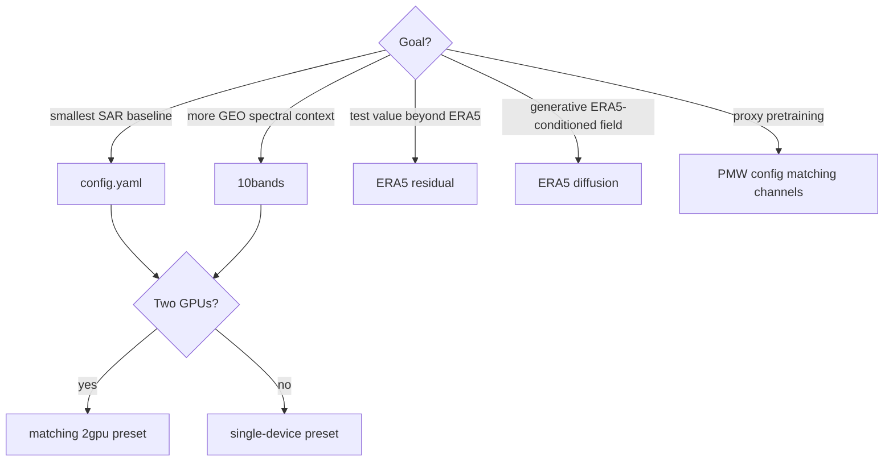

# Choose an experiment

The checked-in configs are presets, not inheritance layers. Each is a complete experiment description for the sections it contains.

| Config | Task | Condition | Model | Devices |
|---|---|---|---|---:|
| `config.yaml` | GEO → SAR | 4 GEO | diffusion, linear/DDPM | 1 auto |
| `config_geo_sar_10bands.yaml` | GEO → SAR | 10 GEO | diffusion, linear/DDPM | 1 auto |
| `config_geo_sar_2gpu.yaml` | GEO → SAR | 4 GEO | diffusion | 2 GPU |
| `config_geo_sar_10bands_2gpu.yaml` | GEO → SAR | 10 GEO | diffusion | 2 GPU |
| `config_geo_sar_10bands_era5.yaml` | GEO + ERA5 → SAR | 10 GEO + 9 ERA5 | cosine diffusion, 100-step DDIM, EMA | 2 auto |
| `config_geo_sar_10bands_era5_residual.yaml` | improve ERA5 toward SAR | 10 GEO + 9 ERA5 | deterministic residual | 1 auto |
| `config_pretrain_geo_pmw.yaml` | GEO → PMW | 4 GEO | diffusion | 1 auto |
| `config_pretrain_geo_pmw_10bands.yaml` | GEO → PMW | 10 GEO | diffusion | 1 auto |
| `config_pretrain_geo_pmw_10bands_era5.yaml` | GEO + ERA5 → PMW | 10 GEO + 9 ERA5 | diffusion | 1 auto |

## Decision guide

## Important comparability choices

- Keep the exported data root and split policy constant when comparing models.
- `include_test_in_train: true` is active in all presets; disable it for a true held-out test.
- The ERA5 diffusion config uses robust condition normalization and min–max target normalization, unlike basic presets.
- DDPM and 100-step DDIM have very different validation cost.
- The residual baseline predicts in physical m/s; normalized diffusion losses are not directly comparable to residual Huber loss.
- Two-GPU configs use per-device batch size 2, giving global batch size 4 before gradient accumulation.

Continue to the [configuration guide](configuration.md) before changing channel counts or resume behavior.
