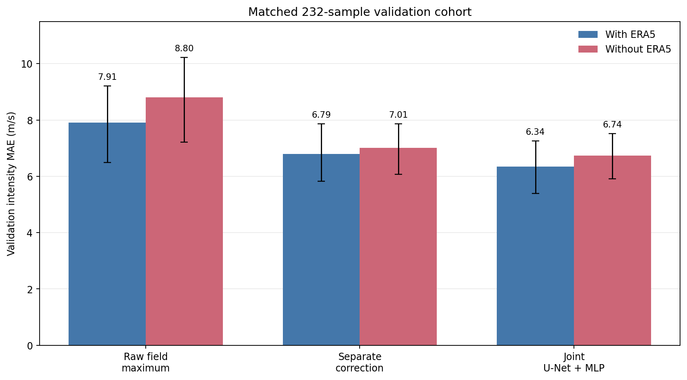
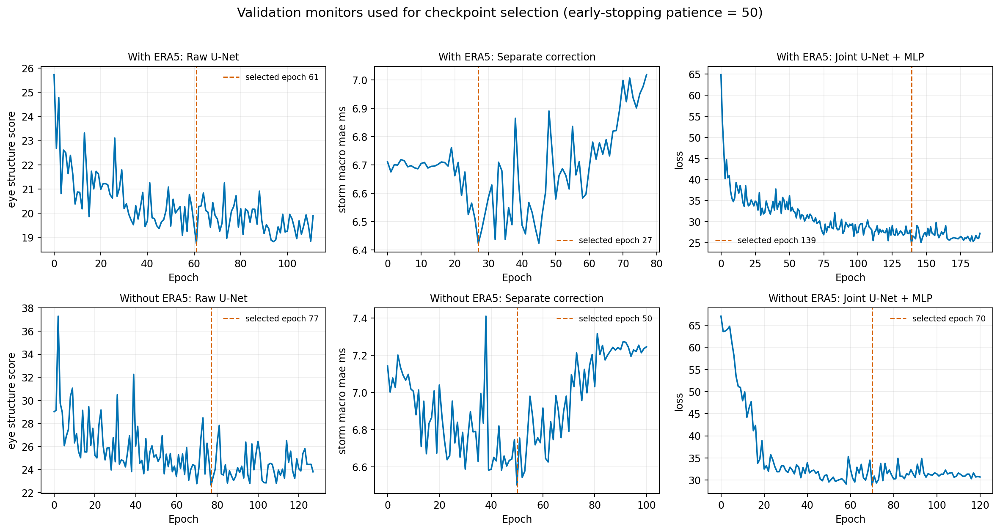
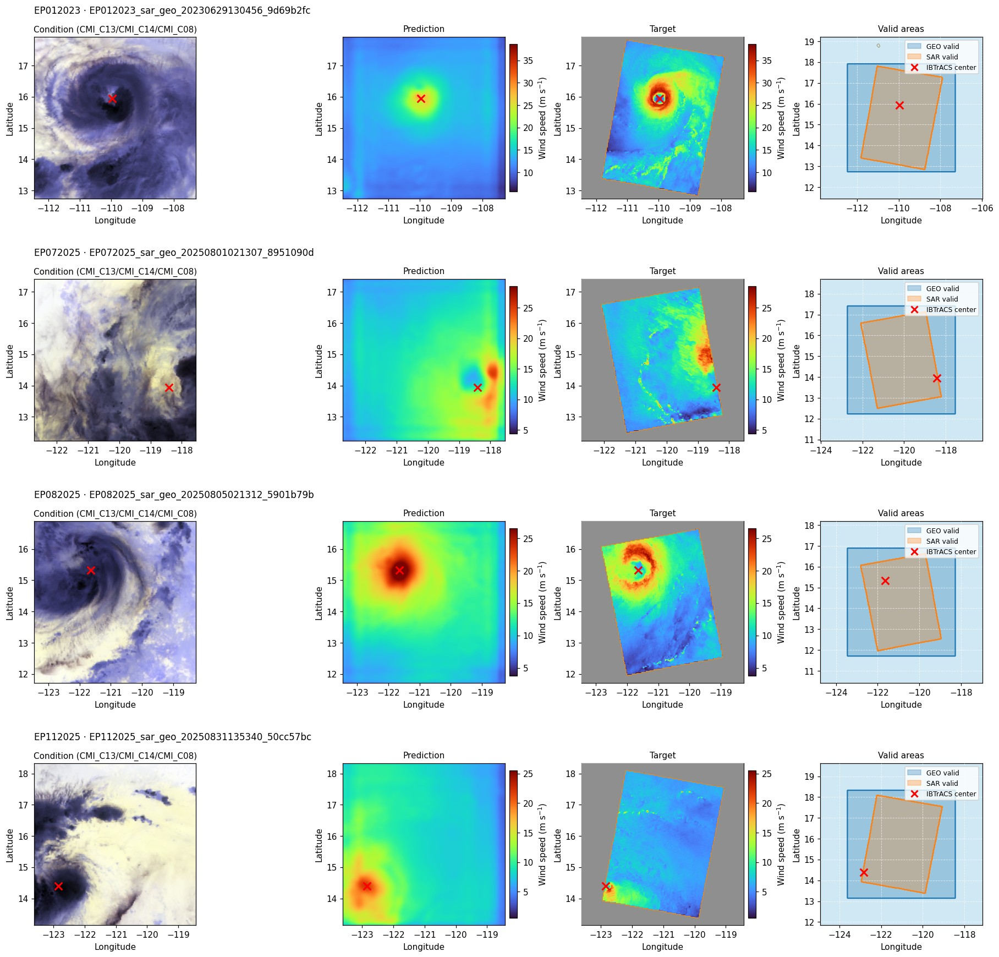
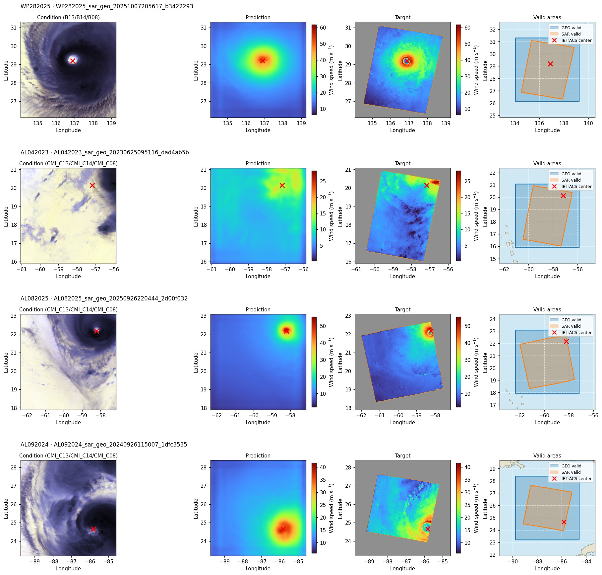
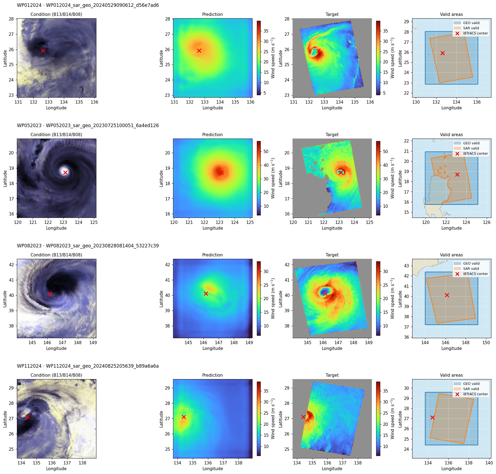
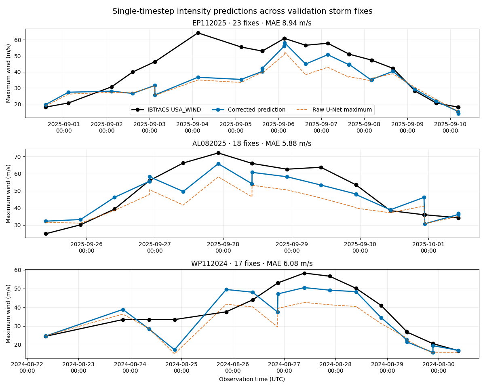
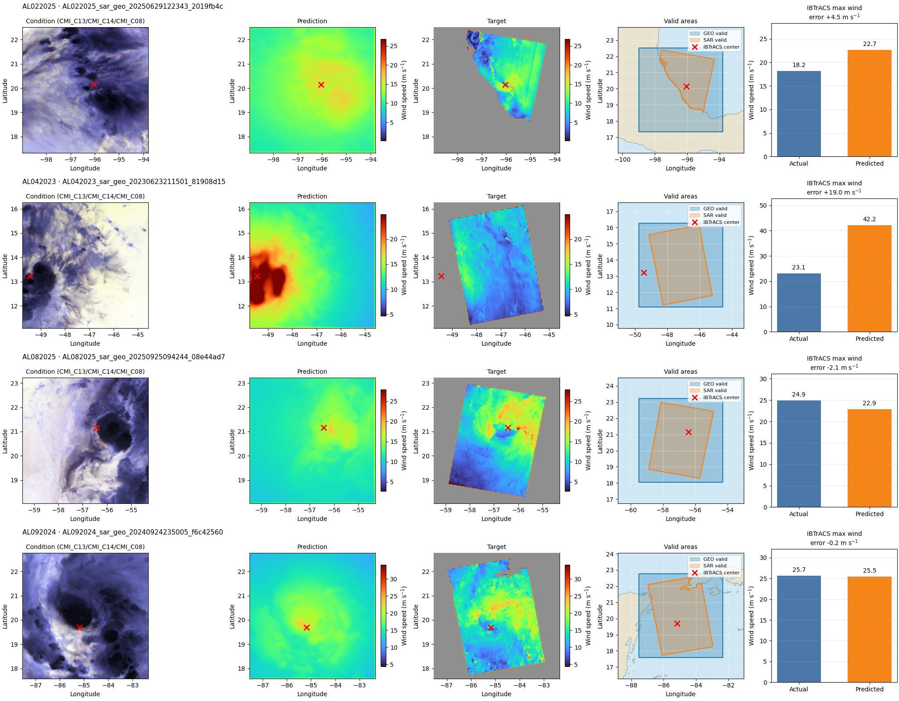
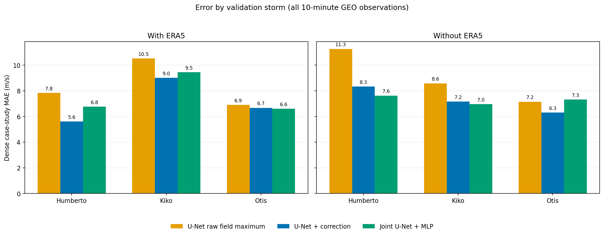

# Intensity reconstruction benchmark

This report compares the raw U-Net field maximum, a separately trained U-Net plus correction network, and the jointly trained U-Net+MLP. Every model is evaluated once with ERA5 conditioning and once without it.

!!! warning "Validation results, not a final test claim"
    The matched benchmark and the Humberto, Kiko, and Otis trajectories are all from the `val` split. None of these storm IDs occurs in training, but validation metrics were used for early stopping and checkpoint selection. These are model-selection diagnostics, not an unbiased held-out test estimate.

## Main result

On the matched **232-observation, 34-storm** validation cohort, the joint model has the lowest intensity MAE: **6.344 m/s with ERA5** and **6.738 m/s without ERA5**. With ERA5, the separate correction reaches **6.786 m/s**, versus **7.910 m/s** for the raw field maximum. The storm-bootstrap intervals for both learned scalar heads' improvement over the raw maximum exclude zero in both regimes.



[Download validation results as CSV](../assets/data/intensity-comparison/validation-results.csv){ .md-button }

## Matched validation tables

### With ERA5

| Model | n | MAE (95% CI), m/s | Δ MAE vs raw, m/s | RMSE, m/s | Bias, m/s | Storm-macro MAE, m/s | Exact category | Macro F1 | Within one | Field MAE / RMSE / bias, m/s |
|---|---:|---:|---:|---:|---:|---:|---:|---:|---:|---:|
| U-Net raw field maximum | 232 | 7.910 (6.495–9.205) | 0.000 | 10.312 | -5.160 | 6.785 | 0.487 | 0.265 | 0.784 | 2.032 / 3.097 / -0.287 |
| U-Net + correction | 232 | 6.786 (5.823–7.863) | -1.124 (-1.902–-0.235) | 8.847 | -2.368 | 6.422 | 0.487 | 0.330 | 0.901 | — / — / — |
| Joint U-Net + MLP | 232 | 6.344 (5.392–7.254) | -1.566 (-2.686–-0.228) | 8.606 | -0.800 | 5.693 | 0.522 | 0.362 | 0.875 | 2.205 / 3.208 / 0.434 |

### Without ERA5

| Model | n | MAE (95% CI), m/s | Δ MAE vs raw, m/s | RMSE, m/s | Bias, m/s | Storm-macro MAE, m/s | Exact category | Macro F1 | Within one | Field MAE / RMSE / bias, m/s |
|---|---:|---:|---:|---:|---:|---:|---:|---:|---:|---:|
| U-Net raw field maximum | 232 | 8.804 (7.212–10.223) | 0.000 | 11.521 | -6.285 | 7.324 | 0.448 | 0.256 | 0.806 | 3.604 / 4.960 / -0.307 |
| U-Net + correction | 232 | 7.011 (6.063–7.861) | -1.793 (-2.700–-0.806) | 9.060 | -1.549 | 6.503 | 0.509 | 0.354 | 0.879 | — / — / — |
| Joint U-Net + MLP | 232 | 6.738 (5.914–7.511) | -2.067 (-3.162–-0.735) | 8.655 | 0.179 | 7.021 | 0.496 | 0.330 | 0.914 | 3.725 / 4.934 / 0.280 |

The two tables use identical sample IDs. ERA5 therefore changes only the conditioning available to the models, not the evaluation cohort.

## What each metric measures

Let the scalar error be `prediction − IBTrACS target` for one observation.

| Metric | Calculation and interpretation |
|---|---|
| **Intensity MAE** | Mean absolute scalar error. It describes the typical magnitude of an intensity miss in m/s; lower is better. The range is a 95% paired cluster-bootstrap interval over storms. |
| **Δ MAE vs raw** | Candidate MAE minus raw-U-Net MAE on the same storm resample. Negative favors the candidate. An interval below zero means the improvement is consistent across the storm bootstrap. |
| **Intensity RMSE** | Square root of mean squared scalar error. Large misses receive extra weight; lower is better. |
| **Intensity bias** | Mean signed scalar error. Negative is systematic underprediction, positive is overprediction, and zero is ideal. Positive and negative errors can cancel. |
| **Storm-macro MAE** | MAE is computed within each storm and then averaged with equal weight per storm. It prevents storms with many images from dominating. |
| **Exact category accuracy** | Fraction assigned exactly the correct TD, TS, or Saffir–Simpson category; higher is better. |
| **Category macro F1** | Per-category harmonic mean of precision and recall, averaged equally across represented categories; higher is better. |
| **Within one** | Fraction no more than one category away from the target; higher is better. |
| **Field MAE / RMSE / bias** | Pixel-pooled U-Net-minus-SAR errors over the common finite valid mask. These diagnose the reconstructed wind field, not scalar intensity. They do not apply to the separate correction head, which emits only a scalar. |

IBTrACS `USA_WIND` is converted from knots with `1 kt = 0.514444 m/s` and linearly interpolated to the image timestamp only when the enclosing fixes are at most three hours apart. Categories use the unrounded thresholds: TD `<34 kt`, TS `34–<64`, C1 `64–<83`, C2 `83–<96`, C3 `96–<113`, C4 `113–<137`, and C5 `≥137 kt`.

The 95% intervals use 2,000 paired cluster-bootstrap repetitions over storm IDs (seed 42). Every resample evaluates all models on the same storms and retains every observation from each sampled storm.

## Training, W&B, and early stopping

All six runs logged metrics to Weights & Biases. Training allowed up to 1,000 epochs but stopped after **50 validation epochs without improvement**. The vertical dashed lines below mark the checkpoint selected by each stage-specific validation monitor.



| Conditioning | Raw U-Net | Separate correction | Joint U-Net + MLP |
|---|---|---|---|
| With ERA5 | epoch 61 · `4rqrc3oh` | epoch 27 · `ymivzoau` | epoch 139 · `rj7951rk` |
| Without ERA5 | epoch 77 · `ldd7fp28` | epoch 50 · `frrrn6dl` | epoch 70 · `oyiqs6go` |

### Validation reconstruction media at the selected checkpoints

The correction images are the W&B three-storm diagnostic nearest each selected checkpoint. They show the automatically selected validation storms (not the dedicated three-storm dense analysis below). The joint images show validation GEO input, predicted and SAR target fields, valid footprints, ERA5 where applicable, and scalar-intensity error.

The raw U-Net run had media logging disabled, so its panels below were regenerated from the exact selected epoch-77 checkpoint (`ldd7fp28`) on the same storm-stratified validation loader. Each row shows GEO input, the reconstructed wind field, the SAR target, and both valid footprints. No ERA5 field is supplied to this model.

=== "Raw U-Net · without ERA5"

    

    

    

=== "Correction · with ERA5"

    

=== "Correction · without ERA5"

    

=== "Joint · with ERA5"

    

=== "Joint · without ERA5"

    

## Humberto, Kiko, and Otis: dense full-storm inference

The inference manifest contributes every listed 10-minute GEO image: **1,006 Humberto observations (`AL082025`)**, **1,578 Kiko observations (`EP112025`)**, and **684 Otis observations (`EP182023`)**, for **3,268** timestamps. All 3,268 have a valid three-hour-or-narrower IBTrACS bracket. Both conditioning regimes use exactly the same observation IDs, centers, timestamps, and ground truth.

Inference was attempted for all **3,268** scans. **3,266** have a non-empty valid footprint after the model's center crop and are scored; **2 scans** are retained in the download with `inference_valid = false` and excluded identically from both regimes and every model metric.

Across the dense common cohort, **U-Net + correction** has the lowest aggregate MAE with ERA5 (**7.476 m/s**), while **Joint U-Net + MLP** is lowest without ERA5 (**7.243 m/s**). Per-storm behavior differs; the trajectory and storm-level table report that variation.

The plotted curves are hourly means to keep the dense 10-minute series readable. The table scores every valid individual observation, while the download also retains any explicitly flagged unusable scan.




All values below are m/s except the sample count.

| Conditioning | Model | valid n / attempted | MAE | RMSE | Bias | Humberto MAE | Kiko MAE | Otis MAE |
|---|---|---:|---:|---:|---:|---:|---:|---:|
| With ERA5 | U-Net raw field maximum | 3266 / 3268 | 8.942 | 11.882 | -6.458 | 7.838 | 10.531 | 6.908 |
| With ERA5 | U-Net + correction | 3266 / 3268 | 7.476 | 10.302 | -4.430 | 5.614 | 9.011 | 6.677 |
| With ERA5 | Joint U-Net + MLP | 3266 / 3268 | 8.029 | 11.146 | -3.437 | 6.766 | 9.453 | 6.604 |
| Without ERA5 | U-Net raw field maximum | 3266 / 3268 | 9.113 | 11.404 | -4.968 | 11.271 | 8.586 | 7.153 |
| Without ERA5 | U-Net + correction | 3266 / 3268 | 7.345 | 9.452 | -1.483 | 8.338 | 7.160 | 6.314 |
| Without ERA5 | Joint U-Net + MLP | 3266 / 3268 | 7.243 | 9.159 | 0.071 | 7.631 | 6.962 | 7.318 |

[Download all six dense prediction series](../assets/data/intensity-comparison/three-storm-inference.csv){ .md-button } [Download dense metrics](../assets/data/intensity-comparison/three-storm-metrics.csv){ .md-button } [Download JSON summary](../assets/data/intensity-comparison/three-storm-summary.json){ .md-button }

### Split audit

| Storm | Source split | Paired train samples | Paired validation samples | Paired test samples | Dense valid / attempted |
|---|---|---:|---:|---:|---:|
| Humberto (`AL082025`) | `val` | 0 | 18 | 0 | 1,006 / 1,006 |
| Kiko (`EP112025`) | `val` | 0 | 23 | 0 | 1,576 / 1,578 |
| Otis (`EP182023`) | `val` | 0 | 2 | 0 | 684 / 684 |

The split audit confirms that **none of the three storms is in training**. They are validation storms, including Otis; none is in the test split. Because validation guided early stopping, the dense plots are diagnostic case studies rather than independent test cases.

## Reproduce the dense inference

```bash
CUDA_VISIBLE_DEVICES=0 .venv/bin/python scripts/run_intensity_comparison_storm_inference.py --era5 with --device cuda
CUDA_VISIBLE_DEVICES=1 .venv/bin/python scripts/run_intensity_comparison_storm_inference.py --era5 without --device cuda
.venv/bin/python scripts/build_intensity_comparison_web_report.py
```

Each inference JSON records SHA-256 hashes for the raw U-Net, correction, and joint checkpoints. The correction run additionally verifies that its frozen-field cache was generated by the exact selected raw U-Net checkpoint.

## Limitations

- Validation-guided selection makes all reported results model-selection diagnostics.
- Dense 10-minute observations are strongly temporally correlated; 3,268 rows are not 3,268 independent storms or trials.
- IBTrACS is a best-track estimate interpolated in time, not a direct measurement at each satellite scan.
- The raw scalar is the largest valid pixel in a reconstructed field, while the learned heads estimate IBTrACS maximum wind directly; these are related but not identical physical quantities.
- Final performance estimation requires a locked, storm-disjoint test set after architecture and checkpoint selection.
