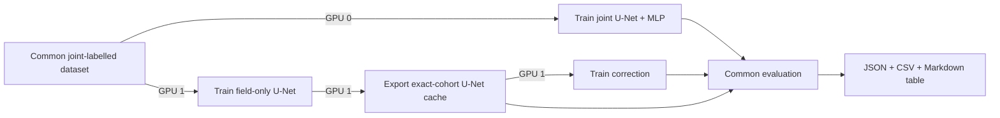

# Intensity model comparison

This workflow compares three scalar intensity estimators on exactly the same
storm-disjoint samples and continuous IBTrACS targets:

1. the maximum valid pixel in a deterministic U-Net wind field;
2. the learned single-field correction applied to that U-Net field; and
3. the scalar MLP output of the jointly trained U-Net + MLP.

It also reports SAR wind-field metrics for the deterministic and joint U-Nets.
The correction model has no field metrics because it emits only a scalar.

## Fair-comparison contract

All image-producing models use `JointPairedIntensityDataModule`. This filters
every split to paired GEO–SAR records having a continuous `USA_WIND` target
interpolated inside the configured three-hour IBTrACS bracket. Consequently the
field-only U-Net and joint model have identical train, validation, and test
sample IDs.

After field-only U-Net training, the workflow regenerates its correction cache
by iterating those exact joint datasets. The exporter preserves each source
`sample_id`, target, split, and storm. Evaluation refuses to run if the joint
dataset and correction cache differ in sample IDs, storm IDs, or targets.

This is deliberately different from the older observation-manifest intensity
cache, whose closest-GEO/eligible-fix matching produces a different cohort.
That cache is valid for its own correction experiment but not for this direct
comparison.

## Two-GPU schedule



GPU 0 and GPU 1 train concurrently. Cache export and correction training depend
on the field-only U-Net, so they run sequentially on GPU 1. Evaluation begins
only after both branches finish.

## Run the complete workflow

From the repository root:

```bash
uv run python scripts/run_intensity_model_comparison.py \
  --joint-gpu 0 \
  --pipeline-gpu 1 \
  --split val
```

The checked-in defaults use
`data/geotiff/geo_sar_10bands_era5_v2_pmw` and
`data/IBTrACs/ibtracs.ALL.list.v04r01.csv`. Override them when needed:

```bash
uv run python scripts/run_intensity_model_comparison.py \
  --paired-root /path/to/paired-data \
  --ibtracs-file /path/to/ibtracs.ALL.list.v04r01.csv \
  --output-root logs/intensity-comparisons/my-run \
  --joint-gpu 0 \
  --pipeline-gpu 1 \
  --split val
```

Use `--disable-wandb` for a local-only run. Use `--smoke-test` to check the
training paths with one epoch and one train/validation batch before committing
to the full jobs. The smoke run still exports and evaluates the full validation
cohort so that the strict cohort audit remains meaningful.

The epoch counts can be overridden independently with `--joint-epochs`,
`--unet-epochs`, and `--correction-epochs`. Set `--seed` to repeat the full
comparison with different model initialization and data-order seeds. If the
epoch options are omitted, the experiment presets remain authoritative.

## Reuse existing checkpoints

Any stage can be skipped with its checkpoint option. Reusing the U-Net also
requires its resolved training config because that config defines the data
contract used during cache generation:

```bash
uv run python scripts/run_intensity_model_comparison.py \
  --unet-checkpoint /path/to/unet.ckpt \
  --unet-config /path/to/resolved-config.yaml \
  --joint-checkpoint /path/to/joint.ckpt \
  --correction-checkpoint /path/to/correction.ckpt \
  --joint-gpu 0 \
  --pipeline-gpu 1
```

For the primary comparison, retrain all three stages. An old correction
checkpoint may have learned from a different cache even when its tensor shape
is compatible.

## Outputs and metrics

Each run writes an isolated directory under
`logs/intensity-comparisons/<UTC timestamp>/` unless `--output-root` is set:

```text
workflow.json
joint-training.log
unet-training.log
cache-export.log
correction-training.log
evaluation.log
unet-intensity-cache/
val-comparison.json
val-comparison.csv
val-comparison.md
```

The scalar table reports sample and storm counts, MAE, RMSE, bias,
storm-macro MAE, category accuracy, category macro F1, and within-one-category
accuracy. The MAE interval is a paired 95% cluster-bootstrap interval over
storms, which avoids treating multiple observations from one storm as
independent. The two field-producing models additionally report valid-pixel
MAE, RMSE, and bias against SAR.

Validation results are model-selection diagnostics because validation controls
checkpoint choice and learning-rate scheduling. Inspect `val` while developing,
freeze all model and hyperparameter decisions, and then run the workflow once
with `--split test` for the final held-out generalization table.

One training seed measures one trained instance. If conclusions are close,
repeat the full workflow with several seeds and summarize variation across
runs; the within-run storm bootstrap does not replace across-seed uncertainty.

## Run stages manually

The field-only comparator preset is:

```bash
uv run geo2wf-train experiment=intensity_comparison_unet
```

After selecting its best checkpoint:

```bash
uv run geo2wf-export joint-intensity-cache \
  --config /path/to/unet-run/resolved-config.yaml \
  --checkpoint /path/to/unet-run/checkpoints/best.ckpt \
  --output-root data/intensity-comparison-cache

uv run geo2wf-train \
  experiment=unet_intensity_correction \
  data.root=data/intensity-comparison-cache

uv run geo2wf-evaluate intensity-comparison \
  --data-config /path/to/unet-run/resolved-config.yaml \
  --cache-root data/intensity-comparison-cache \
  --joint-checkpoint /path/to/joint.ckpt \
  --correction-checkpoint /path/to/correction.ckpt \
  --split val \
  --output logs/intensity-comparison.json
```
