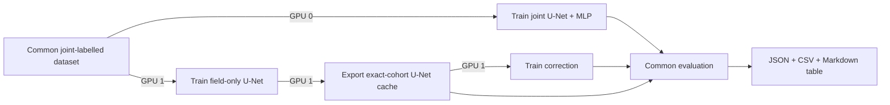

# Intensity model comparison

The completed benchmark, plots, W&B media, and dense Humberto/Kiko/Otis
analysis are available in the [published results report](intensity-comparison-results.md).

This workflow compares three scalar intensity estimators on exactly the same
storm-disjoint samples and continuous IBTrACS targets:

1. the maximum valid pixel in a deterministic U-Net wind field;
2. the learned single-field correction applied to that U-Net field; and
3. the scalar MLP output of the jointly trained U-Net+MLP.

It also reports SAR wind-field metrics for the deterministic and joint U-Nets.
The correction model has no field metrics because it emits only a scalar.

## Fair-comparison contract

All image-producing models use `JointPairedIntensityDataModule`. This filters
every split to paired GEO–SAR records having a continuous `USA_WIND` target
interpolated inside the configured three-hour IBTrACS bracket. Consequently the
field-only U-Net and joint model have identical train, validation, and test
sample IDs.

After field-only U-Net training, the workflow regenerates the correction cache
from the same datasets. Evaluation rejects mismatched sample IDs, storm IDs, or
targets. The older observation-manifest correction cache uses a different
matching procedure and is not valid for this comparison.

## Two-GPU schedule



GPU 0 trains the joint model. GPU 1 trains the field-only U-Net, exports its
cache, and trains the correction model. Evaluation waits for both branches.

## Run both ERA5 regimes

From the repository root:

```bash
uv run python scripts/run_intensity_model_comparison.py \
  --joint-gpu 0 \
  --pipeline-gpu 1 \
  --era5 with \
  --split val

uv run python scripts/run_intensity_model_comparison.py \
  --joint-gpu 0 \
  --pipeline-gpu 1 \
  --era5 without \
  --split val
```

Run these commands sequentially because each comparison occupies both GPUs.
Both regimes require ERA5 availability when selecting samples, so they use
identical sample IDs and storm splits; the no-ERA5 regime omits all ERA5
channels and predicts the absolute wind field instead of an ERA5 residual.
Training uses W&B metrics/config logging by default; model checkpoints stay
local. All three stages stop early after 50 validation epochs without
improvement on the same metric used to select their checkpoint.

The checked-in defaults use
`data/geotiff/geo_sar_10bands_era5_v2_pmw` and
`data/IBTrACs/ibtracs.ALL.list.v04r01.csv`. Override them when needed:

```bash
uv run python scripts/run_intensity_model_comparison.py \
  --paired-root /path/to/paired-data \
  --ibtracs-file /path/to/ibtracs.ALL.list.v04r01.csv \
  --output-root logs/intensity-comparisons/my-run \
  --joint-gpu 0 \
  --pipeline-gpu 1 \
  --era5 with \
  --split val
```

Before starting either GPU, the runner protects the inference-folder case-study
storms from training: Humberto 2025 (`AL082025`), Kiko 2025 (`EP112025`), and
Otis 2023 (`EP182023`). It aborts if any appears in the source or effective
training split and records source and post-filter coverage in `workflow.json`.
Repeat `--protected-storm ATCF_ID` to replace this default list for another
study.

In the current paired dataset all three are validation storms, with 18, 23, and
2 effective samples respectively; none occurs in training or test. The separate
dense inference report evaluates every compatible GEO observation from those
storms, while the matched benchmark table retains the common 232-sample paired
validation cohort.

Use `--disable-wandb` for a local-only run. `--smoke-test` uses one epoch and
one train/validation batch, while retaining full cache export and cohort audit.

The epoch counts can be overridden independently with `--joint-epochs`,
`--unet-epochs`, and `--correction-epochs`. Set `--seed` to repeat the full
comparison with different model initialization and data-order seeds. If the
epoch options are omitted, the experiment presets remain authoritative.

## Reuse existing checkpoints

Any stage can be skipped with its checkpoint option. Reusing the U-Net also
requires its resolved training config because that config defines the data
contract used during cache generation:

```bash
uv run python scripts/run_intensity_model_comparison.py \
  --unet-checkpoint /path/to/unet.ckpt \
  --unet-config /path/to/resolved-config.yaml \
  --joint-checkpoint /path/to/joint.ckpt \
  --correction-checkpoint /path/to/correction.ckpt \
  --joint-gpu 0 \
  --pipeline-gpu 1
```

Reused correction checkpoints must originate from the exact cache identified
by the workflow; tensor compatibility alone is insufficient.

## Outputs and metrics

Each run writes an isolated directory under
`logs/intensity-comparisons/<UTC timestamp>/` unless `--output-root` is set:

```text
workflow.json
joint-training.log
unet-training.log
cache-export.log
correction-training.log
evaluation.log
unet-intensity-cache/
val-comparison.json
val-comparison.csv
val-comparison.md
```

After completing both ERA5 regimes, combine their saved JSON results into one
self-contained report with both tables and a shared metric glossary:

```bash
uv run python scripts/combine_intensity_comparison_reports.py \
  --with-era5 /path/to/with-era5/val-comparison.json \
  --without-era5 /path/to/without-era5/val-comparison.json \
  --output logs/intensity-comparisons/validation-with-and-without-era5.md
```

The combiner verifies that the split, exact cohort fingerprint, and bootstrap
settings match before writing the report.

The scalar table reports error and category metrics, sample and storm counts,
and the paired MAE difference from the raw U-Net. MAE intervals use a
storm-cluster bootstrap. Field-producing models additionally report
valid-pixel MAE, RMSE, and bias against SAR.

Validation results are model-selection diagnostics because validation controls
checkpoint choice and learning-rate scheduling. Inspect `val` while developing,
freeze all model and hyperparameter decisions, and then run the workflow once
with `--split test` for the final held-out generalization table.

One seed measures one trained instance. Repeat complete workflows with several
seeds when model differences are small; the storm bootstrap does not quantify
training-seed variation.
