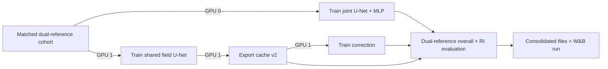

# Matched IBTrACS versus SAR intensity comparison

This workflow compares scalar supervision from interpolated IBTrACS
`USA_WIND` with a SAR robust peak, defined as the mean of the highest 0.5% of
valid pixels in the resized and center-cropped SAR field. SAR pixel-field
supervision itself is unchanged.

The older IBTrACS-only benchmark and Humberto/Kiko/Otis analysis remain in the
[published results report](intensity-comparison-results.md).

For every scalar target and ERA5 regime, the workflow compares:

1. a reference-aligned diagnostic from a shared deterministic U-Net field;
2. a learned single-field correction using that diagnostic as its anchor; and
3. the scalar MLP output of a jointly trained U-Net+MLP.

The deterministic and joint U-Nets also report SAR field metrics. The
correction model has no field metrics because it emits only a scalar.

## Fair-comparison contract

Every retained sample has a continuous `USA_WIND` target interpolated inside a
three-hour IBTrACS bracket, a finite SAR robust peak, and a valid SAR mask cell
at the storm center after resize and center crop. Both scalar references are
calculated for every retained sample. Target-independent cohort fingerprints
enforce identical sample IDs and split ownership; separate target fingerprints
capture the changed labels.

For each ERA5 regime, one field-only U-Net is trained on this cohort and reused
for the two target variants. IBTrACS corrections use the predicted field
maximum as their anchor; SAR corrections use the predicted field top-0.5% mean.
Full-validation metrics still select checkpoints and control early stopping.

Cache schema v2 records both references, the primary target, correction anchor,
SAR maximum, RI status, 24-hour change, and filtering counts. Schema-v1 caches
remain readable as legacy IBTrACS/max-anchor caches.

Rapid intensification (RI) is diagnostic only. A sample is RI when interpolated
IBTrACS wind has increased by at least 30 kt over the preceding 24 hours. A
missing interpolatable history is non-RI with an undefined change.

## Recomputed cohort and SAR–IBTrACS divergence

These values were generated on 2026-08-23 from the current default data paths
with seed 42 and 2,000 storm-bootstrap repetitions. The center-valid cohort is
568 train, 159 validation, and 139 test samples. Validation contains 24 RI
samples from 14 storms. Counts are recomputed rather than hard-coded, so they
can change with a data release or raster-processing contract.

Center-valid rates among usable IBTrACS/SAR matches are 67.5% train, 68.5%
validation, 65.6% test, 68.7% for RI, and 67.2% for non-RI samples.

| Subset | SAR diagnostic | Samples | Storms | Bias (m/s) | MAE (m/s; 95% CI) | RMSE (m/s) | Pearson | Spearman |
|---|---|---:|---:|---:|---:|---:|---:|---:|
| All | Maximum | 866 | 175 | 4.319 | 7.150 (6.441–8.014) | 11.097 | 0.762 | 0.806 |
| All | Robust peak | 866 | 175 | -2.009 | 5.522 (4.994–6.012) | 7.826 | 0.889 | 0.906 |
| Validation | Maximum | 159 | 33 | 4.877 | 7.512 (5.673–10.633) | 12.634 | 0.722 | 0.804 |
| Validation | Robust peak | 159 | 33 | -2.212 | 5.248 (4.259–6.124) | 6.893 | 0.933 | 0.941 |
| RI, all splits | Maximum | 92 | 53 | -2.108 | 5.697 (4.792–6.755) | 7.446 | 0.764 | 0.786 |
| RI, all splits | Robust peak | 92 | 53 | -9.997 | 10.734 (9.582–11.917) | 12.255 | 0.760 | 0.745 |
| Non-RI, all splits | Maximum | 774 | 171 | 5.083 | 7.322 (6.526–8.274) | 11.453 | 0.708 | 0.769 |
| Non-RI, all splits | Robust peak | 774 | 171 | -1.060 | 4.903 (4.467–5.391) | 7.119 | 0.870 | 0.887 |

Positive bias means the SAR diagnostic exceeds IBTrACS. The robust peak is more
strongly correlated with IBTrACS and has lower overall MAE than the SAR maximum,
but it is substantially lower than IBTrACS during RI.

## Seed-42 matched validation results

<!-- matched-validation-results:start -->

The complete matched validation matrix is pending. This section is replaced
automatically after the four target/ERA5 evaluations and consolidated W&B run
complete successfully.

<!-- matched-validation-results:end -->

The divergence command writes JSON, CSV, and Markdown containing the full
overall/split/RI tables, center-valid rates, signed and absolute-error
quantiles, MAE and bias intervals, and per-sample rows:

```bash
uv run python scripts/analyze_sar_ibtracs_divergence.py \
  --output logs/intensity-comparisons/sar-ibtracs-divergence.json \
  --bootstrap-repetitions 2000 \
  --bootstrap-seed 42
```

## Two-GPU schedule



GPU 0 trains the joint model while GPU 1 trains the field U-Net, exports its
cache, and trains the correction. The second target run in each ERA5 regime
reuses the first run's field-U-Net checkpoint.

## Run the complete seed-42 matrix

The matrix runner trains two shared field U-Nets, four joint models, and four
correction models. It publishes one grouped W&B evaluation run in project
`geo2wf` with overall and RI tables, per-sample predictions, divergence
tables/plots, configs, checkpoint hashes, and JSON/CSV/Markdown artifacts.

```bash
uv run python scripts/run_matched_intensity_validation_matrix.py \
  --joint-gpu 0 \
  --pipeline-gpu 1 \
  --seed 42 \
  --wandb-project geo2wf
```

The full matrix requires the project's execution host with two visible CUDA
GPUs and valid W&B credentials. In restricted tool sessions, GPU commands and
training processes may need to be launched outside the filesystem sandbox.
The divergence results above are CPU-generated; the marked model-results
section is updated only after all four matrix cells complete.

Use `--smoke-test` for one epoch and one train/validation batch per stage.
`--disable-wandb` runs locally. Epoch counts can be overridden with
`--joint-epochs`, `--unet-epochs`, and `--correction-epochs`.

## Run one target/regime manually

```bash
uv run python scripts/run_intensity_model_comparison.py \
  --joint-gpu 0 \
  --pipeline-gpu 1 \
  --era5 with \
  --intensity-target-source ibtracs \
  --split val

uv run python scripts/run_intensity_model_comparison.py \
  --joint-gpu 0 \
  --pipeline-gpu 1 \
  --era5 without \
  --intensity-target-source sar_robust_peak \
  --split val
```

Both ERA5 regimes require ERA5 availability while selecting the cohort. The
no-ERA5 model omits ERA5 channels and predicts the absolute field, ensuring its
sample IDs and storm splits still match the with-ERA5 regime.

The runner protects Humberto 2025 (`AL082025`), Kiko 2025 (`EP112025`), and
Otis 2023 (`EP182023`) from training by default. It aborts if a protected storm
appears in the source or effective training split and records the audit in
`workflow.json`.

## Reuse checkpoints

Reusing the field U-Net also requires its resolved config because the config
defines the exact data and cache contract:

```bash
uv run python scripts/run_intensity_model_comparison.py \
  --unet-checkpoint /path/to/unet.ckpt \
  --unet-config /path/to/resolved-config.yaml \
  --joint-checkpoint /path/to/joint.ckpt \
  --correction-checkpoint /path/to/correction.ckpt \
  --joint-gpu 0 \
  --pipeline-gpu 1 \
  --intensity-target-source ibtracs
```

Reused correction checkpoints must originate from the exact cache identified
by the workflow; tensor compatibility alone is insufficient.

## Outputs and validation metrics

Each target/regime workflow writes `workflow.json`, stage logs, resolved model
runs, `unet-intensity-cache/`, and `val-comparison.{json,csv,md}`. The matrix
runner additionally writes `matrix-workflow.json`, the divergence artifacts,
`matched-validation.{json,csv,md}`, a per-sample prediction CSV, and a
divergence plot.

Every validation epoch logs under `val_ri/`:

- sample and storm counts;
- MAE, RMSE, bias, storm-macro MAE, category accuracy, macro-F1, and within-one
  accuracy against IBTrACS and the SAR robust peak;
- reference-aligned raw-U-Net baselines; and
- pixel-pooled field MAE, RMSE, and bias for field-producing models.

Distributed validation gathers per-sample rows before computing RI metrics. A
generic dataset with no RI samples logs zero counts and omits undefined rates;
the final schema-v2 evaluator rejects an empty RI cohort.

Validation remains a model-selection diagnostic. Freeze model and
hyperparameter choices before evaluating the held-out test split. One seed is
one trained instance; storm-bootstrap uncertainty does not measure variation
between training seeds.
