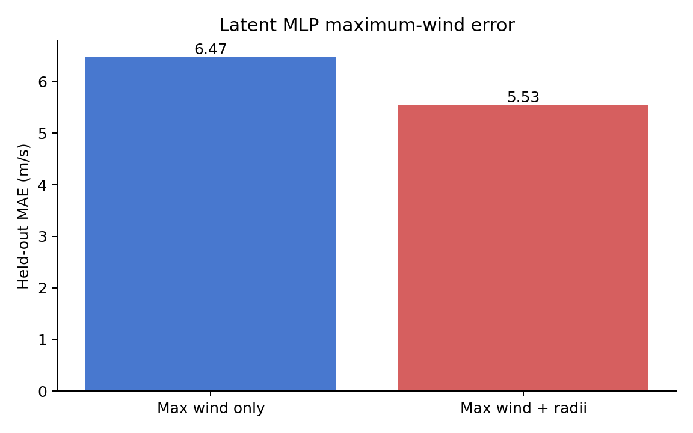
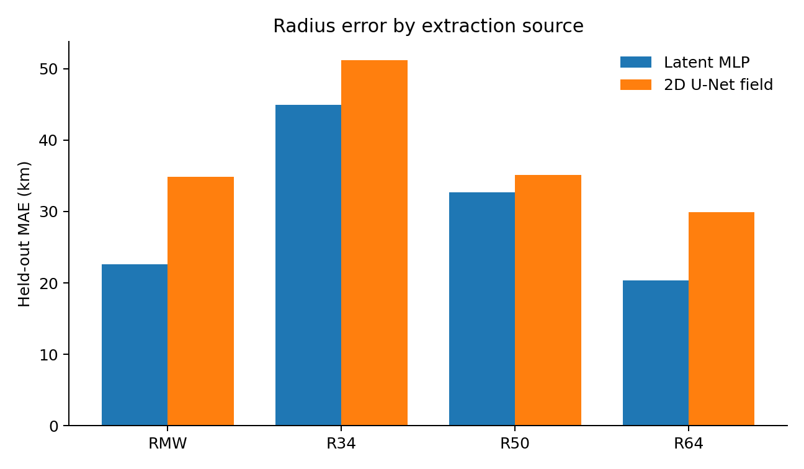

# Joint U-Net/latent-MLP structure results

Generated `2026-08-27T10:50:07.885965+00:00` from the best validation checkpoint of each seed-42
run. These are the canonical paper-facing held-out test results; no test metric
was used for checkpoint selection.

## Maximum wind

| Training objective | MLP MAE (m/s) | MLP RMSE (m/s) | MLP bias (m/s) | Samples |
|---|---:|---:|---:|---:|
| Maximum wind only | 6.471 | 8.181 | 1.133 | 139 |
| Maximum wind + radii | 5.533 | 7.313 | 0.132 | 139 |

On this single seeded comparison, adding radii supervision coincided with a
lower maximum-wind error. This is an observed paired-run result, not a causal
or multi-seed uncertainty estimate.

## 2D wind-field reconstruction

| Training objective | Field MAE (m/s) | Field RMSE (m/s) | Field bias (m/s) | PSNR (dB) | SSIM | Scenes |
|---|---:|---:|---:|---:|---:|---:|
| Maximum wind only | 2.638 | 3.765 | 0.106 | 26.524 | 0.826 | 139 |
| Maximum wind + radii | 2.565 | 3.684 | -0.185 | 26.713 | 0.829 | 139 |

## Rapid-intensification phases

RI observations are the held-out samples where IBTrACS maximum wind increased
by at least 30 kt during the preceding 24 hours.

| Training objective | MLP MAE (m/s) | MLP RMSE (m/s) | MLP bias (m/s) | Samples |
|---|---:|---:|---:|---:|
| Maximum wind only | 9.232 | 10.839 | -0.857 | 13 |
| Maximum wind + radii | 9.957 | 10.814 | 0.092 | 13 |

| Training objective | Field MAE (m/s) | Field RMSE (m/s) | Field bias (m/s) | PSNR (dB) | SSIM | Scenes |
|---|---:|---:|---:|---:|---:|---:|
| Maximum wind only | 2.568 | 3.736 | 0.907 | 26.592 | 0.814 | 13 |
| Maximum wind + radii | 2.526 | 3.918 | 0.851 | 26.179 | 0.814 | 13 |

PSNR uses the fixed 0.2–80.0 m/s SAR export range (79.8 m/s). SSIM is
scene-averaged after clipping to that range and excludes every 7×7 window that
touches an invalid prediction or target pixel.

## Radii from two sources

Both columns evaluate the radii-supervised run. “Latent MLP” is the direct
multi-task head; “2D field” diagnoses the same quantity from the reconstructed
wind image. Missing targets are masked. Field-derived counts can be smaller
because a target outside the image's complete circular domain is excluded.

| Radius | Latent MLP MAE (km) | MLP n | 2D field MAE (km) | Field n |
|---|---:|---:|---:|---:|
| RMW | 22.60 | 138 | 34.89 | 132 |
| R34 | 44.97 | 116 | 51.21 | 53 |
| R50 | 32.69 | 72 | 35.12 | 58 |
| R64 | 20.38 | 48 | 29.92 | 46 |

## Provenance

- Maximum-wind training run: `logs/latent-structure/max-wind/20260827-111024_modular`
- Maximum-wind selected checkpoint: epoch 154, validation loss 22.842821
- Maximum-wind checkpoint SHA-256: `326d1905802efa2c38b5c3f83b8e9ed32c87d22b204820bb505008b2e838bceb`
- Radii-supervised training run: `logs/latent-structure/max-wind-radii/20260827-111026_modular`
- Radii-supervised selected checkpoint: epoch 106, validation loss 28.559853
- Radii-supervised checkpoint SHA-256: `88f19e1985b66ec76235104dc627ecb8551082d537deb42d6baf2a1b160af7c4`
- Machine-readable metrics: [summary.csv](../assets/data/latent-structure/summary.csv)
- Full result metadata: [results.json](../assets/data/latent-structure/results.json)

The two arms use the same ERA5-conditioned cohort (568 train, 159 validation,
139 test), seed, U-Net/MLP architecture, and optimization settings. They differ
only in the enabled structure head and its `0.25` masked-loss weight. Strict
CUDA determinism is disabled for both because reflection-padding backward has
no deterministic CUDA implementation.

The original launch accidentally disabled the configured early-stopping
callback. Training was stopped after each validation history had exceeded the
intended 50-epoch patience, and the global minimum `val/loss` checkpoint was
selected. One-epoch resume runs at
`logs/latent-structure/max-wind/20260827-115409_modular` and
`logs/latent-structure/max-wind-radii/20260827-114638_modular` completed the run
manifests cleanly without changing checkpoint selection. The checked-in presets
now enable the callback.
