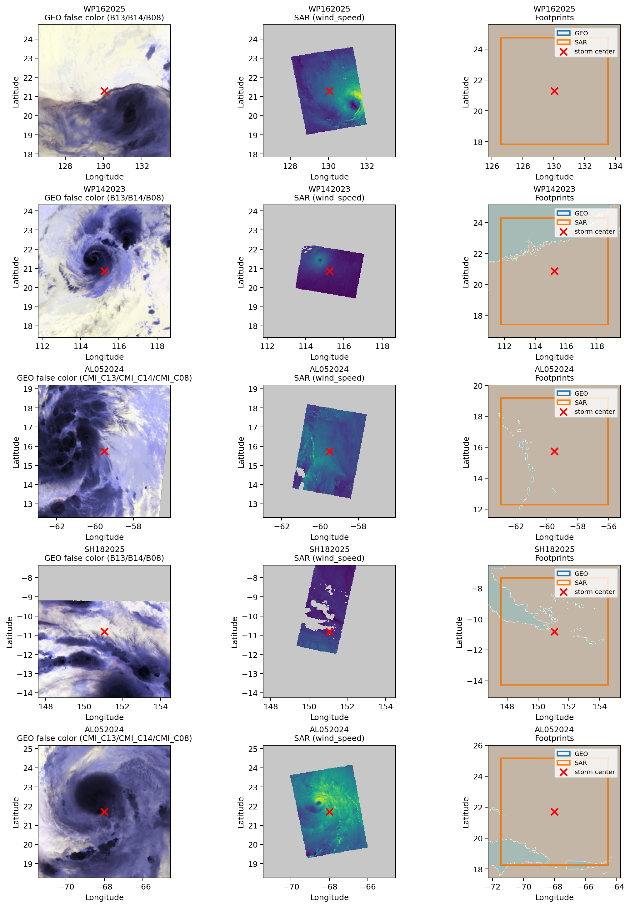
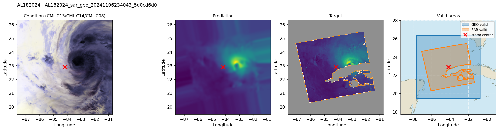

# Visual examples

## Paired observations

<figure markdown>
  [](../assets/images/geo-sar-random-pairs.png)
  <figcaption>Five random training pairs. Left: GEO false-color RGB. Middle: SAR wind speed. Right: valid footprints over an ocean/land mask. The red × is the manifest’s IBTrACS center.</figcaption>
</figure>

The false-color view maps two infrared channels to red/green and a water-vapor channel to blue. It is a visualization, not the literal model input: the model receives all configured bands as separate normalized channels.

The footprint panel exposes the central learning challenge. GEO may cover the crop broadly while SAR is a narrower, irregular swath. `target_mask` prevents missing SAR pixels from becoming zero-wind labels.

## W&B reconstruction panel

<figure markdown>
  [](../assets/images/wandb-logging-preview.png)
  <figcaption>Example condition / prediction / target panels logged from validation and a small training subset.</figcaption>
</figure>

Current validation logging is shared by both model paths. It renders up to five georeferenced samples, labels storm and sample IDs, shades target no-data, plots the IBTrACS center, adds valid-area and ERA5 wind panels when metadata is available, caps the longest edge at 1600 pixels, and sends a compact JPEG to W&B. Diffusion panels use normalized predictions/targets; residual panels use physical m/s values. Prediction and target share a display stretch derived only from valid ground-truth pixels.

The qualitative comparison should be read alongside physical metrics. Look for:

- correct storm-center placement;
- low-wind eye versus high-wind eyewall contrast;
- azimuthal asymmetry rather than only a smooth radial blob;
- realistic radius of maximum wind;
- behavior at the observed swath boundary; and
- saturation or clipping artifacts.

## Recreate the pair figure

`utils.plotting.plot_random_geo_sar_pairs()` reads the split manifest and GeoTIFF metadata:

```python
from utils.plotting import plot_random_geo_sar_pairs

plot_random_geo_sar_pairs(
    "data/geotiff/geo_sar",
    split="train",
    n=5,
    seed=42,
    output_path="resources/geo_sar_random_pairs.png",
)
```

The helper resolves generic `condition_path`/`target_path` first and falls back to legacy `geo_path`/`sar_path`. Band requests tolerate equivalent `Bxx` and `Cxx` names across AHI/ABI descriptions.
