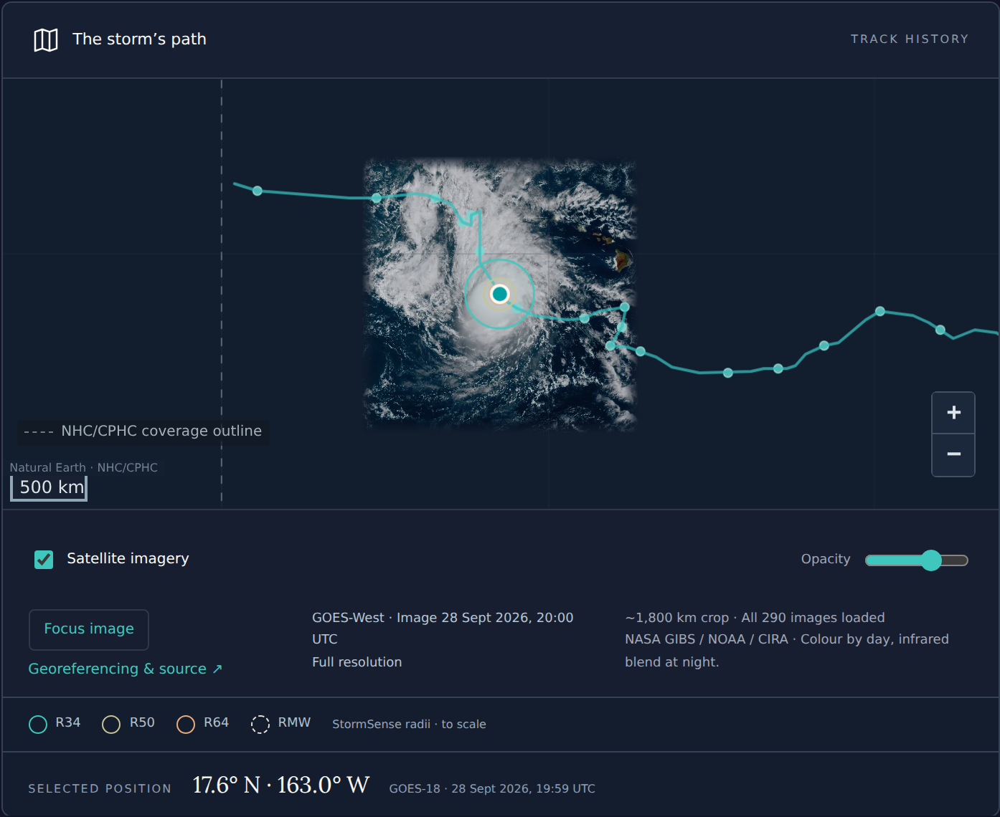
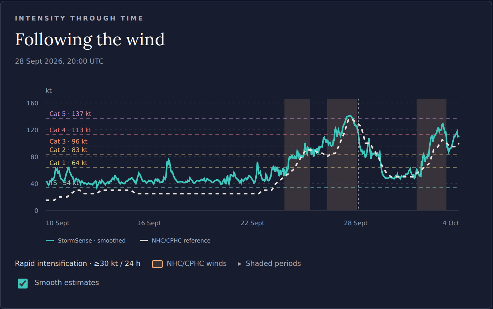

---
hide:
  - toc
---

# StormSense

[StormSense](https://stormsense.hyperalislabs.com/) follows active and archived
NHC/CPHC tropical cyclones in the Atlantic, eastern Pacific, and central
Pacific. It combines storm tracks and satellite imagery with hourly model
estimates of maximum sustained wind and wind radii. It is a research
application; NHC/CPHC advisories remain the source of official guidance.

[Open StormSense](https://stormsense.hyperalislabs.com/){ .md-button .md-button--primary }
[Browse the storm archive](https://stormsense.hyperalislabs.com/archive){ .md-button }
[Methods and data status](https://stormsense.hyperalislabs.com/about){ .md-button }

## Explore a storm

Select an active storm or search the archive by name or identifier. The timeline
keeps the selected position, satellite frame, intensity, and wind radii in sync;
play it or drag to a particular hour. The URL retains the selected time for
sharing. Times are UTC, wind units can be switched between knots and m/s, and
radii are in kilometres.

*Nolo (2026) in the hosted application. “Focus image” fits the satellite crop
on the map; the rings show model wind radii at geographic scale.*

The map uses archived GOES GeoColor display images from NASA GIBS, with a
daytime colour composite and a nighttime infrared blend. The displayed image
time is separate from the scan used for model inference. Missing images or
model inputs are shown as gaps. CSV and JSON downloads preserve numerical
estimates; image downloads include georeferencing and source metadata.

## Read the predictions

The current nowcast is the [GEO-only joint field/latent model](models/bottleneck-unet-mlp.md)
trained with SAR and radius supervision. Ten GOES ABI infrared channels and
storm/time context produce maximum wind, radius of maximum wind (RMW), and
equivalent-area R34/R50/R64. Neither SAR nor ERA5 is required at inference.

*Observation-time intensity estimates compared with the NHC/CPHC reference
series. Amber shading marks reference-wind rapid-intensification periods.*

NHC/CPHC reference winds are displayed independently of the model estimates.
The intensity chart optionally smooths estimates; interior gaps may be
interpolated for display. Tiles, map rings, downloads, and evaluation retain
the original values. Rapid-intensification shading uses a reference wind
increase of at least 30 kt over 24 hours, not a forecast of future change.

The pipeline also produces experimental intensity forecasts using the
[six-hour scalar model](models/intensity-forecast.md): current, −6 h, and
−12 h **StormSense estimates** feed a direct +6 h prediction and a recursive
+12 h prediction. Missing history withholds an issue. These forecasts do not
use official or future winds as inputs; evaluation reports are linked from
the application's [methods page](https://stormsense.hyperalislabs.com/about).

## Live estimates, hindcasts, and freshness

Live estimates use the available advisory position and reported motion.
Historical hindcasts use retrospective track centers and are labeled
separately. Their reference tracks can be revised, so hindcasts do not
establish prospective forecast skill.

The app retains a rolling year of storms. Updates currently run hourly while
the temporary runner is online; source and generation timestamps show actual
freshness. The website remains available independently of that runner.

## Research data and the earlier viewer

The [scientific dataset](https://huggingface.co/datasets/simon-donike/geo2wf-data)
and [21-checkpoint model release](https://huggingface.co/simon-donike/geo2wf-models)
are hosted on Hugging Face. The application runs separately from this docs
site and reads its own versioned R2 data releases. See the
[application source and setup guide](https://github.com/simon-donike/geo2wf/tree/main/apps/stormsense)
for local use and runner configuration.

The paper's fixed Humberto, Kiko, and Otis observations remain in the
[case-study manifest](data/storm-manifest.md) and [paper results](results.md).
Those legacy assets include imported ViT/ConvLSTM comparisons and a
**U-Net+MLP** label for [post-hoc correction](models/intensity-correction.md).
That label is distinct from the joint latent model used by the current app.
The earlier MLP case studies also used IBTrACS intensity anchors; the current
forecast pipeline uses StormSense's own estimated history.
