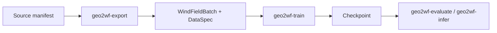

# Start here

The supported workflow is an installable `geo2wf` package with a composed
training configuration and thin export, evaluation, and inference commands.

## Reading order

1. [Install and verify the package](installation.md).
2. Run the [first smoke experiment](first-experiment.md).
3. Learn [how config groups and overrides compose](../experiments/configuration.md).
4. Read the [ERA5-residual field model](../models/era5-residual.md).
5. Use the [command reference](../reference/commands.md) for evaluation and inference.

## Main runtime pieces

`geo2wf-train`
: Composes `data`, `model`, `trainer`, `logging`, and optional `experiment`
  groups; validates the model against the dataset `DataSpec`; creates the run
  directory; and starts Lightning.

`PairedDataModule`
: Builds datasets and loaders from split manifests. Its canonical collator
  stacks tensors while keeping metadata sample-oriented.

`WindFieldLightningModule`
: Defines the common training-objective and physical-prediction extension
  points used by modular models.

`geo2wf-evaluate` and `geo2wf-infer`
: Dispatch to the maintained checkpoint-evaluation and storm-inference
  workflows in `scripts/`. Each subcommand retains its workflow-specific
  arguments.

## Choose a route

- To verify the installation and configuration, follow [First experiment](first-experiment.md).
- To train the field model, use the [ERA5-residual guide](../models/era5-residual.md).
- To add a component, follow [Adding models, datasets, and metrics](../reference/adding-components.md).
- To understand package ownership, read [Modular package architecture](../concepts/modular-architecture.md).

!!! warning "Dataset access is external"
    Source observations are not bundled with the repository. Exporters normally
    read the larger tropical-cyclone archive selected by `TCD_DATA_ROOT` or
    `--data-root`. An existing export only needs split manifests, rasters, and
    `stats.json`.
