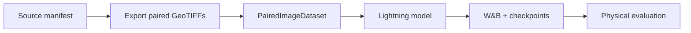

# Start here

geo2wf is organized as a thin vertical slice through a scientific ML experiment. The shortest useful path is:

## What you will run

`train.py`
: Loads one YAML file, creates a timestamped run directory, seeds all workers, builds the `PairedDataModule`, selects a model by `model.type`, configures W&B and checkpoints, then calls `Trainer.fit()`.

`PairedDataModule`
: Constructs train, validation, and test datasets. Its validation interface returns two loaders: a storm-stratified validation loader and a tiny training subset used for qualitative reconstruction logging.

`PixelDiffusionConditional`
: Learns the noise added to a target wind field at a random diffusion step. During validation and prediction it starts from fixed per-sample noise and runs a complete DDPM or DDIM reverse chain.

`ERA5ResidualRegressor`
: A deterministic control that predicts a physical correction in m/s around ERA5 10 m wind speed. Its zero-initialized head means the untrained model is exactly the ERA5 baseline.

## Choose your route

=== "I want a smoke run"

    Continue to [Installation](installation.md), then [First experiment](first-experiment.md). The smoke path limits export and training work without inventing synthetic data.

=== "I need to understand the research"

    Read [The reconstruction problem](../concepts/problem.md), [Data pipeline](../data/index.md), and [Evaluation](../experiments/evaluation.md).

=== "I am preparing a full run"

    Compare [experiment configurations](../experiments/index.md), confirm the [data contract](../data/dataset-contract.md), and review [training and checkpoints](../experiments/training.md).

!!! warning "Dataset access is external"
    The exporters default to the larger tropical-cyclone data tree under `/lustre/scratch/1054/tropical_cyclone_dynamics/data`. The source observations are not bundled with this repository. Existing local exports can be used directly if their manifests and `stats.json` are present.
