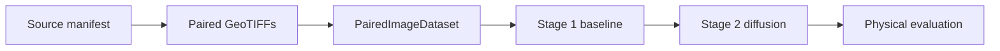

# Start here

The main geo2wf experiment is a short vertical pipeline with a two-stage model at the end:

## Recommended reading order

1. Read [Two-stage baseline + diffusion](../models/two-stage.md).
2. Inspect the [real model inputs and training target](../data/index.md).
3. [Install the environment](installation.md).
4. Run the [first smoke experiment](first-experiment.md).
5. Compare the [experiment presets](../experiments/index.md).

## Main runtime pieces

`train.py`
: Loads one YAML file, creates a timestamped run directory, seeds workers, builds the `PairedDataModule`, selects a model by `model.type`, and configures W&B and checkpoints.

`PairedDataModule`
: Builds train, validation, and test datasets from split manifests. Validation includes a storm-stratified loader and a small qualitative training subset.

`ERA5ResidualRegressor`
: Stage 1. Produces one physical wind field as ERA5 plus a learned correction.

`ERA5ResidualDiffusion`
: Stage 2. Freezes Stage 1 and learns the signed SAR-minus-baseline residual as a diffusion problem.

## Choose a route

### Run the complete stack

Start with [Installation](installation.md), then train the two presets in the order shown on the [two-stage workflow page](../models/two-stage.md#training-sequence).

### Run a small smoke test

Use [First experiment](first-experiment.md). The smoke path limits export and training work without inventing synthetic observations.

### Review the research design

Read [The reconstruction problem](../concepts/problem.md), [System architecture](../concepts/architecture.md), and [Evaluation](../experiments/evaluation.md).

!!! warning "Dataset access is external"
    Exporters default to the larger tropical-cyclone data tree under `/lustre/scratch/1054/tropical_cyclone_dynamics/data`. Source observations are not bundled with the repository. Existing local exports work when their split manifests and `stats.json` are present.
