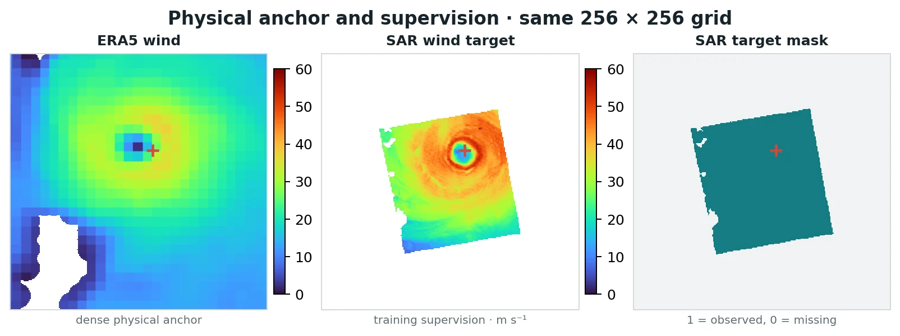

---
hide:
  - toc
---

Tropical-cyclone wind reconstruction

# Tropical-cyclone wind reconstruction

geo2wf reconstructs surface wind fields from geostationary satellite imagery
and optional ERA5 context. Its maintained field model predicts a deterministic
physical correction around ERA5; separate models estimate current intensity
and short-range scalar intensity change.

[Understand the field model](models/era5-residual.md){ .md-button .md-button--primary }
[See current results](results.md){ .md-button }
[Understand the scientific problem](concepts/problem.md){ .md-button }
[Understand the data](data/index.md){ .md-button }
[Open StormSense](explorer/dashboard.html){ .md-button }

## Reconstruction workflow

  

    Field reconstruction
    <strong>ERA5-residual U-Net</strong>
    
GEO, ERA5, storm-relative geometry, solar context, and validity masks produce one dense wind field.

    <code>baseline = ERA5 + learned correction</code>
  

The U-Net learns where GEO and environmental context support corrections to the
dense ERA5 wind anchor. [See its equations, objective, and input assembly.](models/era5-residual.md)

## What the models receive

The default field configuration uses a 23-channel data condition:

- 10 GEO infrared and water-vapor bands;
- 9 ERA5 fields: seven exported variables plus derived 10 m wind speed and relative vorticity;
- 1 normalized distance-to-IBTrACS-center raster; and
- 3 solar-time fields.

Validity masks and an explicit ERA5 wind anchor are appended by the model. SAR
wind is the supervised target during training; it is not an inference-time input.

Real exported sample <code>WP232024_sar_geo_20241030095303_bb2c52ca</code>, rendered from the repository GeoTIFFs with Matplotlib. The data page shows every input family.

## Read by task

  <a class="quick-link" href="models/era5-residual/"><strong>Understand the field model</strong>The maintained ERA5-residual U-Net.</a>
  <a class="quick-link" href="data/"><strong>Understand the inputs</strong>Real examples, channel lists, masks, and tensor assembly.</a>
  <a class="quick-link" href="getting-started/first-experiment/"><strong>Run an experiment</strong>Export a small batch and launch a smoke run.</a>
  <a class="quick-link" href="experiments/"><strong>Choose a preset</strong>Compare the stacked workflow with standalone controls.</a>
  <a class="quick-link" href="experiments/evaluation/"><strong>Evaluate structure</strong>Physical error, eye, inner core, radial profile, and RMW.</a>
  <a class="quick-link" href="reference/"><strong>Find a file or command</strong>Project map, configuration keys, and troubleshooting.</a>

## Scope

The principal wind-field models operate on paired rasters on a common grid and
use a 192 × 192 center crop. They reconstruct the observation time; they do not
forecast a future wind field. Separate scalar models estimate current intensity
and a six-hour intensity change, with an optional recursive +12 h diagnostic.
The repository does not implement joint track and wind-field forecasting or
arbitrary observation-set models.

Start with [the field model](models/era5-residual.md), then follow the [data inputs](data/index.md) into [training](experiments/training.md) and [evaluation](experiments/evaluation.md).
