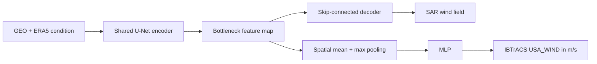

# Bottleneck U-Net + MLP

This model learns a SAR wind-field reconstruction and a continuous IBTrACS
maximum-wind estimate in one end-to-end network.



The scalar target is the continuous IBTrACS `USA_WIND` value converted from
knots to metres per second. Tropical-cyclone categories are not model targets
and do not contribute to the loss.

The data module reuses `PairedImageDataset` for all raster loading,
normalization, masking, and augmentation. It reads `USA_WIND` directly from
IBTrACS and linearly interpolates it at each SAR target timestamp between the
immediately preceding and following valid fixes. The two fixes may be at most
three hours apart. Exact fix timestamps use the recorded value directly.
Category fields, frozen-U-Net caches, and ERA5 are not involved in constructing
the scalar target. Samples outside a valid three-hour bracket are excluded.

Train with the default local data paths:

```bash
uv run geo2wf-train experiment=bottleneck_unet_mlp
```

Override the paired root and IBTrACS file through environment variables:

```bash
GEO2WF_JOINT_PAIRED_ROOT=/path/to/paired \
GEO2WF_IBTRACS_FILE=/path/to/ibtracs.ALL.list.v04r01.csv \
uv run geo2wf-train experiment=bottleneck_unet_mlp
```

For the GEO-only ablation, use the checked-in preset:

```bash
uv run geo2wf-train experiment=bottleneck_unet_mlp_no_era5
```

This sets `data.use_era5=false` and changes `model.condition_channels` from 23
to 14: ten GEO bands, distance to the storm center, and three solar-time
channels. The comparison preset still requires ERA5 availability to preserve
the same cohort, but no ERA5 channel or companion tensor is passed to the
model.

The objective is

\[
L = w_{image} L_{Huber,image} + w_{intensity} L_{Huber,IBTrACS},
\]

with both weights equal to one by default. Both terms update the shared
encoder. The image term additionally updates the decoder, while the continuous
IBTrACS term updates the bottleneck MLP. Checkpoints are selected by the
combined `val/loss`; the two component losses and image/intensity MAE, RMSE,
and bias are logged separately.

## Encoder-only IBTrACS ablation

The encoder-only experiment removes the decoder and reconstruction head
entirely. It applies the same spatial mean/max pooling and MLP to the shared
encoder bottleneck, but its only target and loss are continuous IBTrACS
`USA_WIND`:

```bash
uv run geo2wf-train experiment=unet_encoder_mlp_ibtracs
uv run geo2wf-train experiment=unet_encoder_mlp_ibtracs_no_era5
```

For strict comparison, the data module preserves the joint experiment's
SAR-valid-center sample IDs. On first use it fingerprints the split manifest,
IBTrACS file, crop settings, and eligibility settings, scans SAR to materialize
that cohort, and writes a sidecar under
`<paired-root>/.geo2wf/encoder-ibtracs-cohorts/`. Condition-only batches then
read GEO and optional ERA5 only: they contain no SAR raster, target mask, field
metric, or reconstruction output. Set `GEO2WF_INTENSITY_COHORT_CACHE` to place
the sidecars elsewhere.

The scalar objective remains 5 m/s Huber loss. Validation IBTrACS MAE selects
checkpoints and drives learning-rate scheduling and early stopping; RMSE, bias,
category accuracy, and macro F1 are also logged.
