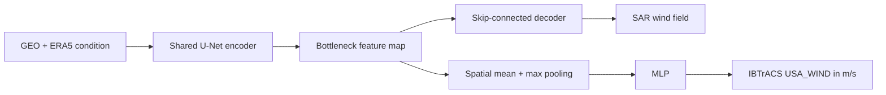

# Bottleneck U-Net + MLP

This model learns a SAR wind-field reconstruction and a continuous IBTrACS
maximum-wind estimate in one end-to-end network.



The scalar target is the continuous IBTrACS `USA_WIND` value converted from
knots to metres per second. Tropical-cyclone categories are not model targets
and do not contribute to the loss.

The data module reuses `PairedImageDataset` for all raster loading,
normalization, masking, and augmentation. It reads only label rows from the
existing intensity cache, joins them to paired samples with `source_sample_id`,
and filters each split to samples having both a SAR image and an IBTrACS label.
Cached frozen-U-Net fields and predictions are not used.

Train with the default local data paths:

```bash
uv run geo2wf-train experiment=bottleneck_unet_mlp
```

Override the two roots directly or through environment variables:

```bash
GEO2WF_JOINT_PAIRED_ROOT=/path/to/paired \
GEO2WF_JOINT_INTENSITY_ROOT=/path/to/intensity-cache \
uv run geo2wf-train experiment=bottleneck_unet_mlp
```

For the GEO-only ablation, use the checked-in preset:

```bash
uv run geo2wf-train experiment=bottleneck_unet_mlp_no_era5
```

This sets `data.use_era5=false` and changes `model.condition_channels` from 23
to 14: ten GEO bands, distance to the storm center, and three solar-time
channels. The paired manifests and IBTrACS intensity join are unchanged. ERA5
rasters, derived ERA5 wind speed/vorticity, and ERA5 companion tensors are not
loaded or passed to either branch.

The objective is

\[
L = w_{image} L_{Huber,image} + w_{intensity} L_{Huber,IBTrACS},
\]

with both weights equal to one by default. Both terms update the shared
encoder. The image term additionally updates the decoder, while the continuous
IBTrACS term updates the bottleneck MLP. Checkpoints are selected by the
combined `val/loss`; the two component losses and image/intensity MAE, RMSE,
and bias are logged separately.
