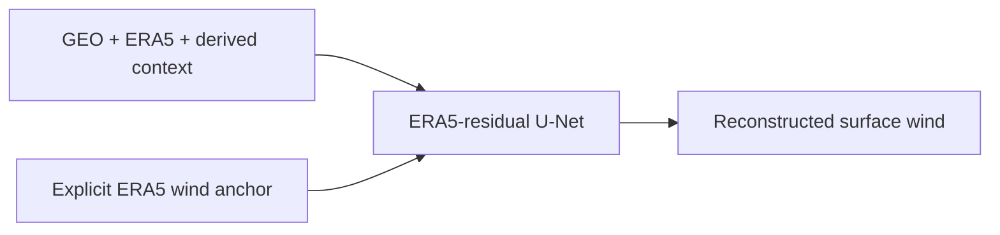

# Model overview

geo2wf contains three related but distinct model tasks. Keeping their targets
separate prevents a field reconstruction, a current scalar estimate, and a
future forecast from being interpreted as the same product.

## 1. Instantaneous spatial fields

| Model | Generated quantity | Main inputs | Role |
|---|---|---|---|
| [ERA5-residual U-Net](era5-residual.md) | surface wind in m/s | GEO, ERA5, derived context, masks | maintained physical wind-field reconstruction |
| [Direct PMW U-Net](direct-unet.md) | near-89 GHz brightness temperature in K | GEO, optional ERA5, derived context, masks | proxy reconstruction/pretraining control |

The principal wind-field system learns a physical correction around ERA5:

[Read the maintained field model.](era5-residual.md) The direct U-Net is
Kelvin-only and is not an interchangeable wind regressor.

## 2. Current scalar intensity

| Model | Output | Contract |
|---|---|---|
| [Bottleneck U-Net + MLP](bottleneck-unet-mlp.md) | a SAR wind field and one current intensity | end-to-end shared encoder; default scalar target is interpolated IBTrACS `USA_WIND` |
| [Encoder-only MLP](bottleneck-unet-mlp.md#encoder-only-ibtracs-ablation) | one current intensity | the same eligible cohort and encoder, with no decoder or SAR field in the batch |
| [Single-field intensity correction](intensity-correction.md) | corrected current maximum wind and a derived category | one frozen U-Net field plus current metadata; no track history |

The joint model and the separate correction model are not equivalent. The
joint model learns its image and scalar heads together. The correction model
consumes an already frozen field and adjusts a field-derived scalar anchor.

Both joint and correction data contracts support a matched SAR robust-peak
target for explicit comparisons. Their checked-in default experiments use
IBTrACS intensity. Both architectures also contain an optional five-value
IBTrACS structure head (eye size, RMW, and equivalent-area R34/R50/R64); it is
disabled by default with zero loss weight.

## 3. Future scalar intensity

The [six-hour scalar intensity forecast](intensity-forecast.md) predicts
`USA_WIND` at +6 h from the current corrected estimate and retrospective
best-track history at −6 h and −12 h. The same one-step MLP can be applied
recursively for a +12 h dashboard diagnostic. This is the only maintained
future-prediction model in `src/geo2wf/models/`; the spatial reconstruction
models estimate the current observation time.

## Dashboard-only artifacts

StormSense can display additional inference products that are not maintained
training models in this package:

- a precomputed ViT reconstruction artifact under `inference/inf_vit`; and
- an external 12-hour processor/ConvLSTM forecast artifact under
  `inference/forecasts`.

They are useful comparison layers, but this repository does not contain enough
model definition and training configuration to document or reproduce their
architectures. They should not be conflated with the maintained U-Net,
correction, or forecast models above.

## Shared contracts

Wind-field reconstruction paths share the paired-raster contract, reversible
physical target conversion, and explicit masks. Scalar models use their own
cached or joint data contracts. See [Model inputs and training
targets](../data/index.md), [Dataset contract](../data/dataset-contract.md), and
[Choose an experiment](../experiments/index.md).
