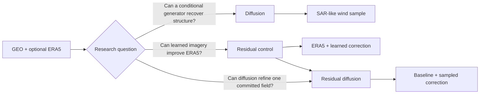

# Model overview

geo2wf contains three complementary paths: absolute-field diffusion, diffusion of a signed correction around a dense baseline, and a deterministic ERA5 correction.

| | Conditional diffusion | Residual diffusion | ERA5 residual control |
|---|---|---|---|
| Output | absolute wind sample | baseline plus sampled correction | one deterministic wind field |
| Inputs | GEO, optional ERA5, masks | GEO + ERA5, masks, explicit baseline | GEO + ERA5, masks, explicit ERA5 wind |
| Prediction | diffusion noise for absolute wind | diffusion noise for transformed physical residual | correction in physical m/s |
| Loss | masked noise MSE | masked residual-noise MSE + weak zero anchor | masked Huber + weak off-swath anchor |
| Baseline | none | ERA5 or frozen deterministic model | ERA5 |
| Best use | distribution experiments | one baseline-anchored plausible reconstruction | interpretable skill-over-ERA5 control |

All three are Lightning modules, share the same `PairedDataModule`, checkpoint on the lower-is-better eye structure score when available, and report storm-centric metrics over observed SAR pixels.

- :material-creation-outline: **[Conditional diffusion](conditional-diffusion.md)** — forward noise, U-Net conditioning, EMA, sparse targets, inference.
- :material-waveform: **[Residual diffusion](residual-diffusion.md)** — signed physical corrections around ERA5 or a frozen deterministic reconstruction.
- :material-vector-difference: **[ERA5 residual](era5-residual.md)** — physical residual connection, robust loss, off-swath anchoring.
- :material-timer-sand: **[Sampling](sampling.md)** — DDPM vs DDIM, schedules, reproducibility, clipping.

