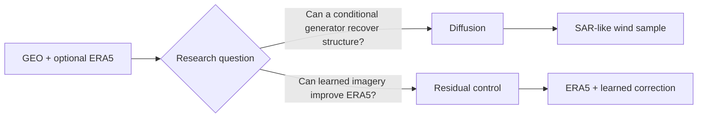

# Model overview

geo2wf contains two complementary answers to the same target: a probabilistic pixel-space diffusion model and a deterministic correction around ERA5.

| | Conditional diffusion | ERA5 residual control |
|---|---|---|
| Output | sample from a learned conditional distribution | one deterministic wind field |
| Inputs | GEO, optional ERA5, condition mask, noisy target | GEO + ERA5, masks, explicit ERA5 wind |
| Prediction | diffusion noise at timestep `t` | correction in physical m/s |
| Loss | masked noise MSE, optionally weak ERA5 completion | masked Huber + weak off-swath anchor |
| Backbone | ConvNeXt-style attention U-Net | compact GroupNorm residual U-Net |
| Baseline before training | random denoising behavior | exactly ERA5 due to zero head |
| Best use | generative reconstruction and uncertainty experiments | interpretable skill-over-ERA5 control |

Both are Lightning modules, share the same `PairedDataModule`, checkpoint on the lower-is-better eye structure score when available, and report storm-centric metrics over observed SAR pixels.

- :material-creation-outline: **[Conditional diffusion](conditional-diffusion.md)** — forward noise, U-Net conditioning, EMA, sparse targets, inference.
- :material-vector-difference: **[ERA5 residual](era5-residual.md)** — physical residual connection, robust loss, off-swath anchoring.
- :material-timer-sand: **[Sampling](sampling.md)** — DDPM vs DDIM, schedules, reproducibility, clipping.

