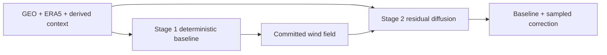

# Model overview

The recommended system is a stack, not a choice between unrelated models:

1. **Stage 1 — deterministic baseline:** learn a physical correction around ERA5.
2. **Stage 2 — residual diffusion:** freeze Stage 1 and sample a signed correction around its output.

[Start with the complete two-stage workflow.](two-stage.md)

| Path | Output | Inputs | Primary use |
|---|---|---|---|
| Two-stage baseline + diffusion | frozen baseline + sampled residual | GEO, ERA5, derived context, masks, Stage 1 field | main reconstruction system |
| Deterministic baseline only | one dense wind field | GEO, ERA5, derived context, masks | interpretable control and Stage 1 checkpoint |
| Residual diffusion on ERA5 | ERA5 + sampled residual | GEO, ERA5, derived context, masks | portable generative ablation without Stage 1 |
| Absolute conditional diffusion | absolute wind sample | GEO, optional ERA5, derived context, masks | standalone research baseline |
| Single-field intensity correction | corrected maximum wind + derived category | one frozen U-Net field, mask, center distance, current metadata | dashboard-scalar estimation |

The wind-field reconstruction paths use the same `PairedDataModule`, physical target conversion, masks, and storm-centric metrics. The scalar intensity path uses its own cached single-field contract while preserving storm-disjoint evaluation.

## Main articles

- **[Two-stage baseline + diffusion](two-stage.md)** — the central workflow, exact handoff, channel counts, and training order.
- **[Stage 1 deterministic baseline](era5-residual.md)** — residual connection to ERA5, physical Huber loss, and zero-initialized head.
- **[Stage 2 residual diffusion](residual-diffusion.md)** — signed residual transform, frozen baseline, guidance, and ensemble diagnostics.
- **[Single-field intensity correction](intensity-correction.md)** — correct a frozen U-Net field into USA maximum wind and a wind-derived category.

## Supporting and ablation articles

- **[Standalone conditional diffusion](conditional-diffusion.md)** — generate an absolute field directly from a noise latent and conditions.
- **[Sampling](sampling.md)** — DDPM, DDIM, schedules, clipping, and reproducibility.
- **[Diffusion in one page](../concepts/diffusion-primer.md)** — a short conceptual primer.
