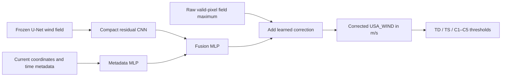

# Single-field intensity correction

The intensity-correction model turns one frozen deterministic U-Net wind field
into one corrected maximum sustained wind estimate. It does not reconstruct an
image and it never reads previous or future observations.



## Scientific target contract

Training targets come only from tropical IBTrACS `USA_WIND` fixes whose
`USA_SSHS` value is between `-1` and `5`. `USA_WIND` is converted from knots
with `1 kt = 0.514444 m/s`. The exporter intentionally does not use the
repository's WMO-first convenience intensity because IBTrACS does not
homogenize the agencies' wind-averaging periods, while `USA_SSHS` is defined
from US one-minute winds. See the [IBTrACS column
documentation](https://www.ncei.noaa.gov/sites/default/files/2025-09/IBTrACS_v04r01_column_documentation.pdf).

The model sees three image channels: physical U-Net wind, validity, and
normalized distance to the current storm center. Its scalar metadata is limited
to current latitude, cyclic longitude, basin, cyclic UTC/day-of-year/local-solar
time, elapsed time from the first track record, and valid fraction. Storm IDs,
absolute year, track history, intensity labels, pressure, and future-lifecycle
fields are not model inputs.

The learned scalar is a signed residual around the valid-pixel U-Net maximum.
The final layer starts at zero, so a new model initially reproduces that
baseline. The corrected value is nonnegative. TD, TS, and hurricane categories
are derived from the corrected continuous wind without rounding.

## Export the frozen fields

```bash
uv run geo2wf-export intensity-cache \
  --data-root /path/to/archive \
  --manifest /path/to/observation_manifest_v6.csv \
  --ibtracs-file /path/to/ibtracs.ALL.list.v04r01.csv \
  --config configs/config_geo_sar_10bands_era5_residual.yaml \
  --checkpoint /path/to/frozen-unet.ckpt \
  --stats data/geotiff/geo_sar_10bands_era5/stats.json \
  --output-root data/unet_intensity
```

Each split contains `manifest.csv` and compressed field arrays. The root
`cache-metadata.json` hashes the U-Net checkpoint, resolved source config,
normalization statistics, source manifest, and IBTrACS file. Loading can require
an expected checkpoint hash and fails on mismatches.

The exporter rejects storms shared by multiple splits. If the upstream U-Net
config declares `include_test_in_train: true`, provenance marks the result as
development-only. A clean end-to-end generalization claim requires an upstream
checkpoint that did not train on or select against the final evaluation storms.

## Train and run ablations

```bash
uv run geo2wf-train \
  experiment=unet_intensity_correction \
  data.root=data/unet_intensity

# Image-only comparator
uv run geo2wf-train \
  experiment=unet_intensity_correction \
  data.root=data/unet_intensity \
  model.use_metadata=false

# Metadata-only comparator; the raw field maximum remains the residual anchor
uv run geo2wf-train \
  experiment=unet_intensity_correction \
  data.root=data/unet_intensity \
  model.use_field=false
```

Training uses storm-balanced, capped category-aware Huber weights. Checkpoints
are selected by `val/storm_macro_mae_ms`. Validation also logs global MAE,
RMSE, bias, raw-U-Net MAE, category accuracy, macro F1, within-one-category
accuracy, and per-category MAE.

When W&B is enabled, every validation epoch also logs a three-panel storm plot
comparing IBTrACS `USA_WIND`, the corrected prediction, and the raw U-Net
maximum over observation time. These are independently inferred single-timestep
fixes arranged chronologically for inspection; the model never receives the curve.
The default selection is the three validation storms with the most cached fixes,
with storm ID as a deterministic tie-breaker. Pin a particular trio with, for
example, `model.validation_plot_storm_ids=[AL012020,EP022021,WP032022]`. W&B
also receives the plotted fixes as a table, per-storm metrics for the full
validation split, the category confusion matrix, correction statistics, and
raw-U-Net baseline metrics.

## Evaluate and infer

```bash
uv run geo2wf-evaluate intensity-correction \
  --cache-root data/unet_intensity \
  --checkpoint /path/to/intensity.ckpt \
  --split test \
  --comparison-checkpoint image_only=/path/to/image-only.ckpt \
  --comparison-checkpoint metadata_only=/path/to/metadata-only.ckpt \
  --output logs/intensity-evaluation.json

uv run geo2wf-infer intensity-correction \
  --cache-root data/unet_intensity \
  --checkpoint /path/to/intensity.ckpt \
  --split test \
  --output inference/intensity-summary.csv
```

Inference returns `raw_unet_max_wind_ms`, `correction_ms`, `output_msw_ms`, and
`output_category` with observation identifiers and timestamps. StormSense
displays this output as its U-Net+MLP maximum-wind series.
