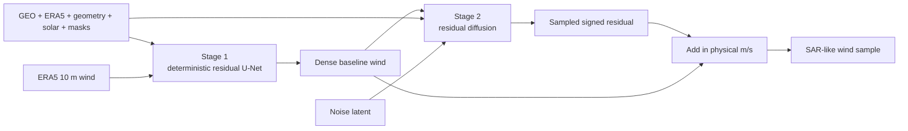

# Two-stage baseline + diffusion

This is the main geo2wf workflow. Stage 1 produces one stable physical reconstruction. Stage 2 treats that reconstruction as fixed and models only the remaining signed difference to SAR.



## Stage 1: commit to a baseline

The deterministic `ERA5ResidualRegressor` predicts a physical correction around ERA5:

\[
\hat v_{\mathrm{base}} =
v_{\mathrm{ERA5}} + f_\theta(x_{\mathrm{GEO}}, x_{\mathrm{ERA5}}, x_{\mathrm{derived}}, m)
\]

Its final head is initialized to zero. Before training, the model returns ERA5 exactly. Training then asks whether GEO and the wider context can improve that field on observed SAR pixels.

The 26 U-Net inputs are:

```text
23 data condition channels
+ condition-validity mask
+ explicit ERA5 wind
+ ERA5-validity mask
```

The loss is Huber in m/s over pixels where SAR and ERA5 are valid, plus a weak off-swath correction anchor. [Read the Stage 1 model details.](era5-residual.md)

## Stage 2: model what remains

The trained Stage 1 checkpoint is loaded as a frozen child module. For each sample, it produces the exact baseline used to define the residual target:

\[
r = v_{\mathrm{SAR}} - \hat v_{\mathrm{base}}
\]

The diffusion model does not regenerate absolute wind. It denoises a transformed version of this signed residual, inverts the transform, and adds the result back to the same baseline:

\[
\hat v = \mathrm{clip}\left(\hat v_{\mathrm{base}} + \hat r,\ 0,\ 80\right)
\]

The odd asinh transform preserves zero, gives small corrections more resolution, and still represents rare strong corrections:

\[
z = \frac{\operatorname{asinh}(r/s)}{\operatorname{asinh}(c/s)}
\]

The checked-in preset uses \(s=5\) m/s and \(c=80\) m/s.

At each diffusion timestep, the denoiser receives 27 channels:

```text
1 noisy residual
+ 24 prepared condition channels
+ 1 frozen Stage 1 baseline
+ 1 baseline-validity mask
```

[Read the Stage 2 objective, guidance, and probabilistic metrics.](residual-diffusion.md)

## Why split the work?

| Stage | Job | Desired behavior |
|---|---|---|
| Deterministic baseline | broad wind magnitude and placement | stable, interpretable, directly comparable with ERA5 |
| Residual diffusion | unresolved SAR-like correction | plausible structure and diversity without moving the large-scale field arbitrarily |

An absolute-field diffusion model must learn broad physics and fine detail inside one generative objective. The staged version gives diffusion a narrower question: *given this committed field and the observations, what plausible signed structure remains?*

The baseline also makes evaluation clearer. Stage 2 reports `baseline_mae_ms` and `mae_skill_vs_baseline`, so refinement is measured against the exact frozen prediction it was asked to improve.

## Training sequence

### 1. Train Stage 1

```bash
uv run geo2wf-train \
  data=geo_sar_common10_era5 \
  model=deterministic_residual
```

Choose a Stage 1 checkpoint using physical and storm-structure validation metrics, not training loss alone.

### 2. Train Stage 2 on the frozen checkpoint

```bash
GEO2WF_BASELINE_CKPT=/path/to/deterministic.ckpt \
uv run geo2wf-train \
  data=geo_sar_common10_era5 \
  model=residual_diffusion_deterministic_baseline
```

The baseline module stays in evaluation mode, is excluded from the optimizer, and is saved inside the residual-diffusion checkpoint for reproducibility.

### 3. Inspect samples, not only the ensemble mean

The deterministic Stage 1 output is a single field. Stage 2 produces multiple valid members from different initial latents. Judge the individual members for sharpness; an ensemble mean will blur alternatives even when each member is coherent.

## Next

- [Model inputs and real examples](../data/index.md)
- [Stage 1: deterministic baseline](era5-residual.md)
- [Stage 2: residual diffusion](residual-diffusion.md)
- [Sampling with DDPM and DDIM](sampling.md)
- [Evaluation and probabilistic refinement metrics](../experiments/evaluation.md)
