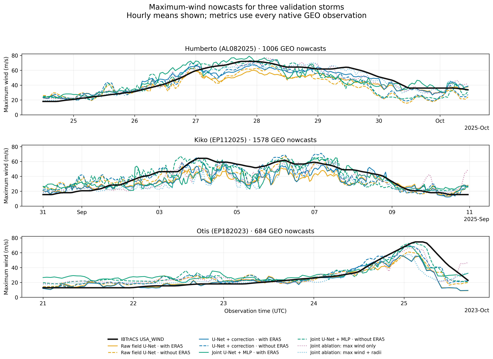

# Final results

This page contains only the final experiments requested for the streamlined
experiment set:

1. three instantaneous models, each tested with and without ERA5; and
2. their maximum-wind nowcasts on three validation storms; and
3. the joint U-Net/latent-MLP radii ablation.

!!! success "Canonical held-out results"
    The completed tables on this page are the correct paper-facing test
    results. They supersede exploratory validation summaries and historical
    runs elsewhere in the repository. The test observations were not used for
    training or checkpoint selection.

## Three-model ERA5 ablation

All six cells use the same storm-disjoint cohort and IBTrACS scalar target:
842 training observations, 232 validation observations, and 212 held-out test
observations. The test set contains 38 storms and was not folded into training.
Both conditioning regimes use identical sample IDs; the no-ERA5 models simply
do not receive the ERA5 channels.

| Model | ERA5 | Maximum-wind MAE (m/s; 95% CI) | Δ MAE vs raw U-Net (m/s; 95% CI) | RMSE (m/s) | Bias (m/s) | Storm-macro MAE (m/s) | Category accuracy | Category macro F1 | Within one category | n |
|---|---|---:|---:|---:|---:|---:|---:|---:|---:|---:|
| Raw field U-Net | With | 6.446 (5.269–7.843) | 0.000 (0.000–0.000) | 8.649 | -3.743 | 6.022 | 0.575 | 0.269 | 0.887 | 212 |
| U-Net + scalar correction | With | 5.529 (4.676–6.587) | -0.917 (-1.487–-0.345) | 7.173 | -1.644 | 5.422 | 0.604 | 0.370 | 0.962 | 212 |
| Joint U-Net + bottleneck MLP | With | 7.302 (6.605–8.064) | 0.857 (-0.354–2.011) | 8.566 | 4.298 | 7.907 | 0.552 | 0.297 | 0.948 | 212 |
| Raw field U-Net | Without | 7.518 (6.053–9.144) | 0.000 (0.000–0.000) | 10.233 | -4.797 | 7.037 | 0.542 | 0.251 | 0.868 | 212 |
| U-Net + scalar correction | Without | 6.715 (5.515–8.084) | -0.803 (-1.755–0.182) | 9.045 | -1.178 | 6.928 | 0.594 | 0.362 | 0.920 | 212 |
| Joint U-Net + bottleneck MLP | Without | 5.885 (5.047–6.854) | -1.633 (-2.701–-0.526) | 7.806 | -0.851 | 6.123 | 0.637 | 0.339 | 0.939 | 212 |

In this held-out cohort, the ERA5-conditioned correction model has the lowest
overall MAE among the ERA5 models (5.529 m/s), while the joint latent-MLP model
has the lowest overall MAE without ERA5 (5.885 m/s).

### Wind-field reconstruction

The scalar correction head does not emit a wind field, so field metrics are
not applicable to that model. MAE is the requested physical reconstruction
error; PSNR and SSIM quantify image fidelity and structure.

| Model | ERA5 | Field MAE (m/s) | Field RMSE (m/s) | Field bias (m/s) | PSNR (dB) | SSIM | SSIM scenes |
|---|---|---:|---:|---:|---:|---:|---:|
| Raw field U-Net | With | 2.159 | 3.332 | -0.208 | 27.586 | 0.848 | 210 |
| Joint U-Net + bottleneck MLP | With | 2.404 | 3.494 | 0.603 | 27.174 | 0.839 | 210 |
| Raw field U-Net | Without | 3.888 | 5.337 | -0.484 | 23.495 | 0.809 | 211 |
| Joint U-Net + bottleneck MLP | Without | 4.170 | 5.597 | -0.393 | 23.081 | 0.798 | 211 |

PSNR uses the fixed 0.2–80.0 m/s SAR range (data range 79.8 m/s). SSIM is
averaged by scene after clipping to this range; every 7×7 window touching an
invalid prediction or target pixel is excluded.

### Rapid-intensification phases

The same scalar metrics are reported on the 19 observations from 11 storms
where IBTrACS maximum wind increased by at least 30 kt during the preceding 24
hours.

| Model | ERA5 | RI MAE (m/s; 95% CI) | Δ MAE vs raw U-Net (m/s; 95% CI) | RI RMSE (m/s) | RI bias (m/s) | Storm-macro MAE (m/s) | Category accuracy | Category macro F1 | Within one category | n |
|---|---|---:|---:|---:|---:|---:|---:|---:|---:|---:|
| Raw field U-Net | With | 14.475 (9.676–18.554) | 0.000 (0.000–0.000) | 16.596 | -14.043 | 13.513 | 0.158 | 0.170 | 0.421 | 19 |
| U-Net + scalar correction | With | 10.512 (6.402–13.666) | -3.963 (-5.911–-1.742) | 12.137 | -7.753 | 9.928 | 0.263 | 0.267 | 0.895 | 19 |
| Joint U-Net + bottleneck MLP | With | 7.716 (4.363–11.250) | -6.759 (-10.368–-3.404) | 9.720 | -1.167 | 6.230 | 0.474 | 0.387 | 0.895 | 19 |
| Raw field U-Net | Without | 17.859 (10.914–24.483) | 0.000 (0.000–0.000) | 21.051 | -17.859 | 16.143 | 0.211 | 0.213 | 0.421 | 19 |
| U-Net + scalar correction | Without | 12.507 (5.438–19.416) | -5.353 (-7.777–-2.220) | 16.913 | -11.995 | 10.733 | 0.421 | 0.397 | 0.684 | 19 |
| Joint U-Net + bottleneck MLP | Without | 8.934 (4.277–13.946) | -8.926 (-11.776–-4.843) | 12.068 | -6.241 | 7.206 | 0.316 | 0.303 | 0.789 | 19 |

On the RI subset, the joint latent-MLP model has the lowest scalar MAE in both
conditioning regimes. The subset is small, so its 19-sample result should be
read together with the storm-bootstrap interval rather than as a standalone
ranking.

The corresponding U-Net image metrics on exactly those RI observations are:

| Model | ERA5 | Field MAE (m/s) | Field RMSE (m/s) | Field bias (m/s) | PSNR (dB) | SSIM | Scenes |
|---|---|---:|---:|---:|---:|---:|---:|
| Raw field U-Net | With | 2.219 | 3.586 | 0.296 | 26.947 | 0.833 | 19 |
| Joint U-Net + bottleneck MLP | With | 2.441 | 3.623 | 1.185 | 26.859 | 0.821 | 19 |
| Raw field U-Net | Without | 3.298 | 4.556 | 0.266 | 24.869 | 0.809 | 19 |
| Joint U-Net + bottleneck MLP | Without | 3.699 | 4.915 | 0.427 | 24.210 | 0.795 | 19 |

[Download all standard and RI metrics (CSV)](assets/data/final-results/three-model-era5-comparison.csv){ .md-button .md-button--primary }
[Download comparison provenance (JSON)](assets/data/final-results/three-model-era5-comparison.json){ .md-button }

<!-- three-storm-nowcast:start -->
## Three-storm maximum-wind nowcasts

Humberto 2025, Kiko 2025, and Otis 2023 are validation-storm case
studies, not held-out test estimates. Each prediction is an independent
single-observation nowcast. The figure uses hourly means for readability;
the metrics use every native GEO observation. RI columns apply the same
metrics only where IBTrACS increased by at least 30 kt in the preceding
24 hours.

| Model | Conditioning | All n | All MAE | All RMSE | All bias | RI n | RI MAE | RI RMSE | RI bias |
|---|---|---:|---:|---:|---:|---:|---:|---:|---:|
| Raw field U-Net | with ERA5 | 3266 | 9.066 | 12.026 | -6.560 | 466 | 15.542 | 18.403 | -15.404 |
| Raw field U-Net | without ERA5 | 3266 | 9.197 | 11.444 | -4.961 | 466 | 12.203 | 14.333 | -11.750 |
| U-Net + correction | with ERA5 | 3266 | 7.609 | 10.453 | -4.561 | 466 | 13.401 | 16.614 | -10.770 |
| U-Net + correction | without ERA5 | 3266 | 7.383 | 9.439 | -1.465 | 466 | 7.760 | 10.082 | -4.553 |
| Joint U-Net + MLP | with ERA5 | 3266 | 8.402 | 10.509 | -0.387 | 466 | 11.912 | 14.271 | -4.669 |
| Joint U-Net + MLP | without ERA5 | 3266 | 7.191 | 9.229 | -0.316 | 466 | 5.021 | 6.690 | -1.827 |
| Joint ablation: max wind only | with ERA5 | 3266 | 7.086 | 9.467 | -1.943 | 466 | 9.841 | 13.292 | -7.921 |
| Joint ablation: max wind + radii | with ERA5 | 3266 | 7.058 | 10.550 | -4.082 | 466 | 13.890 | 18.436 | -11.834 |

[Download predictions](assets/data/final-results/three-storm-nowcast-predictions.csv){ .md-button }
[Download metrics](assets/data/final-results/three-storm-nowcast-metrics.csv){ .md-button }
[Download provenance](assets/data/final-results/three-storm-nowcast.json){ .md-button }
<!-- three-storm-nowcast:end -->

## Joint U-Net/latent-MLP radii ablation

These are held-out test results from two seed-42 runs on the same strict,
ERA5-conditioned cohort: 568 training, 159 validation, and 139 test samples.
Checkpoints were selected using validation loss before any test metrics were
examined. This structure cohort additionally requires a valid SAR pixel at the
storm center so radii diagnosed from the 2D field have trustworthy
storm-centered geometry. It is therefore not the same cohort as the six-model
matrix above; only the two structure-ablation arms are interpreted as a paired
objective comparison.

### Maximum wind

| Training objective | MLP MAE (m/s) | MLP RMSE (m/s) | MLP bias (m/s) | Samples |
|---|---:|---:|---:|---:|
| Maximum wind only | 6.471 | 8.181 | 1.133 | 139 |
| Maximum wind + radii | 5.533 | 7.313 | 0.132 | 139 |

Adding radii supervision coincided with a 0.938 m/s lower maximum-wind MAE in
this single seeded comparison. This is an observed paired-run result, not a
multi-seed uncertainty estimate.

### 2D wind-field reconstruction

| Training objective | Field MAE (m/s) | Field RMSE (m/s) | Field bias (m/s) | PSNR (dB) | SSIM | Scenes |
|---|---:|---:|---:|---:|---:|---:|
| Maximum wind only | 2.638 | 3.765 | 0.106 | 26.524 | 0.826 | 139 |
| Maximum wind + radii | 2.565 | 3.684 | -0.185 | 26.713 | 0.829 | 139 |

### Rapid-intensification phases

The same metrics on the 13 strict-cohort test observations in an RI phase are:

| Training objective | MLP MAE (m/s) | MLP RMSE (m/s) | MLP bias (m/s) | Samples |
|---|---:|---:|---:|---:|
| Maximum wind only | 9.232 | 10.839 | -0.857 | 13 |
| Maximum wind + radii | 9.957 | 10.814 | 0.092 | 13 |

| Training objective | Field MAE (m/s) | Field RMSE (m/s) | Field bias (m/s) | PSNR (dB) | SSIM | Scenes |
|---|---:|---:|---:|---:|---:|---:|
| Maximum wind only | 2.568 | 3.736 | 0.907 | 26.592 | 0.814 | 13 |
| Maximum wind + radii | 2.526 | 3.918 | 0.851 | 26.179 | 0.814 | 13 |

Radii supervision improves the all-test maximum-wind MAE by 0.938 m/s and
slightly improves all-test field MAE, PSNR, and SSIM. It does not improve the
13-scene RI maximum-wind MAE, so that small-subset result is reported rather
than folded into the overall conclusion.

### Radii from the latent head and 2D field

Both columns evaluate the radii-supervised run. The latent MLP predicts radii
directly, while the field values are diagnosed from the reconstructed U-Net
image. Missing targets are masked; field counts can be smaller when the target
lies outside the image's complete circular domain.

| Radius | Latent MLP MAE (km) | MLP n | 2D field MAE (km) | Field n |
|---|---:|---:|---:|---:|
| RMW | 22.60 | 138 | 34.89 | 132 |
| R34 | 44.97 | 116 | 51.21 | 53 |
| R50 | 32.69 | 72 | 35.12 | 58 |
| R64 | 20.38 | 48 | 29.92 | 46 |

[Full radii-ablation provenance](experiments/latent-structure-results.md){ .md-button .md-button--primary }
[Download radii-ablation CSV](assets/data/latent-structure/summary.csv){ .md-button }
[Download radii-ablation JSON](assets/data/latent-structure/results.json){ .md-button }
