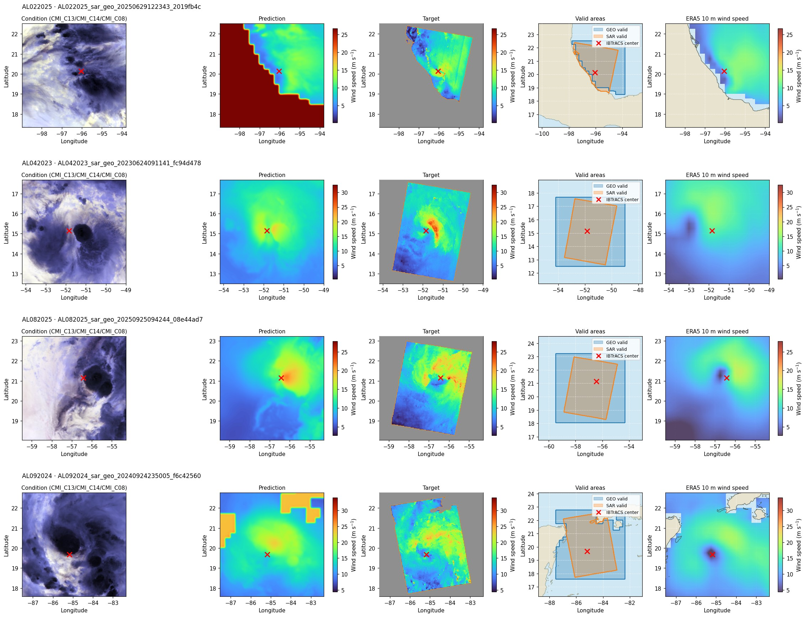
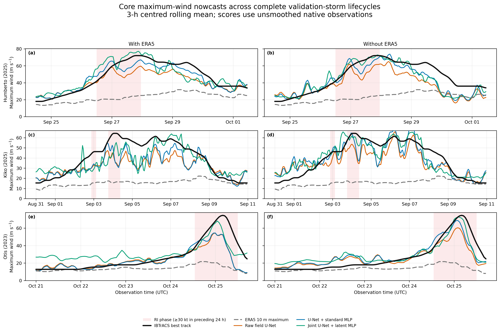
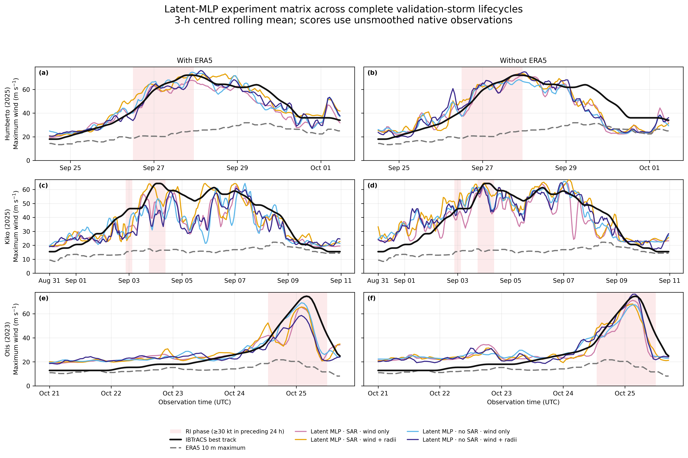
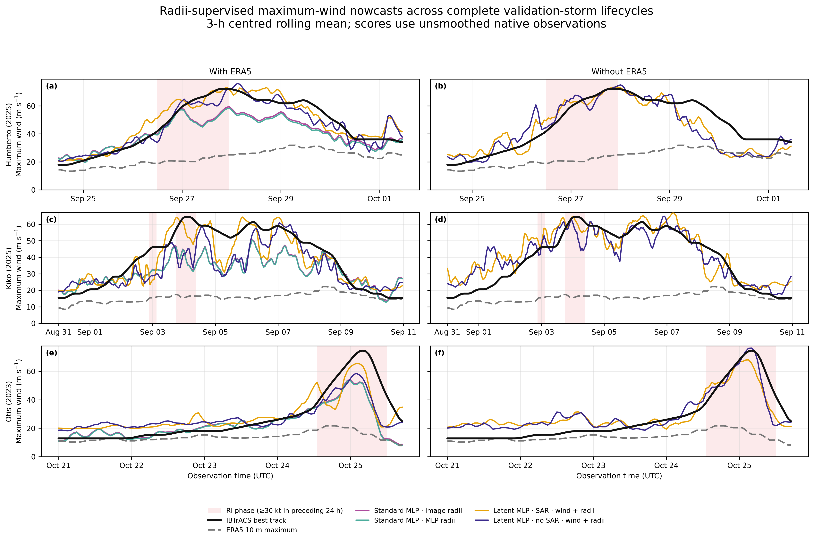

# Current results

!!! success "Canonical experiment outputs"
    These tables are generated directly from the completed experiment
    matrix and its selected checkpoints. They are the paper-facing source
    of truth for current validation, RI validation, and the three complete
    validation-storm case studies.

## Current validation matrix

Maximum-wind targets are interpolated IBTrACS USA_WIND values. RI is
defined as an increase of at least 30 kt during the preceding 24 hours.
The configured validation cohorts are used exactly as trained; ERA5-required
runs exclude observations without valid matched ERA5, so cross-regime rankings
are descriptive rather than strictly paired.

### Maximum wind

All wind errors are in m s⁻¹.

| Experiment | ERA5 | SAR | Radii supervision | All MAE | All RMSE | RI MAE | RI RMSE |
|---|:---:|:---:|---|---:|---:|---:|---:|
| U-Net + standard MLP · image radii | With | Yes | 2D image | 7.001 | 8.697 | 10.239 | 12.228 |
| U-Net + standard MLP · MLP radii | With | Yes | MLP head | 7.264 | 9.026 | 11.044 | 12.957 |
| Latent MLP · SAR · wind only | With | Yes | None | 5.795 | 7.723 | 8.128 | 9.958 |
| Latent MLP · SAR · wind + radii | With | Yes | MLP head | 5.859 | 7.662 | 7.316 | 8.879 |
| Latent MLP · no SAR · wind only | With | No | None | 5.446 | 6.889 | 6.555 | 7.210 |
| Latent MLP · no SAR · wind + radii | With | No | MLP head | 5.688 | 6.845 | 6.904 | 7.454 |
| Latent MLP · SAR · wind only | Without | Yes | None | 6.694 | 9.099 | 6.867 | 9.394 |
| Latent MLP · SAR · wind + radii | Without | Yes | MLP head | 6.344 | 8.519 | 5.469 | 7.469 |
| Latent MLP · no SAR · wind only | Without | No | None | 6.828 | 8.245 | 6.645 | 7.263 |
| Latent MLP · no SAR · wind + radii | Without | No | MLP head | 6.297 | 7.779 | 7.198 | 7.634 |

[Download CSV](assets/data/final-results/current-validation-maximum-wind.csv){ .md-button .result-download download }

### Wind-field reconstruction

L1 is pooled valid-pixel MAE in m s⁻¹. PSNR uses the fixed 79.8 m s⁻¹
physical range; SSIM is the scene mean over complete valid 7×7 windows.
Encoder-only no-SAR models have no image output and are therefore omitted.

| Experiment | ERA5 | All L1 | All PSNR | All SSIM | RI L1 | RI PSNR | RI SSIM |
|---|:---:|---:|---:|---:|---:|---:|---:|
| U-Net + standard MLP · image radii | With | 2.410 | 26.975 | 0.833 | 2.448 | 26.820 | 0.819 |
| U-Net + standard MLP · MLP radii | With | 2.410 | 26.975 | 0.833 | 2.448 | 26.820 | 0.819 |
| Latent MLP · SAR · wind only | With | 2.565 | 26.604 | 0.840 | 2.675 | 26.395 | 0.818 |
| Latent MLP · SAR · wind + radii | With | 2.402 | 27.139 | 0.840 | 2.494 | 26.630 | 0.816 |
| Latent MLP · SAR · wind only | Without | 4.106 | 23.202 | 0.800 | 3.351 | 24.502 | 0.802 |
| Latent MLP · SAR · wind + radii | Without | 3.864 | 23.831 | 0.811 | 3.506 | 24.643 | 0.806 |

[Download CSV](assets/data/final-results/current-validation-image-reconstruction.csv){ .md-button .result-download download }

#### Held-out reconstruction examples

Four validation observations from the selected SAR + ERA5 latent-MLP model
with wind-and-radii supervision are shown below. Predictions are complete 2D
wind-speed fields; SAR targets are only observed inside the orange footprint,
so the unobserved part of each prediction is a conditional reconstruction.
The red cross marks the interpolated IBTrACS storm centre.

### Wind radii

The compact table reports all-validation MAE in km. The downloadable
canonical table additionally contains RMSE, bias, RI-only values, and
explicit not-applicable reasons for every experiment/metric combination.
ERA5 identifies whether ERA5 fields were supplied as conditioning inputs;
rows with the same experiment label but different ERA5 values are separate
input-ablation runs, not repeated measurements.

| Experiment | ERA5 | Radius source | RMW MAE | R34 MAE | R50 MAE | R64 MAE |
|---|:---:|---|---:|---:|---:|---:|
| U-Net + standard MLP · image radii | With | Diagnosed from 2D image | 20.62 | 78.25 | 33.91 | 20.44 |
| U-Net + standard MLP · MLP radii | With | Direct MLP head | 24.66 | 42.78 | 16.92 | 13.77 |
| U-Net + standard MLP · MLP radii | With | Diagnosed from 2D image | 20.62 | 78.25 | 33.91 | 20.44 |
| Latent MLP · SAR · wind only | With | Diagnosed from 2D image | 32.12 | 55.67 | 41.41 | 34.72 |
| Latent MLP · SAR · wind + radii | With | Direct MLP head | 19.51 | 44.47 | 20.19 | 13.18 |
| Latent MLP · SAR · wind + radii | With | Diagnosed from 2D image | 28.65 | 38.99 | 28.02 | 27.07 |
| Latent MLP · no SAR · wind + radii | With | Direct MLP head | 20.71 | 42.82 | 20.39 | 12.99 |
| Latent MLP · SAR · wind only | Without | Diagnosed from 2D image | 27.30 | 59.07 | 44.77 | 32.95 |
| Latent MLP · SAR · wind + radii | Without | Direct MLP head | 18.24 | 65.82 | 28.14 | 15.33 |
| Latent MLP · SAR · wind + radii | Without | Diagnosed from 2D image | 24.02 | 58.62 | 42.51 | 29.64 |
| Latent MLP · no SAR · wind + radii | Without | Direct MLP head | 19.44 | 56.73 | 25.89 | 13.47 |

[Download CSV](assets/data/final-results/current-validation-radii.csv){ .md-button .result-download download }

## Complete-storm nowcasts

Humberto 2025, Kiko 2025, and Otis 2023 are dense validation-storm
case studies. Each value is an independent instantaneous nowcast from one
GEO observation. Figures show hourly means followed by a centred
3-hour rolling mean; every metric below uses all valid,
unsmoothed native observations. Shaded intervals are RI phases.

The ERA5 line is the maximum native 10 m wind speed within the same
5.184° storm-centred crop used by the models at the
nearest ERA5 analysis time. It is an external reanalysis reference in the
without-ERA5 panels, not an input to those models.

### Core field and scalar architectures

[Download CSV](assets/data/final-results/current-three-storm-core-nowcasts.csv){ .md-button .result-download download }

### SAR/no-SAR and ERA5/no-ERA5 latent-MLP matrix

[Download CSV](assets/data/final-results/current-three-storm-latent-nowcasts.csv){ .md-button .result-download download }

### Radii-supervised correction and latent experiments

[Download CSV](assets/data/final-results/current-three-storm-radii-nowcasts.csv){ .md-button .result-download download }

### Dense three-storm metrics

Wind errors are in m s⁻¹. The two invalid GEO observations are excluded
consistently from every model series and the ERA5 reference.

| Model | Conditioning | All n | MAE | RMSE | Bias | RI n | RI MAE | RI RMSE |
|---|---|---:|---:|---:|---:|---:|---:|---:|
| Raw field U-Net | With ERA5 | 3266 | 9.066 | 12.026 | -6.560 | 466 | 15.542 | 18.403 |
| U-Net + standard MLP | With ERA5 | 3266 | 7.609 | 10.453 | -4.561 | 466 | 13.401 | 16.614 |
| Joint U-Net + latent MLP | With ERA5 | 3266 | 8.402 | 10.509 | -0.387 | 466 | 11.912 | 14.271 |
| Standard MLP · image radii | With ERA5 | 3266 | 9.135 | 12.147 | -6.781 | 466 | 15.741 | 18.587 |
| Standard MLP · MLP radii | With ERA5 | 3266 | 9.405 | 12.507 | -7.320 | 466 | 16.263 | 19.057 |
| Latent MLP · SAR · wind only | With ERA5 | 3266 | 7.325 | 9.638 | -3.688 | 466 | 11.049 | 13.926 |
| Latent MLP · SAR · wind + radii | With ERA5 | 3266 | 6.413 | 8.502 | -0.197 | 466 | 10.103 | 13.098 |
| Latent MLP · no SAR · wind only | With ERA5 | 3266 | 7.421 | 10.001 | -2.269 | 466 | 9.361 | 12.700 |
| Latent MLP · no SAR · wind + radii | With ERA5 | 3266 | 7.370 | 9.935 | -3.112 | 466 | 12.367 | 15.572 |
| Raw field U-Net | Without ERA5 | 3266 | 9.197 | 11.444 | -4.961 | 466 | 12.203 | 14.333 |
| U-Net + standard MLP | Without ERA5 | 3266 | 7.383 | 9.439 | -1.465 | 466 | 7.760 | 10.082 |
| Joint U-Net + latent MLP | Without ERA5 | 3266 | 7.191 | 9.229 | -0.316 | 466 | 5.021 | 6.690 |
| Latent MLP · SAR · wind only | Without ERA5 | 3266 | 7.909 | 10.237 | -2.140 | 466 | 6.982 | 9.606 |
| Latent MLP · SAR · wind + radii | Without ERA5 | 3266 | 7.434 | 9.331 | 1.289 | 466 | 5.441 | 7.602 |
| Latent MLP · no SAR · wind only | Without ERA5 | 3266 | 7.484 | 9.301 | 0.029 | 466 | 5.807 | 7.782 |
| Latent MLP · no SAR · wind + radii | Without ERA5 | 3266 | 7.039 | 9.330 | 0.443 | 466 | 6.044 | 8.560 |
| ERA5 10 m maximum | Reanalysis reference | 3266 | 22.119 | 27.208 | -22.117 | 466 | 40.550 | 41.657 |

[Download CSV](assets/data/final-results/current-three-storm-metrics.csv){ .md-button .result-download download }
