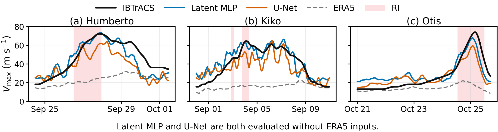
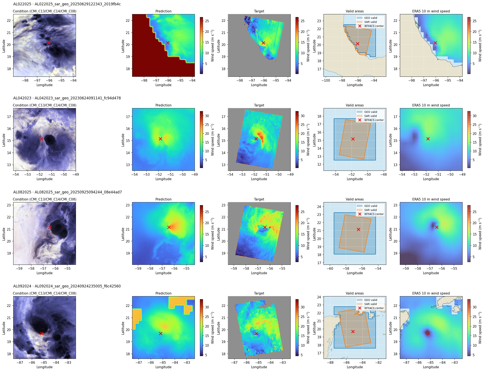

# Paper results

The accepted paper studies whether shared spatial and scalar supervision
improves tropical-cyclone intensity estimates. These tables retain its reported
values, with the cohort distinctions preserved below. RI means an IBTrACS
wind increase of at least 30 kt over the preceding 24 hours; it is an evaluation
subset, not a separate training set.

## Architecture ablation

Maximum-wind MAE in m/s on the original architecture test cohort (paper Table 1a).

| Model | ERA5 | All | RI |
|---|:---:|---:|---:|
| Field U-Net diagnostic | No | 7.518 | 17.859 |
| Post-hoc MLP | No | 6.715 | 12.507 |
| Joint latent MLP | No | **5.885** | **8.934** |
| Field U-Net diagnostic | Yes | 6.446 | 14.475 |
| Post-hoc MLP | Yes | **5.529** | 10.512 |
| Joint latent MLP | Yes | 7.302 | **7.716** |

Without ERA5, the joint model improves on both alternatives, especially during
RI. ERA5 improves the field-only and post-hoc models and the joint model's RI
error, but worsens the joint model's all-observation error. Its benefit depends
on the architecture and regime.

## Latent-supervision ablation

Maximum-wind MAE in m/s and RMW MAE in km. RMW is the paper's radius of maximum
wind, also called Rmax. Dashes mean no scalar radius head. The four no-ERA5
rows correspond to paper Table 1b; the ERA5 rows retain the companion comparison.

| ERA5 | SAR supervision | Radius supervision | Wind All | Wind RI | RMW All | RMW RI |
|:---:|:---:|:---:|---:|---:|---:|---:|
| No | Yes | No | 6.694 | 6.867 | — | — |
| No | No | Yes | 6.297 | 7.198 | 19.44 | 13.14 |
| No | No | No | 6.828 | 6.645 | — | — |
| No | Yes | Yes | 6.344 | **5.469** | 18.24 | **11.18** |
| Yes | Yes | No | 5.795 | 8.128 | — | — |
| Yes | Yes | Yes | 5.859 | 7.316 | 19.51 | 13.78 |
| Yes | No | No | 5.446 | 6.555 | — | — |
| Yes | No | Yes | 5.688 | 6.904 | 20.71 | 16.27 |

Adding SAR reconstruction to the GEO-only radius-supervised model reduces RI
wind MAE from 7.198 to 5.469 m/s and RI RMW MAE from 13.14 to 11.18 km.
SAR supervision alone does not improve RI intensity in the wind-only control.
This supports the paper's argument that the spatial and scalar objectives
are complementary.

!!! note "Cohort provenance"
    The supplied paper captions Table 1b as a reduced test set with SAR-valid
    centers. The retained reports and the [Hugging Face release](https://huggingface.co/datasets/simon-donike/geo2wf-data#scientific-scope-and-limitations)
    identify these latent-ablation values as **validation** results. They are
    kept distinct from the architecture test table. Use the release's
    effective-cohort and training-membership records for reproduction; there
    is no common split covering every published artifact.

## Complete-storm case studies

Humberto 2025, Kiko 2025, and Otis 2023 provide 3,266 valid observations,
including 466 RI observations. Each prediction is an independent instantaneous
nowcast. The joint model here uses SAR and radius supervision with no ERA5
input. These dense storm diagnostics are separate from the paired test table.

| Model / reference | All MAE (m/s) | RI MAE (m/s) |
|---|---:|---:|
| GEO-only field U-Net | 9.197 | 12.203 |
| GEO-only latent MLP, SAR + radii | **7.434** | **5.441** |
| ERA5 10 m wind maximum | 22.119 | 40.550 |

Curves use hourly means and a centered five-hour rolling mean; all metrics
use unsmoothed native predictions. Shading marks RI. ERA5 is an external
reference: maximum 10 m wind in the same 5.184° storm-centered crop at the
nearest analysis time. Two invalid GEO observations are excluded consistently.

[Download figure PDF](assets/images/final-results/current-three-storm-compact-nowcasts.pdf){ .md-button download }
[Download full case-study metrics](assets/data/final-results/current-three-storm-metrics.csv){ .md-button download }
[Open StormSense](explorer/dashboard.html){ .md-button }

## Wind-field reconstruction

These validation examples use the SAR + ERA5 latent model with wind/radius
supervision. The orange footprint marks observed SAR; the red cross is the
IBTrACS center. Predictions extend beyond the swath, where they are conditional
estimates rather than verified wind observations. The field is smoother than
the SAR reference, so scalar skill should be read alongside spatial diagnostics.

## Detailed reports

The retained exports provide additional diagnostics without repeating every
matrix here:

- [Validation maximum wind](assets/data/final-results/current-validation-maximum-wind.csv)
- [Validation field reconstruction](assets/data/final-results/current-validation-image-reconstruction.csv)
- [Validation radii, including direct-head and image-derived estimates](assets/data/final-results/current-validation-radii.csv)
- [Full validation report](assets/data/final-results/current-validation-results.json)
- [Native three-storm predictions](assets/data/final-results/current-three-storm-predictions.csv.gz)

See [evaluation](experiments/evaluation.md) for masks, units, and aggregation,
and [paper reasoning](concepts/problem.md) for interpretation and limitations.
